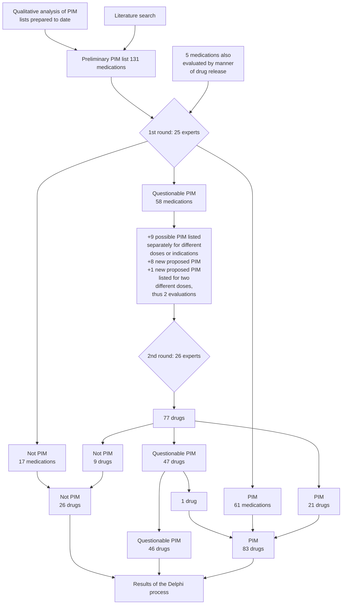

MEDICINE

ORIGINAL ARTICLE

# Potentially Inappropriate Medications in the Elderly: The PRISCUS List

Stefanie Holt, Sven Schmiedl, Petra A. Thürmann

### SUMMARY

**Background:** Certain drugs are classified as potentially inappropriate medications (PIM) for the elderly because they carry an increased risk of adverse drug events in this patient group. PIM lists from other countries are of limited usefulness in Germany because different drugs are on the market in each country and prescribing practices vary as well. Thus, a list of potentially inappropriate medications for the elderly was developed specifically for use in Germany.

**Methods:** A preliminary PIM list suitable for the German market was created on the basis of a selective literature search and a qualitative analysis of published international PIM lists. The final German PIM list was developed by means of a comprehensive, structured expert survey in two rounds (a so-called Delphi process).

**Results:** 83 drugs in a total of 18 drug classes were rated as potentially inappropriate for elderly patients. For 46 drugs, the experts came to no clear decision after the second Delphi round. For cases in which the administration of a PIM is clinically necessary, the final PRISCUS list contains recommendations for clinical practice, e.g. monitoring of laboratory values and dose adaptation. Therapeutic alternatives are also listed.

**Conclusion:** Potentially inappropriate medications carry the risk of causing adverse drug events in the elderly. A drawback of using a Delphi process to generate a PIM list, as was done for the new German list, is that little scientific evidence is currently available for the evaluation of active substances, potential therapeutic alternatives, and indicated monitoring procedures. Thus, the validity and practicability of the PRISCUS list remain to be demonstrated (and the same holds for PIM lists already published in other countries). It should be used as a component of an overall concept for geriatric pharmacotherapy in which polypharmacy and interacting medications are avoided, and doses are regularly re-evaluated.

> **Cite this as: Dtsch Arztebl Int 2010; 107(31–32): 543–51**
> **DOI: 10.3238/arztebl.2010.0543**

***

Klinische Pharmakologie, Private Universität Witten/Herdecke gGmbH:
Holt, Dr. med. Schmiedl, Prof. Dr. med. Thürmann

Philipp Klee-Institut für Klinische Pharmakologie, HELIOS Klinikum Wuppertal:
Dr. med. Schmiedl, Prof. Dr. med. Thürmann

In Germany, the Federal Statistical Office (*Statistisches Bundesamt*) currently predicts a marked rise in the percentage of elderly people in the population, with the number of people over age 80 rising by more than 4 million, to approximately 10 million, by the year 2050 (e1). Multimorbidity is more common in advanced age (1) and leads inevitably to polypharmacy. According to an annual report of medical prescribing in Germany (*Arzneiverordnungsreport*), persons over age 60 participating in the German statutory health insurance system received an average of 3.1 defined daily doses (DDD) of medication as long-term treatment in the year 2008 (2). This age group was given 66% of all prescribed drugs, even though it accounts for only 26.8% of the population. Comparable figures have been published in the United Kingdom, Sweden, the Netherlands, Ireland, the USA, and other countries (3, e2–e5). The more drugs a patient takes, the greater the risk of drug interactions and adverse effects (e6, e7). Aside from adverse effects in the narrow sense of the term, patients commonly suffer from adverse drug events (ADE), often because of multiple prescribing. In this article, we will make frequent use of the term "adverse drug events" and the abbreviation ADE.

Old age is commonly associated with multiple illnesses, as well as with altered pharmacokinetics and pharmacodynamics (4, e8, e9)—for example, delayed renal elimination of drugs and increased sensitivity to anticholinergic and sedating effects. Many drugs are thus inappropriate for elderly patients because of their pharmacological effects and/or potential adverse effects. Many types of ADE are difficult to distinguish from the manifestations of diseases that the patient already has or might develop, and many drugs can elevate the risk of complications, such as falls, that typically affect the elderly (e10). Medications whose risk of ADE exceeds their expected clinical benefit when they are given to elderly persons, and which can be replaced by better-tolerated alternatives, are called potentially inappropriate medications (PIM) (5). Efforts have been made recently in the USA, Canada, France, Ireland, and Norway (6–11) to identify PIM among the drugs that are available in each of these countries. The best known list of this type is the so-called Beers list (6). The medication recommendations for multimorbid elderly patients that have been published to date in countries outside Germany are variable in both form and content

Deutsches Ärzteblatt International | Dtsch Arztebl Int 2010; 107(31–32): 543–51
543

MEDICINE

and often do not apply to the German situation because of differences in approved drugs, in prescribing behavior, and in therapeutic guidelines. Propoxyphene, for example, appears on international lists as a PIM but is not available as a medication in Germany.

The creation of a specifically German list of potentially inappropriate medications that elderly persons should not take, or whose doses require special adjustment for elderly patients (6, 7), was made a goal of the German Health Ministry’s Drug Safety Initiative (*Aktionsplan Arzneimitteltherapiesicherheit*) for 2008/2009 (e11), on the recommendation of a council of experts for the evaluation of developments in health care (e12). The joint project was entitled PRISCUS (Latin for “old and venerable”). The PIM list that it created can be found in full at www.priscus.net (in German). This PIM list is described in the present article, and its potential uses are discussed.

## Methods
The PRISCUS list was created in four steps:

**(a) Qualitative analysis of selected PIM lists for elderly patients from other countries**—Two publications on the subject from the USA (6, 7), one from Canada (8), and one from France (9) were identified, qualitatively analyzed, and evaluated for applicability to the German drug market in terms of availability and prescribing frequency (e13).

**(b) Literature search**—The literature was searched (in the Medline database PubMed and elsewhere) for publications on drug recommendations for the elderly and problems related to drugs commonly used by elderly patients. Particular attention was paid to publications that provided scientific evidence of an elevated risk of ADE and drug interactions for specific medications and medication classes taken by the elderly. The literature contains many different age thresholds for the definition of the elderly. The authors of the PRISCUS list established age 65 as the lower limit (10, 12).

**(c) Development of a preliminary list of potentially inappropriate medications for elderly patients, specifically adapted to the German market**—The information obtained in steps (a) and (b) was used to create a preliminary PIM list containing 131 medications belonging to 24 different classes, with extensive accompanying information (*eBox 1, eTable 1*). *eBox 2* contains a detailed description of steps (a) – (c).

**(d) Generation of the final PRISCUS list by consultation of experts (modified Delphi process)**—As was done for the PIM lists that were published in other countries, the German PIM list was generated by expert consensus (*eBox 3*) on the basis of a literature review followed by consultation of experts in a modified Delphi process (13, e14, e15).

The Internet-based Delphi interrogation process consisted of two rounds and began in December 2008, when contact was made with more than 50 German-speaking experts, of whom 38 agreed in writing to participate in the project. These experts represented eight different specialties (geriatric medicine, clinical pharmacology, general practice, internal medicine, pain therapy, neurology, psychiatry, and pharmacy). The experts were identified with the aid of the specialty societies and the Drug Commission of the German Medical Association. Further potential participants were identified by personal communication.

The experts rated each potentially inappropriate medication on the five-point Likert scale (e16), which ranges from a score of 1 (drugs that can definitely be considered potentially inappropriate for elderly patients) to 5 (drugs whose risk for elderly patients is comparable to the risk for younger patients). A score of 3 is neutral (undecided). Furthermore, the experts were asked to propose monitoring parameters (e.g., laboratory values to be tested), dose adjustments, and alternative, predominantly pharmacological, treatment alternatives for each drug. They were also asked to list, for each drug, any comorbidities that would elevate the risk of adverse events.

After the first round of questioning, the mean Likert score and the corresponding 95% confidence interval (CI) were determined for each drug. Drugs for which the upper bound of the 95% CI was less than 3.0 were classed as PIM, while drugs for which the lower bound of the 95% CI was greater than 3.0 were classed as drugs whose risk is comparable in elderly and younger patients. Only the drugs whose 95% CI was on both sides of 3.0 were evaluated a further time by the experts in the second round of questioning (7, 10). The experts’ answers in the second round were evaluated by the same procedure. Drugs whose 95% CI remained on both sides of 3.0 in the second round were designated as “not unequivocally characterized.”

A number of medications were evaluated in separate categories of dosage, indication, or manner of drug release in the second round, on the basis of the experts’ recommendations. Statistical calculations were performed with the SPSS program, version 17 (SPSS Inc., Chicago, IL, USA).

## Results
Twenty-five of the 38 experts (65.8%) participated in the first round of questioning, and 26 completed the second round. One expert participated only in the first round, two others only in the second round.

Five of the 131 different drugs (active substances) under consideration were evaluated by the experts in the first round in two different categories based on the manner of drug release. Rapidly released nifedipine, for example, was unequivocally rated as a PIM, while sustained-release nifedipine was classified as a questionable PIM. Thus, 136 different drug evaluations emerged from the first round (*Figure*). 17 drugs were judged to carry comparable risks for younger and older patients, and were thus classified as non-PIM. 61 drugs were considered by the experts to be potentially inappropriate for elderly patients.

For 58 drugs, an unambiguous expert evaluation was not obtained in the first round, and a further evaluation

544 | Deutsches Ärzteblatt International | Dtsch Arztebl Int 2010; 107(31–32): 543–51

MEDICINE

in the second round was needed. Nine of these drugs were evaluated in two different categories based on their dosage or indication, in accordance with the experts’ suggestions. The experts in the second round also suggested 10 new drugs for consideration as possible PIM. Thus, 77 different drugs were evaluated in the second round.

The experts in the second round of questioning evaluated 21 of the 77 drugs as potentially inappropriate for elderly patients. Forty-seven drugs could not be unambiguously classified even after the second round (*eTable 2*). One of these was prasugrel, which was then designated by the authors of the PRISCUS list as a PIM on the basis of the manufacturer’s recommendations (e17) (*Figure*).

Thus, at the end of two rounds of questioning, 83 drugs were judged to be potentially inappropriate for elderly patients (*Table, eTable 3*). Among them were two (nifedipine and tolterodine) that were only classified as PIM in their rapid-release formulation. For 9 drugs, upper dose limits were stated.

After evaluating many textual references to therapeutic alternatives and monitoring derived from the literature, the experts also provided comments, supplementary information, and more concrete statements. These are contained in the final PRISCUS list (short version in the *Table*; complete list at www.priscus.net [in German language]).

Sixty-four of the 83 drugs designated as PIM in the PRISCUS list are so designated in at least one of the PIM lists that have been published in other countries (6–9). Among the remaining 19 German PIM drugs that are not listed as PIM in any of the four foreign lists, 12 are not available on the market in at least one of the three countries to which these lists apply (e18); however, 7 are on the market in all three (the USA, Canada, and France). On the other hand, 124 drugs are designated as PIM in at least one of the four foreign lists (sometimes only in the presence of specific comorbidities) but do not appear on the German PRISCUS list. Seventy of these drugs are not on the German market. Thirty-seven of them did not appear on the preliminary PIM list for various reasons, including low frequency of prescription (dosulepine) or lack of scientific evidence (cimetidine). Of the 17 remaining drugs classified as PIM on foreign lists but not on the German list, 6 were designated as non-PIM, and 11 could not be unambiguously classified.

## Discussion
The project described here created the first list of potentially inappropriate medications for elderly patients in the German-speaking countries. A specifically German list was needed because the French, American, and Canadian drug markets are only partly comparable with the market in Germany (5, 14, 15).

Of the 83 medications that were designated as potentially inappropriate in the final list, nearly three-quarters had already been classified as such in the first round of questioning. This implies that, for these drugs,

### FIGURE

> The Delphi procedure that was used to generate the PRISCUS list
> 
> \* Prasugrel was not unequivocally evaluated by the group of experts but was rated as potentially inappropriate for elderly patients and assigned to the PIM group on the basis of the Summary of Product Characteristics (e17)

Deutsches Ärzteblatt International | Dtsch Arztebl Int 2010; 107(31–32): 543–51
545

MEDICINE

# TABLE
Potentially inappropriate medications for elderly patients (short version) (see also the Summaries of Product Characteristics)

<table>
  <tbody>
    <tr>
        <td>Medication</td>
        <td>Main concerns (selected)</td>
        <td>Possible therapeutic alternatives</td>
        <td>Precautions to be taken when these medications are used</td>
    </tr>
    <tr>
        <th colspan="4">Analgesics, anti-inflammatory drugs</th>
    </tr>
    <tr>
        <td>NSAID – indometacin – acemetacin* – ketoprofen* – piroxicam – meloxicam* – phenylbutazone – etoricoxib</td>
        <td>– very high risk of gastrointestinal hemorrhage, ulceration, or perforation, which may be fatal – indometacin: central nervous disturbances – phenylbutazone: blood dyscrasia – etoricoxib: cardiovascular contraindications</td>
        <td>– paracetamol – (weak) opioids (tramadol, codeine) – weak NSAID (e.g., ibuprofen)</td>
        <td>– use in combination with protective agents, e.g., PPI – follow-up for gastrointestinal manifestations (gastritis, ulcer, hemorrhage) – monitoring of renal function – monitoring of cardiovascular function (blood pressure, signs of congestive heart failure) – dosing recommendation: shortest possible duration of therapy – phenylbutazone: monitoring of blood counts as well</td>
    </tr>
    <tr>
        <td>Opioid analgesics – pethidine</td>
        <td>– elevated risk of delirium and falls</td>
        <td>– paracetamol – other opioids (with a lower risk of delirium, e.g., tilidine/naloxone, morphine, oxycodone, buprenorphine, hydromorphone) – weak NSAID (e.g., ibuprofen)</td>
        <td>– clinical follow-up (central nervous function, tendency to fall, cardiovascular function) – monitoring of renal function – dosing recommendation: low initial dose, shortest possible duration of treatment</td>
    </tr>
    <tr>
        <th colspan="4">Antiarrhythmic drugs</th>
    </tr>
    <tr>
        <td>Quinidine*</td>
        <td>– central nervous side effects – increased mortality – Quinidine plus verapamil: not recommended for patients over age 75 (e25)</td>
        <td>– beta-blockers – verapamil – diltiazem – amiodarone – defibrillator implantation</td>
        <td>– monitoring for central nervous effects – monitoring of cardiovascular function (proarrhythmia, QTc duration) – monitoring of renal function</td>
    </tr>
    <tr>
        <td>Flecainide*</td>
        <td>– higher rate of adverse effects in general</td>
        <td>– beta-blockers – amiodarone</td>
        <td>– monitoring for central nervous effects (e.g., vertigo, cognitive impairment) – monitoring of cardiovascular function – monitoring of renal function (dose adjustment)</td>
    </tr>
    <tr>
        <td>Sotalol*</td>
        <td>– a beta-blocker with an additional antiarrhythmic effect</td>
        <td>– cardioselektive beta-blockers (e.g., metoprolol, bisoprolol, carvedilol) – amiodaron – propafenone (depending on the type of arrhythmia)</td>
        <td>– monitoring of cardiovascular function – monitoring of renal function (dose adjustment) – monitoring of pulmonary function – dosing recommendation: start at 1/2 to 1/3 of the typical dose and increase slowly</td>
    </tr>
    <tr>
        <td>Digoxin, acetyldigoxin,* metildigoxin*</td>
        <td>– elevated glycoside sensitivity (women &gt; men) – risk of intoxication</td>
        <td>– for tachycardia/atrial fibrillation: beta-blockers – for congestive heart failure: diuretics, ACE-inhibitors, etc. – digitoxin may be less toxic</td>
        <td>– monitoring of renal function (dose adjustment) – monitoring of cardiovascular function – therapeutic drug monitoring – age-appropriate maintenance dose</td>
    </tr>
    <tr>
        <th colspan="4">Antibiotics</th>
    </tr>
    <tr>
        <td>Nitrofurantoin</td>
        <td>– unfavorable risk/benefit ratio, particularly with long-term use (pulmonary side effects, liver damage, etc.)</td>
        <td>– other antibiotics (e.g., cephalosporins, cotrimoxazole, trimethoprim—in accordance with sensitivity and resistance testing, as far as possible) – non-pharmacological measures: more fluid intake, incontinence aids</td>
        <td>– monitoring of renal, pulmonary, and hepatic function</td>
    </tr>
    <tr>
        <th colspan="4">Anticholinergic drugs</th>
    </tr>
    <tr>
        <td>Antihistamines – hydroxyzine – clemastine* – dimetindene* – chlorpheniramine – triprolidine</td>
        <td>– anticholinergic side effects (e.g., constipation, dry mouth) – impaired cognitive performance – ECG changes (prolonged QT)</td>
        <td>– non-sedating, non-anticholinergic antihistamines (e.g., cetirizine, loratadine, desloratadine)</td>
        <td>– clinical monitoring for (anticholinergic) side effects – monitoring of central nervous function – ECG</td>
    </tr>
  </tbody>
</table>

546 | Deutsches Ärzteblatt International | Dtsch Arztebl Int 2010; 107(31–32): 543–51

MEDICINE

<table>
  <tbody>
    <tr>
        <td>Urological spasmolytic agents – oxybutynine (non-sustained-release and sustained-release formulations) – tolterodine (non-sustained release) – solifenacin</td>
        <td>– anticholinergic side effects (e.g., constipation, dry mouth, CNS ) – ECG changes (prolonged QT)</td>
        <td>– trospium – non-pharmacological treatment (pelvic floor exercises, physical and behavioral therapy)</td>
        <td>– clinical monitoring for (anticholinergic) side effects – monitoring of central nervous function – ECG</td>
    </tr>
    <tr>
        <th colspan="4"><mark>Inhibitors of platelet aggregation</mark></th>
    </tr>
    <tr>
        <td>Ticlopidine</td>
        <td>– altered blood counts</td>
        <td>– ASA – clopidogrel</td>
        <td>– monitoring of blood counts (leukocytes, platelets)</td>
    </tr>
    <tr>
        <td>Prasugrel*</td>
        <td>– unfavorable risk/benefit profile, especially for patients aged 75 and above</td>
        <td>– ASA – clopidogrel</td>
        <td></td>
    </tr>
    <tr>
        <th colspan="4"><mark>Antidepressants</mark></th>
    </tr>
    <tr>
        <td>Tricyclic antidepressants – amitriptyline – doxepine – imipramine – clomipramine – maprotiline – trimipramine</td>
        <td>– peripheral anticholinergic side effects (e.g., constipation, dry mouth, orthostatic hypotension, cardiac arrhythmia) – central anticholinergic side effects (drowsiness, inner unrest, confusion, other types of delirium) – cognitive deficit – increased risk of falling</td>
        <td>– SSRI (e.g., citalopram, sertraline) – mirtazapine – non-pharmacological treatments such as behavioral therapy</td>
        <td>– monitoring for anticholinergic side effects, suicidality; assessment of risk of falling – ECG monitoring – therapeutic drug monitoring if there is a risk of intoxication – dosing recommendation: start at half the usual daily dose, increase slowly</td>
    </tr>
    <tr>
        <td>SSRI – fluoxetine</td>
        <td>– central nervous side effects (nausea, insomnia, dizziness, confusion) – hyponatremia</td>
        <td>– another SSRI (e.g., sertraline, citalopram) – trazodone – mirtazapine – non-pharmacological treatments such as behavioral therapy</td>
        <td>– clinical monitoring of central nervous fucntion – monitoring of renal function and serum electrolytes</td>
    </tr>
    <tr>
        <td>MAO inhibitors – tranylcypromine*</td>
        <td>– irreversible MAO inhibitors: hypertensive crises, cerebral hemorrhage – malignant hyperthermia</td>
        <td>– SSRI (other than fluoxetine) – non-pharmacological treatments such as behavioral therapy</td>
        <td>– monitoring of cardiovascular function – clinical monitoring for side effects</td>
    </tr>
    <tr>
        <th colspan="4"><mark>Antiemetic drugs</mark></th>
    </tr>
    <tr>
        <td>Dimenhydrinate</td>
        <td>– anticholinergic side effects</td>
        <td>– domperidone – metoclopramide (beware of extrapyramidal side effects)</td>
        <td>– monitoring for anticholinergic side effects – assessment of risk of falling</td>
    </tr>
    <tr>
        <th colspan="4"><mark>Antihypertensive agents and other cardiovascular drugs</mark></th>
    </tr>
    <tr>
        <td>Clonidine</td>
        <td>– hypotension – bradycardia – syncope – central nervous side effects: sedation, cognitive impairment</td>
        <td>– other antihypertensive agents, e.g., ACE inhibitors, AT1 blockers, (thiazide) diuretics, beta-blockers, calcium antagonists (long-acting, with peripheral effect)</td>
        <td>– monitoring of cardiovascular function – monitoring of central nervous effects – dose recommendation: low initial dose, half of usual dose, taper in and out</td>
    </tr>
    <tr>
        <td>Alpha-blockers – doxazosine – prazosine – terazosine (as an anti-hypertensive agent)</td>
        <td>– hypotension (positional) – dry mouth – urinary incontinence/impaired micturition – central nervous side effects (e.g., vertigo, light-headedness, somnolence) – increased risk of cerebrovascular and cardiovascular disease</td>
        <td>– cf. clonidine</td>
        <td>– monitoring of cardiovascular function – monitoring of central nervous effects – clinical monitoring for other adverse effects (e.g., impaired micturition) – dose recommendation: cf. clonidine</td>
    </tr>
    <tr>
        <td>Methyldopa</td>
        <td>– hypotension (orthostatic) – bradycardia – sedation</td>
        <td>– cf. clonidine</td>
        <td>– monitoring of cardiovascular function – dosing recommendation: cf. clonidine</td>
    </tr>
    <tr>
        <td>Reserpine</td>
        <td>– hypotension (orthostatic) – central nervous effects (sedation, depression)</td>
        <td>– cf. Clonidine</td>
        <td>– monitoring of cardiovascular function – dosing recommendation: cf. clonidine</td>
    </tr>
    <tr>
        <td>Calcium channel blockers – nifedipine (non-sustained-release)</td>
        <td>– short-acting nifedipine: increased risk of myocardial infarction, increased mortality in elderly patients</td>
        <td>– cf. clonidine</td>
        <td>– monitoring of cardiovascular function – monitoring for peripheral edema – dosing recommendation: cf. clonidine</td>
    </tr>
  </tbody>
</table>

Deutsches Ärzteblatt International | Dtsch Arztebl Int 2010; 107(31–32): 543–51 **547**

MEDICINE

<table>
  <tbody>
    <tr>
        <td>Neuroleptic drugs</td>
        <td colspan="3"></td>
    </tr>
    <tr>
        <td>Classic neuroleptic drugs – thioridazine – fluphenazine – levomepromazine – perphenazine – haloperidol* (&gt;2 mg)</td>
        <td>– anticholinergic and extrapyramidal side effects (tardive dyskinesia) – parkinsonism – hypotonia – sedation – risk of falling – increased mortality in demented patients</td>
        <td>– atypical neuroleptic drugs with a favorable risk/benefit profile, e.g., risperidone – melperone – pipamperone – haloperidol: in acute psychosis, short-term use (&lt;3 days) at high doses sometimes cannot be avoided</td>
        <td>– clinical monitoring for adverse effects, particularly anticholinergic and extrapyramidal – fall history – neurological and cognitive function (e.g., parkinsonism) – monitoring of cardiovascular function (hypotension, ECG/QT interval)</td>
    </tr>
    <tr>
        <td>Atypical neuroleptic drugs – olanzapine (&gt;10 mg) – clozapine</td>
        <td>– cf. thioridazine – fewer extrapyramidal side effects – clozapine: increased risk of agranulocytosis and myocarditis</td>
        <td>– cf. thioridazine</td>
        <td>– cf. thioridazine – clozapine: blood pressure monitoring</td>
    </tr>
    <tr>
        <td>Ergotamine and its derivatives</td>
        <td colspan="3"></td>
    </tr>
    <tr>
        <td>Ergotamine, dihydroergocryptine, dihydroergotoxin</td>
        <td>– unfavorable risk/benefit profile</td>
        <td>– ergotamine: when used for migraine: triptans (sumatriptan) – dihydroergocryptine: other antiparkinsonian drugs</td>
        <td>– beware of specific adverse effects – monitoring of cardiovascular function</td>
    </tr>
    <tr>
        <td>Laxatives</td>
        <td colspan="3"></td>
    </tr>
    <tr>
        <td>Viscous paraffin</td>
        <td>– pulmonary side effects if aspirated</td>
        <td>– osmotically active laxatives: macrogol, lactulose</td>
        <td></td>
    </tr>
    <tr>
        <td>Muscle relaxants</td>
        <td colspan="3"></td>
    </tr>
    <tr>
        <td>Baclofen, tetrazepam</td>
        <td>– central nervous effects: amnesia, confusion, falls</td>
        <td>– tolperisone – tizanidine – physical therapy – tetrazepam: short-/intermediate-acting benzodiazepines in low doses</td>
        <td>– regular monitoring of motor and cognitive function (e.g., vigilance, steadiness of gait)</td>
    </tr>
    <tr>
        <td>Sedatives, hypnotic agents</td>
        <td colspan="3"></td>
    </tr>
    <tr>
        <td>Long-acting benzodiazepines – chlordiazepoxide – diazepam – flurazepam – dipotassium clorazepate – bromazepam – prazepam – clobazam – nitrazepam – flunitrazepam – medazepam*</td>
        <td>– Risk of falling (muscle-relaxing effect) with risk of hip fracture – prolonged reaction times – psychiatric reactions (can also be paradoxical, e.g., agitation, irritability, hallucinations, psychosis) – cognitive impairment – depression</td>
        <td>– short-/(shorter-)acting benzodiazepines, zolpidem, zopiclone, zaleplone at a low dose – opipramol – sedating antidepressants (e.g., mirtazapine) – neuroleptic drugs of low potency (e.g., melperone, pipamperone)</td>
        <td>– clinical monitoring for adverse effects (cognitive function, vigilance, regular fall history, testing of gait steadiness, psychopathology, ataxia) – dosing recommendation: lowest possible dose, up to half of the usual dose, taper in and out, shortest possible duration of treatment</td>
    </tr>
    <tr>
        <td>Short- and intermediate-acting benzodiazepines – alprazolam – temazepam – triazolam – lorazepam (&gt; 2 mg/d) – oxazepam (&gt; 60 mg/d) – lormetazepam (&gt;0.5 mg/d) – brotizolam* (&gt;0.125 mg/d)</td>
        <td>– cf. long-acting benzodiazepines</td>
        <td>– valerian – sedating antidepressants (trazodone, mianserin, mirtazapine) – zolpidem (≤ 5 mg/d) – opipramol – low-potency neuroleptic drugs (melperone, pipamperone) – non-pharmacological treatment of sleep disturbances (sleep hygiene)</td>
        <td>– cf. long-acting benzodiazepines</td>
    </tr>
    <tr>
        <td>The "z agents": – zolpidem (&gt;5 mg/d) – zopiclone (&gt;3.75 mg/d) – zaleplone* (&gt;5 mg/d)</td>
        <td>– risk of falling and hip fracture – delayed reaction time – psychiatric reactions (sometimes paradoxical, e.g., agitation, irritability, hallucinations, psychosis) – cognitive impairment</td>
        <td>– cf. short- and intermediate-acting benzodiazepines</td>
        <td>– cf. long-acting benzodiazepines</td>
    </tr>
    <tr>
        <td>Doxylamine, diphenhydramine</td>
        <td>– anticholinergic effects – dizziness – ECG changes</td>
        <td>– cf. short- and intermediate-acting benzodiazepines</td>
        <td>– cf. long-acting benzodiazepines – monitor for anticholinergic side effects, ECG</td>
    </tr>
    <tr>
        <td>Chloral hydrate</td>
        <td>– dizziness – ECG changes</td>
        <td>– cf. short- and intermediate-acting benzodiazepines</td>
        <td>– cf. long-acting benzodiazepines – ECG</td>
    </tr>
  </tbody>
</table>

548 Deutsches Ärzteblatt International | Dtsch Arztebl Int 2010; 107(31–32): 543–51

MEDICINE

<table>
  <thead>
    <tr>
        <th colspan="4">Anti-dementia drugs, vasodilators, circulation-promoting agents</th>
    </tr>
  </thead>
  <tbody>
    <tr>
        <td>Pentoxifylline, naftidrofuryl, nicergoline, piracetam</td>
        <td>– no proof of efficacy, unfavorable risk/ benefit profile</td>
        <td>– pharmacotherapy of Alzheimer-type dementia: acetylcholineserase inhibitors, memantine</td>
        <td></td>
    </tr>
    <tr>
        <th colspan="4">Antiepileptic drugs (AED)</th>
    </tr>
    <tr>
        <td>Phenobarbital*</td>
        <td>– sedation – paradoxical excitation</td>
        <td>– other antiepeleptic drugs: lamotrigine, valproic acid, levetiracetam, gabapentin</td>
        <td>– clinical monitoring for adverse effects (testing of gait steadiness, coordination; psychopathology) – therapeutic drug monitoring – dosing recommendation: start at the lowest possible dose, up to half of usual dose, taper in</td>
    </tr>
  </tbody>
</table>

* Medications that were not designated as PIM in any of the four publications analyzed(6–9). 
NSAID, non-steroidal anti-inflammatory drugs; PPI, proton-pump inhibitors; ACE, angiotensin-converting enzyme; ASA, acetylsalicylic acid; 
SSRI, selective serotonin reuptake inhibitors; MAO, monoamine oxidase; PIM, potentially inappropriate medication

solid scientific evidence indicates their potential unsuitability for elderly patients, and/or that better therapeutic alternatives exist. Some drugs, however, were not classified as potentially inappropriate until the second round of questioning, e.g., certain antiarrhythmic drugs (flecainide, sotalol). In these cases, there was doubt about the evidence for increased risk in elderly patients, and/or the lack of available alternatives. Forty-six drugs could not be unambiguously classified even after the second round. In the four PIM lists that were published in other countries (6–9), drugs that could not be unambiguously classified were generally listed as suitable for use by the elderly.

**The use and applications of the PRISCUS list**
Drugs listed as potentially inappropriate in a PIM list with adequate scientific validity ought to be associated with a higher frequency of adverse drug events in the elderly (e19). An analysis of 18 epidemiological studies, mostly from the USA, ranging in size from 186 to 487 383 elderly patients, revealed that the use of drugs on the Beers list was associated with a higher risk of hospitalization, both for outpatients living at home and for residents of old age homes (12). A more recent study has revealed that the consumption of potentially inappropriate medication by elderly persons living at home is associated with a higher risk of falls (e10). Potentially inappropriate medication generally leads to higher costs because of more physician consultations and hospitalizations. In some of these studies, however, the methods used to eliminate confounding factors, such as comorbidities and co-medication, from the analysis were not beyond criticism (12, 15).

The association between a particular, potentially inappropriate medication and the occurrence of adverse events is also, of course, a function of how often the medication is prescribed. Fialová et al. (14) compared the frequency of PIM in eight European countries: 41.1% of elderly persons in the Czech Republic, but only 5.8% in Denmark, received at least one potentially inappropriate medication according to the criteria of Beers (6, 7) and McLeod (8). Such marked differences across countries in the prevalence of PIM can be considered markers for the quality and safety of prescribing practices, even though the potential association of PIM with adverse events was not investigated in this study.

The complete PRISCUS drug recommendations are intended as a supportive aid for physicians and pharmacists (6). The list makes no claim of completeness, nor can it replace the individualized evaluation of benefits and risks for each patient (5, e19, e20). It is hoped that the PRISCUS list will raise awareness of the special difficulties of pharmacotherapy for the elderly. It may, in fact, be necessary to give a drug on the PIM list to an elderly patient if the suggested alternatives are poorly tolerated or if they interact with other drugs that the patient is taking. A list of this type also does not take full account of the problems of polypharmacy, which may lead to clinically relevant interactions, or of undermedication (16). Nonetheless, the PRISCUS list does cover certain important areas, e.g., it provides concrete suggestions for safe monitoring in case the prescription of a potentially inappropriate medication cannot be avoided. A further potential application is the development of preventive strategies and guidelines for multimorbid patients: thus, the PRISCUS list might be integrated into the existing geriatric guidelines for the German state of Hesse (e21), or into a standardized assessment protocol for primary care physicians (10), such as the STEP assessment (17). The list could also conceivably be integrated into electronic prescription systems.

**Validity and limitations of the PRISCUS list**
The group of 25 experts (26 in the second round) belonged to eight different specialties and thus possessed broad knowledge of pharmacotherapy for the elderly

Deutsches Ärzteblatt International | Dtsch Arztebl Int 2010; 107(31–32): 543–51 | 549

MEDICINE

(e15). In view of the lack of methodologically high-quality studies on elderly patients (e12, e22, e23), the Delphi method has been acknowledged as an acceptable way to generate PIM lists (6–10), despite its limitations (7).

The subjectivity of assessment by expert consensus is evident in the differences in content between the PRISCUS list and the other PIM lists that were previously published abroad. The classification of a drug as potentially inappropriate for elderly patients finally depends, not just on the level of evidence for risk, but also on the available alternatives and on the need for treatment. Platelet-aggregation inhibitors, such as acetylsalicylic acid and clopidogrel, and oral anticoagulants, such as phenprocoumone, are not designated as potentially inappropriate, even though they are suspected of causing many adverse drug events in elderly patients (e6). It would scarcely be possible to designate these medications and classes of medications as potentially inappropriate for the elderly, as they are absolutely necessary for the proper treatment of many "typical" diseases of old age, such as stroke and atrial fibrillation. Their safe use requires proper treatment monitoring and dose adjustment.

Validation of the PRISCUS list will have to be performed in two steps. First, there must be a measurable correlation between the prescribing of the drugs listed in it and clinically relevant adverse events. Second, the consistent implementation of the instructions contained in it must demonstrably lead to a reduction of complications (e19). To accomplish these ends, the most common drug-associated and avoidable complications must be identified, and instruments must be developed that can be used in everyday clinical practice. The PRISCUS list suggests therapeutic alternatives; analogously, there are current efforts in the USA to create a "positive Beers list," i.e., a list of drugs whose use in elderly patients is relatively beneficial (e24). The PRISCUS list will have to be updated regularly to take account of new drugs and new data (6).

### Overview
The PRISCUS list was created for the German pharmaceuticals market on the basis of expert knowledge, in view of the lack of scientific data on the safety and efficacy of some drugs for the elderly and the resulting difficulty of making evidence-based recommendations for safe medication use in old age. Studies in multiple countries have shown that the use of potentially inappropriate medications, such as those on the PRISCUS list, elevates the risk of adverse events. The avoidance of such medications would presumably improve the safety of pharmacotherapy for the elderly. The PRISCUS list offers a great deal of practical advice and can help physicians make individualized therapeutic decisions for their patients. The complete PRISCUS list can be found on the Internet at www.priscus.net .

***

This project was supported by the German Federal Ministry of Education and Research (*Bundesministerium für Bildung und Forschung*, BMBF), project number 01ET0721.

**Acknowledgements**
The authors thank the following experts for their participation in the Delphi interrogation process: D. Adam (Ludwig-Maximilian University, Munich), A. Born (University of Bern, Switzerland), K. Ehrenthal (Hanau), H. Endres (University of Bochum), R. Erkwoh (HELIOS Hospital, Erfurt), J. Fritze (Frankfurt/Main), W.E. Haefeli (University of Heidelberg), S. Harder (University of Frankfurt am Main), J. Hauswaldt (Hannover Medical School), W. Hewer (Vinzenz von Paul Hospital gGmbH, Rottweil), U. Jaehde (University of Bonn), R. W. C. Janzen (Bad Homburg), P. Kaufmann-Kolle (Aqua Institute, Göttingen), W. Krahwinkel (HELIOS Hospital, Leisnig), U. Laufs (Saarland University Hospital, Bad Homburg), J. Lauterberg (University of Bonn), P. Mand (Hannover Medical School), E. Mann (Rankweil [Austria]), K. Mörike (Tübingen University Hospital), C. Muth (University of Frankfurt am Main), W. Niebling (University of Freiburg), G. Schmiemann (Hannover Medical School), J. Schulz (HELIOS Hospital Berlin Buch), C. C. Sieber und K. Becher (University of Erlangen-Nuremberg), S. Stehr-Zirngibl (University of Bochum), U. Thiem (University of Bochum), M. Zieschang (Alicepark Dialysis Center, Darmstadt). The authors also thank Prof. Dr. Trampisch and colleagues (Department of Medical Informatics, Biometry, and Epidemiology, Ruhr University, Bochum) for technical support. We also thank the Drug Commission of the German Medical Association, and particularly Dr. F. Aly.

**Conflict of Interest Statement**
Prof. Thürmann received payment for the performance of two clinical phase I trials from the Stada AG and Biotest AG companies, lecture honoraria from Bayer Vital and Biotest Pharma AG, and honoraria for belonging to the Data Safety Monitoring Boards of Ono Pharmaceuticals and Fresenius Kabi.
Dr. Schmiedl and Ms. Holt state that they have no conflict of interest as defined by the guidelines of the International Committee of Medical Journal Editors.

Manuscript submitted on 3 March 2010; revised version accepted on 2 June 2010.

Translated from the original German by Ethan Taub, M.D.

**REFERENCES**
1. Akker M vd, Buntinx F, Knottnerus A: Comorbidity or multimorbidity: what's in a name? A review of the literature. Eur J Gen Pract 1996; 2: 65–70.
2. Coca V, Nink K: Arzneimittelverordnungen nach Alter und Geschlecht. In: Schwabe U, Paffrath D (eds.): Arzneiverordnungsreport 2009. Heidelberg: Springer Medizin Verlag 2009; 901–14.
3. Milton JC, Hill-Smith I, Jackson SHD: Prescribing for older people. BMJ 2008; 336: 606–9.
4. Mangoni AA, Jackson SHD: Age-related changes in pharmacokinetics and pharmacodynamics: basic principles and practical applications. Br J Clin Pharmacol 2003; 57: 6–14.
5. Laroche ML, Charmes JP, Bouthier F, Merle L: Inappropriate medications in the elderly. Clin Pharmacol Ther 2009; 85: 94–7.
6. Beers MH: Explicit criteria for determining potentially inappropriate medication use by the elderly. Arch Intern Med 1997; 157: 1531–6.
7. Fick DM, Cooper JW, Wade WE, Waller JL, Maclean R, Beers MH: Updating the Beers criteria for potentially inappropriate medication use in older adults. Results of a US consensus panel of experts. Arch Intern Med 2003; 163: 2716–24.
8. McLeod PJ, Huang A, Tamblyn RM, Gayton DC: Defining inappropriate practices in prescribing for elderly people: a national consensus panel. Can Med Assoc J 1997; 156: 385–91.
9. Laroche ML, Charmes JP, Merle L: Potentially inappropriate medications in the elderly: a French consensus panel list. Eur J Clin Pharmacol 2007; 63: 725–31.
10. Gallagher P, Ryan C, Byrne S, Kennedy J, O'Mahony D: STOPP (Screening Tool of Older Person's Prescription) and START (Screening Tool to Alert doctors to Right Treatment). Consensus validation. Int J Clin Pharmacol Ther 2008; 46: 72–83.
11. Rognstad S, Brekke M, Fetveit A, Spigset O, Wyller TB, Straand J: The Norwegian General Practice (NORGEP) criteria for assessing potentially inappropriate prescriptions to elderly patients. A modified Delphi study. Scand J Prim Health Care 2009; 27: 153–9.

550 | Deutsches Ärzteblatt International | Dtsch Arztebl Int 2010; 107(31–32): 543–51

MEDICINE

12. Jano E, Aparasu RR: Healthcare outcomes associated with Beers’ Criteria: a systematic review. Ann Pharmacother 2007; 41: 438–48.
13. Jones J, Hunter D: Consensus methods for medical and health services research. BMJ 1995; 311: 376–80.
14. Fialová D, Topinková E, Gambassi G, et al.: Potentially inappropriate medication use among elderly home care patients in Europe. JAMA 2005; 293: 1348–58.
15. Spinewine A, Schmader KE, Barber N, et al.: Prescribing in elderly people 1—Appropriate prescribing in elderly people: how well can it be measured and optimised? Lancet 2007; 370: 173–84.
16. Hanlon JT, Schmader KE, Ruby CM, Weingerber M: Suboptimal prescribing in older inpatients and outpatients. J Am Geriatr Soc 2001; 49: 200–9.
17. Junius U, Schultz C, Fischer G: Evidenz-basiertes präventives Assessment für betagte Patienten. Z Allg Med 2003; 79: 143–8.

***

**Corresponding author**
Prof. Dr. med. Petra A. Thürmann
Klinische Pharmakologie
Private Universität Witten/Herdecke gGmbH
Philipp Klee-Institut für Klinische Pharmakologie
HELIOS Klinikum Wuppertal
Heusnerstr 40
42283 Wuppertal, Germany

@ For eReferences please refer to:
www.aerzteblatt-international.de/ref3110

eTables and eBoxes available at:
www.aerzteblatt-international.de/10m0543

Deutsches Ärzteblatt International | Dtsch Arztebl Int 2010; 107(31–32): 543–51 **551**

MEDICINE

ORIGINAL ARTICLE

# Potentially Inappropriate Medications in the Elderly: The PRISCUS List

Stefanie Holt, Sven Schmiedl, Petra A. Thürmann

### eReferences

*   e1. Statistisches Bundesamt: Bevölkerung Deutschlands bis 2060. 12. koordinierte Bevölkerungsvorausberechnung. Wiesbaden 2009; page 5. www.destatis.de/jetspeed/portal/cms/Sites/destatis/Internet/DE/Presse/pk/2009/Bevoelkerung/pressebroschuere_bevoelkerungsentwicklung2009,property=file.pdf; letzter Zugriff 05.07.2010.
*   e2. Lernfelt B, Samuelsson O, Skoog I, Landahl S: Changes in drug treatment in the elderly between 1971 and 2000. Eur J Clin Pharmacol 2003; 59: 637–44.
*   e3. Griens AMGF, Tinke JL, van der Vaart RJ: Facts and figures 2008. Foundation for pharmaceutical statistics (Stichting Farmaceutische Kengetallen), August 2008. www.sfk.nl; last accessed 05.07.2010.
*   e4. Gallagher P, Barry P, O’Mahony D: Inappropriate prescribing in the elderly. J Clin Pharm Ther 2007; 32: 113–21.
*   e5. National Center for Health Statistics: Health, United States 2008. With Chartbook Hyattsville, MD: 2009. www.cdc.gov/nchs/data/hus/hus08.pdf; letzter Zugriff 05.07.2010.
*   e6. Thürmann PA, Werner U, Hanke F, et al.: Arzneimittelrisiken bei hochbetagten Patienten: Ergebnisse deutscher Studien. In (ed. BÄK): Fortschritt und Fortbildung in der Medizin. Band 31. Köln: Deutscher Ärzte-Verlag Band 31; 2007: 216–24.
*   e7. Onder G, Pedone C, Landi F, et al.: Adverse drug reactions as cause of hospital admissions: results from the Italian group of pharmacoepidemiology in the elderly (GIFA). J Am Geriatr Soc 2002; 50: 1962–8.
*   e8. Turnheim K: When drug therapy gets old: pharmacokinetics and pharmacodynamics in the elderly. Exp Gerontol 2003; 38: 843–53.
*   e9. Turnheim K: Drug therapy in the elderly. Exp Gerontol 2004; 39: 1731–8.
*   e10. Berdot S, Bertrand M, Dartigues JF, et al.: Inappropriate medication use and risk of falls—A prospective study in a large community-dwelling elderly cohort. BMC Geriatrics 2009; 9: 30.
*   e11. Bundesministerium für Gesundheit: Aktionsplan 2008/2009 zur Verbesserung der Arzneimitteltherapiesicherheit. 2007; page 26. www.ap-amts.de; letzter Zugriff 05.07.2010.
*   e12. Sachverständigenrat zur Begutachtung der Entwicklung im Gesundheitswesen: Koordination und Integration – Gesundheitsversorgung in einer Gesellschaft des längeren Lebens. Sondergutachten 2009; page 476–8. www.svr-gesundheit.de/Gutachten/Uebersicht/GA2009-LF.pdf; letzter Zugriff 05.07.2010.
*   e13. Schwabe U, Paffrath D (eds.): Arzneiverordnungsreport 2008 – Aktuelle Daten, Kosten, Trends und Kommentare. Heidelberg: Springer Medizin Verlag 2008.
*   e14. Dalkey NC: The Delphi method: an experimental study of a group opinion. Rand Corporation, Santa Monica, RM–5888-PR; 1969.
*   e15. Häder M: Delphi-Befragungen – ein Arbeitsbuch. 1st edition. Wiesbaden: Westdeutscher Verlag 2002.
*   e16. Matell MS, Jacoby J: Is there an optimal number of alternatives for Likert scale items? I: reliability and validity. Educ Psychiol Measure 1971; 31: 657–74.
*   e17. Fachinformation Efient, Eli Lilly – DAIICHI-SANKYO DEUTSCHLAND GmbH, Stand September 2009. www.fachinfo.de
*   e18. Micromedex Healthcare Series. Internet database: Greenwood Village, Colo: Thomson Reuters (Healthcare) Inc. Updated periodically. www.thomsonhc.com/home/dispatch; last accessed: 05.07.2010.
*   e19. Hamilton HJ, Gallagher PF, O’Mahony D: Inappropriate prescribing and adverse drug events in older people. BMC Geriatrics 2009; 9: 5.
*   e20. Steinman MA, Rosenthal GE, Landefeld CS, Bertenthal D, Kaboli PJ: Agreement between drugs-to-avoid criteria and expert assessments of problematic prescribing. Arch Intern Med 2009; 169: 1326–32.
*   e21. Leitliniengruppe Hessen (Bergert FW, Braun M, Clarius H, et al.): Hausärztliche Leitlinie Geriatrie. Part 1 and 2. Version 1.0 2008. www.leitlinien.de/mdb/downloads/geriatrie/lghessen; letzter Zugriff 05.07.2010.
*   e22. Feinstein AR, Horwitz RI: Problems in the „Evidence“ of „Evidence-based Medicine“. Am J Med 1997; 103: 529–35.
*   e23. Shi S, Mörike K, Klotz U: The clinical implications of ageing for rational drug therapy. Eur J Clin Pharmacol 2008; 64: 183–99.
*   e24. Stefanacci RG, Cavallaro E, Beers MH, Fick DM: Developing explicit positive Beers criteria for preferred central nervous system medications in older adults. Consult Pharm 2009; 24: 601–10.
*   e25. Fachinformation Cordichin, Abbott GmbH & Co. KG, Stand November 2008. www.fachinfo.de
*   e26. Wilson K, Mottram P: A comparison of side effects of selective serotonin reuptake inhibitors and tricyclic antidepressants in older depressed patients: a meta-analysis. Int J Geriatr Psychiatry 2004; 19: 754–62.
*   e27. Pollock BG: Adverse reactions of antidepressants in elderly patients. J Clin Psychiatry 1999; 60 Suppl 20: 4–8.
*   e28. Ray WA, Griffin MR, Schaffner W, Baugh DK, Melton LJ 3rd: Psychotropic drug use and the risk of hip fracture. N Engl J Med 1987; 316: 363–9.
*   e29. Blazer DG 2nd, Federspiel CF, Ray WA, Schaffner W, et al.: The risk of anticholinergic toxicity in the elderly: a study of prescribing practices in two populations. J Gerontol 1983; 38: 31–5.
*   e30. Fachinformation Amitriptylin-Sandoz 100 mg Retardtablette, Sandoz Pharmaceuticals GmbH, Stand März 2007. www.fachinfo.de
*   e31. Cohn CK, Shrivastava R, Mendels J, et al: Double-blind, multicenter comparison of sertraline and amitriptyline in elderly depressed patients. J Clin Psychiatry. 1990; 51 Suppl B: 28–33.
*   e32. Davies RK, Tucker GL, Harrow M et al.: Confusional episodes and antidepressant medication. Am J Psychiatry 1971a; 128: 127.
*   e33. Schneeweiss S, Hasford J, Göttler M, Hoffmann A, Riethling A-K, Avorn J: Admissions caused by adverse drug events to internal medicine and emergency departments in hospitals: a longitudinal population-based study. Eur J Clin Pharmacol 2002; 58: 285–91.
*   e34. Sackett DL, Rosenberg WM, Gray JA, Haynes RB, Richardson WS: Evidence based medicine: what it is and what it isn’t. BMJ 1996; 312: 71–2.
*   e35. Guyatt G: Evidence-based medicine [editorial]. ACP J Club 1991; 114: A-16.

I | Deutsches Ärzteblatt International | Dtsch Arztebl Int 2010; 107(31–32) | Holt et al.: eReferences

MEDICINE

# eTABLE 1
## Antidepressants: an illustration of how information is displayed in the preliminary PIM table

<table>
  <thead>
    <tr>
        <th>Active substance / drug class</th>
        <th>Summary of Product Characteristics</th>
        <th>Other „PIM lists“: [1] – Beers 1997 (6) [2] – Fick 2003 (7) [3] – McLeod 1997 (8) [4] – Laroche 2007 (9)</th>
        <th colspan="2">Information</th>
        <th></th>
    </tr>
    <tr>
        <th></th>
        <th></th>
        <th></th>
        <th>Literature</th>
        <th>MICROMEDEX DrugDex Information (e18) / pharmacological aspects</th>
        <th>Alternatives</th>
    </tr>
  </thead>
  <tbody>
    <tr>
        <td>Antidepressants</td>
        <td rowspan="2"></td>
        <td rowspan="2"></td>
        <td>Meta-analysis: Wilson et al. 2004 (e26): 11 RCTs (comparison of TCA, SSRI—drop-out rates and side-effect profiles in patients over age 60), 537 patients taking TCA (any type), 554 patients taking SSRI: TCAs have a higher overall drop-out rate (RR 1.24, 95% CI 1.04–1.47) and a higher drop-out rate due to side effects (RR 1.30, 95% CI 1.02–1.64). 22.9% of the TCA patients broke off their treatment because of side effects, while 17.3% of the SSRI patients did. 451 patients taking classic TCA, 466 patients taking SSRI: higher drop-out rate in classic TCA patients than in SSRI patients (independent of cause: RR 1.26, 95% CI 1.04–1.52; because of side effects: RR 1.33, 95% CI 1.04–1.71). No significant differences in drop-out rates between SSRI and TCA-related antidepressants. Rate of side effects per ten patients: gastrointestinal tract, 5.2 (classic TCA) vs. 3 (SSRI), neuropsychiatric side effects per 10 patients: 4.3 (classic TCA) vs. 2.5 (SSRI). [. . .]  Further information on antidepressants included in the preliminary PIM list: – 3 other meta-analyses – 2 Cochrane reviews – 2 systematic reviews – 6 cohort studies – 4 case-control studies – 1 observational study – 2 secondary data analyses</td>
        <td>Review: Pollock 1999 (e27): The frequency and severity of the side effects rise sharply with age. These include orthostatic hypotension, anticholinergic effects, extrapyramidal manifestations, and SAIDH (syndrome of the inappropriate secretion of antidiuretic hormone).  The preliminary PIM list also includes information from 2 further reviews.</td>
        <td rowspan="2"></td>
    </tr>
    <tr>
        <td>Classical antidepressants (tri-/tetracyclic)</td>
        <td>These are listed as a group in the McLeod list [3]. Can cause glaucoma attacks, urinary retention in patients with BPH, and worsening of AV block, as well as other anticholinergic side effects [3]. Medications for second-line therapy [4] [. . .]</td>
        <td>Case-control study: Ray et al. 1987 (e28): 1021 patients aged 65 and above with hip fractures, 5606 control patients. Current use of a TCA (amitriptyline, doxepine, imipramine) is associated with an elevated risk of hip fracture (OR 1.9, 95% CI 1.3–2.8). Higher TCA doses are also correlated with a higher risk of hip fracture (amitriptyline, OR 1.6, 95% CI 0.9–2.9; doxepin, OR 2.2, 95% CI 1.2–4.0; imipramine, OR 3.5, 95% CI 1.7–7.3).</td>
        <td>The simultaneous use of a strongly anticholinergic antidepressant, such as amitriptyline, and an antihistamine can elevate the risk of ileus, urinary retention, or chronic glaucoma. This type of interaction may arise more commonly in elderly patients (e29). [. . .]</td>
        <td>SSRIs [3, 4], SNRIs [4]</td>
    </tr>
    <tr>
        <td>Amitriptyline (91.2 million defined daily doses (DDD) [AVR 2008] (e13))</td>
        <td>Dose reduction to ca. 1/2 of the usual daily dose, increased risk of delirium syndromes, higher plasma concentrations, prolonged half-life [. . .] (e30)</td>
        <td>On lists [1], [2] and [4]. Because of its marked anticholinergic and sedating properties, amitriptyline is seldom the antidepressant of choice for an elderly patient [1, 2].</td>
        <td>Randomized, double-blind study involving parallel groups: Cohn et al. 1990 (e31): 242 elderly, depressed patients, among whom 161 were treated with sertraline (50–200 mg/d) and 80 with amitriptyline (50–150 mg/d): the two drugs had similar efficacy. 28% of the sertraline patients and 35% of the amitriptyline patients dropped out of the study because of side effects, and 2.5 % of the sertraline patients dropped out because of altered laboratory values. Compared to amitriptyline, sertraline was associated with significantly less somnolence, dry mouth, constipation, ataxia, and pain, but with more common nausea, anorexia, diarrhea, and insomnia.  The preliminary PIM list also contains the following further information on amitriptyline: – 2 further randomized, double-blind studies employing parallel groups – 1 randomized, double-blind study – 1 double-blind study – 2 case-control studies</td>
        <td>A reduced dose is recommended for elderly patients, because elderly patients taking tricyclic antidepressants have been reported to have a higher frequency of confusion and other manifestations relating to the central nervous system (e32). [. . .]</td>
        <td></td>
    </tr>
  </tbody>
</table>

CI, confidence interval; RCT, randomized controlled trial; SSRI, selective serotonin reuptake inhibitor; TCA, tricyclic antidepressants ; BPH, benign prostatic hypertrophy

Deutsches Ärzteblatt International | Dtsch Arztebl Int 2010; 107(31–32) | Holt et al.: eTables | I

MEDICINE

# eTABLE 2
Active substances for which the expert group did not reach a clear decision (results of the Delphi process)

<table>
  <tbody>
    <tr>
        <td>Questionable PIM (number of responses)</td>
        <td colspan="3">Drug evaluation on the 5-point Likert scale*</td>
    </tr>
    <tr>
        <th></th>
        <th>Mean</th>
        <th>Median</th>
        <th>95% confidence interval</th>
    </tr>
    <tr>
        <td colspan="4">A03—Drugs for functional gastrointestinal disturbances</td>
    </tr>
    <tr>
        <td>Butylscopolamine (18)</td>
        <td>3.11</td>
        <td>3.5</td>
        <td>2.50–3.72</td>
    </tr>
    <tr>
        <td colspan="4">A06—Laxatives</td>
    </tr>
    <tr>
        <td>Bisacodyl (21)</td>
        <td>2.71</td>
        <td>3</td>
        <td>2.08–3.34</td>
    </tr>
    <tr>
        <td>Sodium picosulfate (21)</td>
        <td>2.81</td>
        <td>3</td>
        <td>2.12–3.49</td>
    </tr>
    <tr>
        <td colspan="4">A10—Antidiabetic drugs</td>
    </tr>
    <tr>
        <td>Glibenclamide (20)</td>
        <td>3.1</td>
        <td>3</td>
        <td>2.55–3.65</td>
    </tr>
    <tr>
        <td colspan="4">C01—Antiarrhythmic drugs</td>
    </tr>
    <tr>
        <td>Propafenone (15)</td>
        <td>3</td>
        <td>3</td>
        <td>2.25–3.75</td>
    </tr>
    <tr>
        <td>Amiodarone (19)</td>
        <td>3.05</td>
        <td>3</td>
        <td>2.42–3.68</td>
    </tr>
    <tr>
        <td colspan="4">C02—Antihypertensive drugs</td>
    </tr>
    <tr>
        <td>Moxonidine (20)</td>
        <td>2.7</td>
        <td>2</td>
        <td>2.17–3.23</td>
    </tr>
    <tr>
        <td>Urapidil (18)</td>
        <td>2.89</td>
        <td>3</td>
        <td>2.23–3.55</td>
    </tr>
    <tr>
        <td>Terazosine (for patients wit BPH) (17)</td>
        <td>2.94</td>
        <td>3</td>
        <td>2.41–3.47</td>
    </tr>
    <tr>
        <td colspan="4">C08—Calcium channel blockers</td>
    </tr>
    <tr>
        <td>Nifedipine (sustained release) (21)</td>
        <td>3.1</td>
        <td>3</td>
        <td>2.64–3.55</td>
    </tr>
    <tr>
        <td>Diltiazem (non-sustained release) (20)</td>
        <td>2.9</td>
        <td>3</td>
        <td>2.28–3.52</td>
    </tr>
    <tr>
        <td>Diltiazem (sustained release) (19)</td>
        <td>3.11</td>
        <td>3</td>
        <td>2.60–3.61</td>
    </tr>
    <tr>
        <td colspan="4">G04—Urological agents</td>
    </tr>
    <tr>
        <td>Tolterodine (sustained release) (17)</td>
        <td>2.71</td>
        <td>2</td>
        <td>2.27–3.14</td>
    </tr>
    <tr>
        <td>Darifenacin (12)</td>
        <td>2.58</td>
        <td>2</td>
        <td>1.95–3.22</td>
    </tr>
    <tr>
        <td colspan="4">J01—Antibiotics</td>
    </tr>
    <tr>
        <td>Cotrimoxazole (21)</td>
        <td>3.33</td>
        <td>4</td>
        <td>2.81–3.86</td>
    </tr>
    <tr>
        <td>Ofloxacin (22)</td>
        <td>2.91</td>
        <td>2.5</td>
        <td>2.38–3.44</td>
    </tr>
    <tr>
        <td>Ciprofloxacin (21)</td>
        <td>3.38</td>
        <td>4</td>
        <td>2.85–3.91</td>
    </tr>
    <tr>
        <td>Norfloxacin (21)</td>
        <td>2.67</td>
        <td>3</td>
        <td>2.16–3.17</td>
    </tr>
    <tr>
        <td>Levofloxacin (22)</td>
        <td>3.14</td>
        <td>3</td>
        <td>2.60–3.67</td>
    </tr>
    <tr>
        <td>Moxifloxacin (21)</td>
        <td>3.05</td>
        <td>3</td>
        <td>2.54–3.56</td>
    </tr>
    <tr>
        <td colspan="4">M01—Anti-inflammatory and antirheumatic drugs</td>
    </tr>
    <tr>
        <td>Diclofenac (24)</td>
        <td>2.88</td>
        <td>3</td>
        <td>2.52–3.23</td>
    </tr>
    <tr>
        <td>Naproxen (21)</td>
        <td>2.62</td>
        <td>3</td>
        <td>2.15–3.08</td>
    </tr>
    <tr>
        <td>Celecoxib (22)</td>
        <td>2.73</td>
        <td>2.5</td>
        <td>2.29–3.16</td>
    </tr>
    <tr>
        <td colspan="4">N02—Analgesics</td>
    </tr>
    <tr>
        <td>Buprenorphine (20)</td>
        <td>3</td>
        <td>3</td>
        <td>2.45–3.55</td>
    </tr>
    <tr>
        <td>Acetylsalicylic acid (22)</td>
        <td>3.18</td>
        <td>4</td>
        <td>2.58–3.79</td>
    </tr>
    <tr>
        <td>Flupirtine (20)</td>
        <td>3.15</td>
        <td>3</td>
        <td>2.69–3.61</td>
    </tr>
    <tr>
        <td colspan="4">N03—Antiepileptic drugs</td>
    </tr>
    <tr>
        <td>Phenytoin (19)</td>
        <td>3.32</td>
        <td>3</td>
        <td>2.78–3.85</td>
    </tr>
    <tr>
        <td>Clonazepam (18)</td>
        <td>2.94</td>
        <td>3</td>
        <td>2.39–3.50</td>
    </tr>
    <tr>
        <td colspan="4">N04—Antiparkinsonian drugs</td>
    </tr>
    <tr>
        <td>Pergolide (15)</td>
        <td>2.47</td>
        <td>2</td>
        <td>1.78–3.16</td>
    </tr>
    <tr>
        <td>Cabergoline (15)</td>
        <td>2.67</td>
        <td>2</td>
        <td>1.95–3.38</td>
    </tr>
  </tbody>
</table>

II | Deutsches Ärzteblatt International | Dtsch Arztebl Int 2010; 107(31–32) | Holt et al.: eTables

MEDICINE

<table>
  <thead>
    <tr>
        <th>N05—Psycholeptic drugs</th>
        <th colspan="3"></th>
    </tr>
  </thead>
  <tbody>
    <tr>
        <td>Haloperidol (≤ 2 mg) (20)</td>
        <td>3.4</td>
        <td>3.5</td>
        <td>2.89–3.91</td>
    </tr>
    <tr>
        <td>Olanzapine (≤ 10 mg) (20)</td>
        <td>2.95</td>
        <td>3</td>
        <td>2.48–3.42</td>
    </tr>
    <tr>
        <td>Quetiapine (18)</td>
        <td>3.39</td>
        <td>4</td>
        <td>2.82–3.96</td>
    </tr>
    <tr>
        <td>Lorazepam (≤ 2 mg/d) (19)</td>
        <td>3.37</td>
        <td>4</td>
        <td>2.91–3.83</td>
    </tr>
    <tr>
        <td>Lormetazepam (≤ 0.5 mg/d) (18)</td>
        <td>3.28</td>
        <td>3.5</td>
        <td>2.80–3.75</td>
    </tr>
    <tr>
        <td>Brotizolam (≤ 0.125 mg/d) (15)</td>
        <td>3.07</td>
        <td>3</td>
        <td>2.46–3.68</td>
    </tr>
    <tr>
        <td>Zopiclone (≤ 3.75 mg/d) (19)</td>
        <td>3.37</td>
        <td>3</td>
        <td>2.88–3.86</td>
    </tr>
    <tr>
        <td>Zolpidem (≤ 5 mg/d) (18)</td>
        <td>3.33</td>
        <td>3.5</td>
        <td>2.77–3.90</td>
    </tr>
    <tr>
        <td>Zaleplone (≤ 5 mg/d) (14)</td>
        <td>3.29</td>
        <td>3</td>
        <td>2.71–3.86</td>
    </tr>
    <tr>
        <td>Promethazine (20)</td>
        <td>2.45</td>
        <td>2</td>
        <td>1.83–3.07</td>
    </tr>
    <tr>
        <th>N06—Psychoanaleptic drugs</th>
        <th colspan="3"></th>
    </tr>
    <tr>
        <td>Opipramol (22)</td>
        <td>3.09</td>
        <td>3.5</td>
        <td>2.55–3.64</td>
    </tr>
    <tr>
        <td>Nortriptyline (21)</td>
        <td>2.52</td>
        <td>2</td>
        <td>1.97–3.07</td>
    </tr>
    <tr>
        <td>Fluvoxamine (20)</td>
        <td>3.25</td>
        <td>3</td>
        <td>2.75–3.75</td>
    </tr>
    <tr>
        <td>Moclobemide (22)</td>
        <td>2.95</td>
        <td>3</td>
        <td>2.42–3.49</td>
    </tr>
    <tr>
        <td>Ginkgo biloba (20)</td>
        <td>2.5</td>
        <td>2.5</td>
        <td>1.90–3.10</td>
    </tr>
    <tr>
        <th>R03—Drugs for obstructive pulmonary disease</th>
        <th colspan="3"></th>
    </tr>
    <tr>
        <td>Theophylline (20)</td>
        <td>2.75</td>
        <td>2.5</td>
        <td>2.15–3.35</td>
    </tr>
  </tbody>
</table>

\*Explanation of the Likert scale (e16):
1 = drug is definitely potentially inappropriate for elderly patients;
2 = drug is potentially inappropriate for elderly patients;
3 = undecided;
4 = drug is not potentially inappropriate for elderly patients;
5 = drug is definitely not potentially inappropriate for elderly patients.
PIM, potentially inappropriate medication; BPH, benign prostatic hypertrophy

Deutsches Ärzteblatt International | Dtsch Arztebl Int 2010; 107(31–32) | Holt et al.: eTables **III**

MEDICINE

# eTABLE 3
The PRISCUS list: potentially inappropriate medications for elderly patients (results of the Delphi process)

<table>
  <tbody>
    <tr>
        <td>PIM (number of responses)</td>
        <td colspan="3">Drug evaluation on the 5-point Likert scale*1</td>
    </tr>
    <tr>
        <th></th>
        <th>Mean</th>
        <th>Median</th>
        <th>95% confidence interval</th>
    </tr>
    <tr>
        <td colspan="4"><mark>A04—Antiemetic drugs and drugs against nausea</mark></td>
    </tr>
    <tr>
        <td>Dimenhydrinate (16)</td>
        <td>2</td>
        <td>2</td>
        <td>1.42–2.58</td>
    </tr>
    <tr>
        <td colspan="4"><mark>A06—Laxatives</mark></td>
    </tr>
    <tr>
        <td>Viscous paraffin (16)</td>
        <td>2.06</td>
        <td>2</td>
        <td>1.38–2.75</td>
    </tr>
    <tr>
        <td colspan="4"><mark>B01—Antithrombotic drugs</mark></td>
    </tr>
    <tr>
        <td>Ticlopidine (17)</td>
        <td>1.29</td>
        <td>1</td>
        <td>1.05–1.54</td>
    </tr>
    <tr>
        <td>Prasugrel*2 (16)</td>
        <td colspan="3">PIM on the basis of manufacturer-provided information to physicians ("not recommended for patients over age 75")</td>
    </tr>
    <tr>
        <td colspan="4"><mark>C01—Antiarrhythmic drugs</mark></td>
    </tr>
    <tr>
        <td>Quinidine*2 (18)</td>
        <td>1.39</td>
        <td>1</td>
        <td>0.90–1.88</td>
    </tr>
    <tr>
        <td>Flecainide*2 (17)</td>
        <td>2.18</td>
        <td>2</td>
        <td>1.54–2.81</td>
    </tr>
    <tr>
        <td>Digoxine derivatives (acetyldigoxine*2, digoxine, metildigoxine*2) (22)</td>
        <td>2.5</td>
        <td>2</td>
        <td>2.03–2.97</td>
    </tr>
    <tr>
        <td colspan="4"><mark>C02—Antihypertensive drugs</mark></td>
    </tr>
    <tr>
        <td>Reserpine (16)</td>
        <td>1.44</td>
        <td>1</td>
        <td>1.10–1.77</td>
    </tr>
    <tr>
        <td>Methyldopa (14)</td>
        <td>1.29</td>
        <td>1</td>
        <td>1.02–1.56</td>
    </tr>
    <tr>
        <td>Clonidine (18)</td>
        <td>2.28</td>
        <td>2</td>
        <td>1.67–2.89</td>
    </tr>
    <tr>
        <td>Prazosine (15)</td>
        <td>1.93</td>
        <td>2</td>
        <td>1.36–2.51</td>
    </tr>
    <tr>
        <td>Doxazosine (15)</td>
        <td>2.27</td>
        <td>2</td>
        <td>1.56–2.98</td>
    </tr>
    <tr>
        <td>Terazosine (as an antihypertensive drug) (20)</td>
        <td>2.2</td>
        <td>2</td>
        <td>1.81–2.59</td>
    </tr>
    <tr>
        <td colspan="4"><mark>C04—Peripheral vasodilators</mark></td>
    </tr>
    <tr>
        <td>Pentoxifylline (17)</td>
        <td>1.53</td>
        <td>1</td>
        <td>1.12–1.94</td>
    </tr>
    <tr>
        <td>Nicergoline (16)</td>
        <td>1.69</td>
        <td>1</td>
        <td>1.18–2.19</td>
    </tr>
    <tr>
        <td>Naftidrofuryl (14)</td>
        <td>1.64</td>
        <td>1</td>
        <td>1.11–2.18</td>
    </tr>
    <tr>
        <td colspan="4"><mark>C07—Beta-adrenoceptor antagonists</mark></td>
    </tr>
    <tr>
        <td>Sotalol*2 (17)</td>
        <td>2.41</td>
        <td>2</td>
        <td>1.93–2.89</td>
    </tr>
    <tr>
        <td colspan="4"><mark>C08—Calcium channel blockers</mark></td>
    </tr>
    <tr>
        <td>Nifedipine (non-sustained release) (18)</td>
        <td>2.17</td>
        <td>2</td>
        <td>1.52–2.81</td>
    </tr>
    <tr>
        <td colspan="4"><mark>G04—Urological drugs</mark></td>
    </tr>
    <tr>
        <td>Oxybutynine (non-sustained release) (15)</td>
        <td>2.2</td>
        <td>2</td>
        <td>1.53–2.87</td>
    </tr>
    <tr>
        <td>Oxybutynine (sustained release) (17)</td>
        <td>2.41</td>
        <td>2</td>
        <td>1.90–2.93</td>
    </tr>
    <tr>
        <td>Tolterodine (non-sustained release) (18)</td>
        <td>2.11</td>
        <td>2</td>
        <td>1.70–2.53</td>
    </tr>
    <tr>
        <td>Solifenacin (16)</td>
        <td>2.38</td>
        <td>2</td>
        <td>1.95–2.80</td>
    </tr>
    <tr>
        <td colspan="4"><mark>J01—Antibiotics</mark></td>
    </tr>
    <tr>
        <td>Nitrofurantoin (20)</td>
        <td>1.9</td>
        <td>1.5</td>
        <td>1.38–2.42</td>
    </tr>
    <tr>
        <td colspan="4"><mark>M01—Anti-inflammatory and antirheumatic drugs</mark></td>
    </tr>
    <tr>
        <td>Phenylbutazone (20)</td>
        <td>1.2</td>
        <td>1</td>
        <td>0.96–1.44</td>
    </tr>
    <tr>
        <td>Indomethacin (20)</td>
        <td>1.35</td>
        <td>1</td>
        <td>1.08–1.62</td>
    </tr>
    <tr>
        <td>Acemethacin*2 (18)</td>
        <td>1.78</td>
        <td>1</td>
        <td>1.22–2.33</td>
    </tr>
    <tr>
        <td>Piroxicam (19)</td>
        <td>1.89</td>
        <td>2</td>
        <td>1.39–2.40</td>
    </tr>
    <tr>
        <td>Meloxicam*2 (18)</td>
        <td>2.11</td>
        <td>1.5</td>
        <td>1.45–2.77</td>
    </tr>
    <tr>
        <td>Ketoprofen*2 (17)</td>
        <td>2.24</td>
        <td>2</td>
        <td>1.65–2.83</td>
    </tr>
    <tr>
        <td>Etoricoxib*2 (16)</td>
        <td>2.38</td>
        <td>2</td>
        <td>1.83–2.92</td>
    </tr>
  </tbody>
</table>

IV | Deutsches Ärzteblatt International | Dtsch Arztebl Int 2010; 107(31–32) | Holt et al.: eTables

MEDICINE

<table>
  <thead>
    <tr>
        <th>M03—Muscle relaxant agents</th>
        <th colspan="3"></th>
    </tr>
  </thead>
  <tbody>
    <tr>
        <td>Baclofen (16)</td>
        <td>2.38</td>
        <td>2.5</td>
        <td>1.83–2.92</td>
    </tr>
    <tr>
        <td>Tetrazepam (16)</td>
        <td>2.19</td>
        <td>1.5</td>
        <td>1.43–2.95</td>
    </tr>
    <tr>
        <th>N02—Analgesic drugs</th>
        <th colspan="3"></th>
    </tr>
    <tr>
        <td>Pethidine (19)</td>
        <td>1.63</td>
        <td>2</td>
        <td>1.30–1.96</td>
    </tr>
    <tr>
        <td>Ergotamine and its derivatives (13)</td>
        <td>1.15</td>
        <td>1</td>
        <td>0.93–1.38</td>
    </tr>
    <tr>
        <th>N03—Antiepileptic drugs</th>
        <th colspan="3"></th>
    </tr>
    <tr>
        <td>Phenobarbital*2 (20)</td>
        <td>2.25</td>
        <td>2</td>
        <td>1.88–2.62</td>
    </tr>
    <tr>
        <th>N04—Antiparkinsonian drugs</th>
        <th colspan="3"></th>
    </tr>
    <tr>
        <td>Dihydroergocryptine (11)</td>
        <td>1.64</td>
        <td>1</td>
        <td>0.83–2.45</td>
    </tr>
    <tr>
        <th>N05—Psycholeptic drugs</th>
        <th colspan="3"></th>
    </tr>
    <tr>
        <td>Levomepromazine (18)</td>
        <td>1.94</td>
        <td>2</td>
        <td>1.51–2.38</td>
    </tr>
    <tr>
        <td>Fluphenazine (18)</td>
        <td>1.89</td>
        <td>2</td>
        <td>1.51–2.27</td>
    </tr>
    <tr>
        <td>Perphenazine (17)</td>
        <td>2.18</td>
        <td>2</td>
        <td>1.80–2.55</td>
    </tr>
    <tr>
        <td>Thioridazine (19)</td>
        <td>1.58</td>
        <td>1</td>
        <td>1.25–1.91</td>
    </tr>
    <tr>
        <td>Haloperidol*2 (&gt; 2 mg) (21)</td>
        <td>2.43</td>
        <td>2</td>
        <td>1.92–2.94</td>
    </tr>
    <tr>
        <td>Clozapine (21)</td>
        <td>2.52</td>
        <td>2</td>
        <td>2.05–2.99</td>
    </tr>
    <tr>
        <td>Olanzapine (&gt; 10 mg) (21)</td>
        <td>2.43</td>
        <td>2</td>
        <td>1.98–2.87</td>
    </tr>
    <tr>
        <td>Diazepam (18)</td>
        <td>2.22</td>
        <td>2</td>
        <td>1.59–2.85</td>
    </tr>
    <tr>
        <td>Chlordiazepoxide (17)</td>
        <td>1.65</td>
        <td>1</td>
        <td>1.10–2.19</td>
    </tr>
    <tr>
        <td>Medazepam*2 (15)</td>
        <td>1.67</td>
        <td>1</td>
        <td>0.95–2.38</td>
    </tr>
    <tr>
        <td>Oxazepam (&gt; 60 mg/d) (21)</td>
        <td>1.76</td>
        <td>2</td>
        <td>1.48–2.05</td>
    </tr>
    <tr>
        <td>Dipotasssium clorazepate (17)</td>
        <td>1.65</td>
        <td>1</td>
        <td>1.02–2.28</td>
    </tr>
    <tr>
        <td>Lorazepam (&gt; 2 mg/d) (21)</td>
        <td>1.95</td>
        <td>2</td>
        <td>1.49–2.42</td>
    </tr>
    <tr>
        <td>Bromazepam (16)</td>
        <td>1.75</td>
        <td>1</td>
        <td>1.18–2.32</td>
    </tr>
    <tr>
        <td>Clobazam (17)</td>
        <td>1.71</td>
        <td>1</td>
        <td>1.14–2.27</td>
    </tr>
    <tr>
        <td>Prazepam (17)</td>
        <td>1.65</td>
        <td>1</td>
        <td>1.02–2.28</td>
    </tr>
    <tr>
        <td>Alprazolam (15)</td>
        <td>2.33</td>
        <td>2</td>
        <td>1.79–2.87</td>
    </tr>
    <tr>
        <td>Chloral hydrate*2 (16)</td>
        <td>2</td>
        <td>2</td>
        <td>1.45–2.55</td>
    </tr>
    <tr>
        <td>Flurazepam (17)</td>
        <td>1.41</td>
        <td>1</td>
        <td>0.86–1.96</td>
    </tr>
    <tr>
        <td>Nitrazepam (17)</td>
        <td>1.53</td>
        <td>1</td>
        <td>0.98–2.08</td>
    </tr>
    <tr>
        <td>Flunitrazepam (16)</td>
        <td>1.25</td>
        <td>1</td>
        <td>0.84–1.66</td>
    </tr>
    <tr>
        <td>Triazolam (16)</td>
        <td>2.19</td>
        <td>2</td>
        <td>1.63–2.75</td>
    </tr>
    <tr>
        <td>Lormetazepam (&gt; 0.5 mg/d) (18)</td>
        <td>1.72</td>
        <td>2</td>
        <td>1.44–2.01</td>
    </tr>
    <tr>
        <td>Temazepam (16)</td>
        <td>2.31</td>
        <td>2</td>
        <td>1.74–2.89</td>
    </tr>
    <tr>
        <td>Brotizolam*2 (&gt; 0.125 mg/d) (17)</td>
        <td>1.88</td>
        <td>2</td>
        <td>1.52–2.24</td>
    </tr>
    <tr>
        <td>Zopiclone (&gt; 3.75 mg/d) (21)</td>
        <td>2.33</td>
        <td>2</td>
        <td>1.81–2.86</td>
    </tr>
    <tr>
        <td>Zolpidem (&gt; 5 mg/d) (21)</td>
        <td>2.24</td>
        <td>2</td>
        <td>1.76–2.71</td>
    </tr>
    <tr>
        <td>Zaleplone*2 (&gt; 5 mg/d) (15)</td>
        <td>2.13</td>
        <td>2</td>
        <td>1.51–2.76</td>
    </tr>
    <tr>
        <td>Diphenhydramine (17)</td>
        <td>1.82</td>
        <td>1</td>
        <td>1.27–2.38</td>
    </tr>
    <tr>
        <td>Doxylamine (14)</td>
        <td>2</td>
        <td>1.5</td>
        <td>1.28–2.72</td>
    </tr>
    <tr>
        <th>N06—Psychoanaleptic drugs</th>
        <th colspan="3"></th>
    </tr>
    <tr>
        <td>Imipramine (17)</td>
        <td>2.12</td>
        <td>2</td>
        <td>1.61–2.63</td>
    </tr>
    <tr>
        <td>Clomipramine (17)</td>
        <td>2.18</td>
        <td>2</td>
        <td>1.72–2.63</td>
    </tr>
    <tr>
        <td>Trimipramine (16)</td>
        <td>2.44</td>
        <td>2</td>
        <td>1.92–2.95</td>
    </tr>
    <tr>
        <td>Amitriptyline (17)</td>
        <td>2.12</td>
        <td>2</td>
        <td>1.49–2.74</td>
    </tr>
    <tr>
        <td>Doxepine (18)</td>
        <td>2.17</td>
        <td>2</td>
        <td>1.62–2.71</td>
    </tr>
  </tbody>
</table>

Deutsches Ärzteblatt International | Dtsch Arztebl Int 2010; 107(31–32) | Holt et al.: eTables V

MEDICINE

<table>
  <tbody>
    <tr>
        <td>Maprotiline (17)</td>
        <td>2.47</td>
        <td>2</td>
        <td>1.95–2.99</td>
    </tr>
    <tr>
        <td>Fluoxetine (18)</td>
        <td>2.33</td>
        <td>2</td>
        <td>1.79–2.87</td>
    </tr>
    <tr>
        <td>Tranylcypromine*2 (18)</td>
        <td>2.06</td>
        <td>2</td>
        <td>1.50–2.61</td>
    </tr>
    <tr>
        <td>Piracetam (15)</td>
        <td>1.73</td>
        <td>2</td>
        <td>1.24–2.22</td>
    </tr>
    <tr>
        <td>Dihydroergotoxin (14)</td>
        <td>1.21</td>
        <td>1</td>
        <td>0.97–1.46</td>
    </tr>
    <tr>
        <td colspan="4"><mark>R06—Antihistamines, systemic</mark></td>
    </tr>
    <tr>
        <td>Clemastine*2, dimetindene*2, hydroxyzine (17)</td>
        <td>1.71</td>
        <td>1</td>
        <td>1.17–2.24</td>
    </tr>
    <tr>
        <td>Chlorphenamine (16)</td>
        <td>1.88</td>
        <td>1</td>
        <td>1.12–2.63</td>
    </tr>
    <tr>
        <td>Triprolidine (16)</td>
        <td>1.88</td>
        <td>1</td>
        <td>1.15–2.60</td>
    </tr>
  </tbody>
</table>

\*1 Explanation of the Likert scale (e16):
1 = drug is definitely potentially inappropriate for elderly patients;
2 = drug is potentially inappropriate for elderly patients;
3 = undecided;
4 = drug is not potentially inappropriate for elderly patients;
5 = drug is definitely not potentially inappropriate for elderly patients.
\*2 Drugs that were not designated as PIM in any of the four publications analyzed (6–9)

VI | Deutsches Ärzteblatt International | Dtsch Arztebl Int 2010; 107(31–32) | Holt et al.: eTables

MEDICINE

# eBOX 1

## Potentially inappropriate medications on the preliminary PIM list

(131 medications belonging to 24 medication classes [according to the ATC classification (German "Yellow List"): www.gelbe-liste.de/pharmindex, last accessed on 24 February 2010])

## A03—Medications for functional gastrointestinal disturbances

* Butylscopolamine, metoclopramide

## A04—Antiemetic and anti-nausea drugs

* Dimenhydrinate

## A06—Laxatives

* Viscous paraffin, bisacodyl, sodium picosulfate

## A10—Antidiabetic drugs

* Glibenclamide, glimepiride

## B01—Antithrombotic drugs

* Warfarin, phenprocoumon, clopidogrel, ticlopidine, acetylsalicylic acid *

## B03—Drugs for anemia

* Iron supplements

## C01—Antiarrhythmic drugs

* Quinidine, propafenone, flecainide, amiodarone, acetyldigoxin, digitoxin, digoxin, medigoxin

## C02—Antihypertensive drugs

* Reserpine, methyldopa, clonidine, moxonidine, prazosine, doxazosin, urapidil, terazosine

## C03—Diuretics

* Hydrochlorothiazide (alone or in combination with triamterene or amiloride), furosemide, torasemide, spironolactone

## C04—Peripheral vasodilators

* Pentoxifylline, nicergoline, naftidrofuryl

## C07—Beta-adrenoceptor antagonists

* Sotalol

## C08—Calcium channel blockers

* Nifedipine, verapamil, diltiazem

## G04—Urological drugs

* Oxybutynine, tolterodine, solifenacine

## H02—Corticosteroids, systemic

* Prednisolone

## J01—Antibiotics

* Cotrimoxazole, ciprofloxacin, nitrofurantoin

## M01—Anti-inflammatory and antirheumatic drugs

* Phenylbutazone, indomelacin, diclofenac, acemetacine, piroxicam, meloxicam, ibuprofen, naproxen, ketoprofen, celecoxib, cloricoxib

## M03—Muscle relaxants

* Baclofen, tetrazepam

## N02—Analgesic drugs

* Oxycodon, pethidine, fentanyl, buprenorphine, tramadol, acetylsalicylic acid, flupirtine, ergolamine and its derivatives

## N03—Antiepileptic drugs

* Phenobarbital, phenyloin, clonazepam, carbamazepine

## N04—Antiparkinsonian drugs

* Dihydroergocryptine

## N05—Psycholeptic drugs

* Levomepromazine, fluphenazine, perphenazine, thioridazine, haloperidol, melperone, clozapine, olanzapine, quetiapine, risperidone, diazepam, chlordiazepoxide, medazepam, oxazepam, dipotassium clorazepate, lorazepam, bromazepam, clobazam, prazepam, alprazolam, chloral hydrate, flurazepam, nitrazepam, flunitrazepam, triazolam, formelazepam, temazepam, brotizolam, zopiclone, zolpidem, diphenhydramine, doxylamine, promethazine

## N06—Psychoanalleptic drugs

* Imipramine, clomipramine, opipramole, trimipramine, amitriptyline, nortriptyline, doxepine, maprotiline, fluoxetine, citalopram, lopram, paroxetine, sertraline, fluvoxamine, tranylcypromine, moclobemide, piracetam, ginkgo biloba, dihydroergotoxin

## R03—Drugs for obstructive pulmonary disease

* Theophylline

## R06—Antihistamines, systemic

* Clemasine, dimelidene, chlorpheniramine, triprolidine, hydroxyzine

---

* Acetylsalicylic acid is counted twice (under two different indications) because the expert group rated it differently depending on the indication.

Deutsches Ärzteblatt International | Dtsch Arztebl Int 2010; 107(31–32) | Holt et al.: eBoxes

MEDICINE

<mark>eBOX 2</mark>

# Methods

### (a) Qualitative analysis of selected PIM lists for elderly patients from other countries
A search of the international literature in the Medline database PubMed for publications on the topic of potentially inappropriate medications for elderly patients that appeared from 1975 to November 2007 yielded two publications from the USA (6, 7), one from Canada (8), and one from France (9). These four PIM lists were qualitatively analyzed with respect to similarities and differences in methods and content and evaluated for applicability to the German drug market in terms of availability and prescribing frequency (according to the *Arzneiverordnungsreport* for 2008, an annual report of drug prescribing in Germany) (e13).

### (b) Literature search
The literature was searched for already existing publications on drug recommendations for the elderly and problems related to drugs commonly used by elderly patients. Particular attention was paid to publications that provided scientific evidence of an elevated risk of adverse drug events (ADE) and drug interactions for specific medications and medication classes taken by the elderly. The search was performed, among other sources, in PubMed, the MicromedexTM drug information program (18), the information for physicians supplied by the drug manufacturers (www.fachinfo.de), the treatment guidelines of various medical societies and the Drug Commission of the German Medical Association, and data from the Network of Regional Pharmacovigilance Centers in Germany (*Netzwerk der regionalen Pharmakovigilanzzentren*) (e33). The literature contains many different age thresholds for the definition of the elderly. The authors of the PRISCUS list established age 65 as the lower limit (10, 12).

### (c) Development of a preliminary list of potentially inappropriate medications for elderly patients, specifically adapted to the German market
The information obtained in steps (a) and (b) was used to create a preliminary PIM list containing 131 medications belonging to 24 different classes, with extensive accompanying information (*eBox 1*).

The experts participating in the evaluation received information on classes of medications and on individual potentially inappropriate medications. This included information about each medication or class of medication in the previously published PIM lists, manufacturer-provided information for physicians specifically regarding use in elderly patients, and a summary of the literature that was selected in step (b) (359 publications), prepared according to the categories of evidence-based medicine (e34, e35). The preliminary PIM list also contained age-specific information (as available) from MicromedexTM (e18) and suggestions of potential therapeutic alternatives (*eTable 1*).

### (d) Generation of the final PRISCUS list by consultation of experts (modified Delphi process)
As was done for the PIM lists that were published in other countries, the German PIM list was generated by expert consensus (*eBox 3*) on the basis of a literature review followed by consultation of experts in a modified Delphi process (13, e14, e15).

The Internet-based Delphi interrogation process consisted of two rounds and began in December 2008, when contact was made with more than 50 German-speaking experts, of whom 38 agreed in writing to participate in the project. These experts represented eight different specialties (geriatric medicine, clinical pharmacology, general practice, internal medicine, pain therapy, neurology, psychiatry, and pharmacy). The experts were identified with the aid of the medical societies and the Drug Commission of the German Medical Association. Further potential participants were identified by personal communication.

The experts rated each potentially inappropriate medication on the five-point Likert scale (e16), which ranges from a score of 1 (drugs that can definitely be considered potentially inappropriate for elderly patients) to 5 (drugs whose risk for elderly patients is comparable to the risk for younger patients). A score of 3 is neutral (undecided). Furthermore, the experts were asked to propose monitoring parameters (e.g., laboratory values to be tested), dose adjustments, and alternative treatments / medications (if available) for each drug. They were also asked to list, for each drug, any comorbidities that would elevate the risk of adverse events.

After the first round of questioning, the mean Likert score and the corresponding 95% confidence interval (CI) were determined for each drug. Drugs for which the upper bound of the 95% CI was less than 3.0 were classed as PIM, while drugs for which the lower bound of the 95% CI was greater than 3.0 were classed as drugs whose risk is comparable in elderly and younger patients. Only the drugs whose 95% CI included 3.0 were evaluated a further time by the experts in the second round of questioning (7, 10). The experts’ answers in the second round were evaluated by the same procedure. Drugs whose 95% CI still included 3.0 in the second round were designated as “not unequivocally characterized.”

A number of medications were evaluated in separate categories of dosage, indication, or manner of drug release in the second round, on the basis of the experts’ recommendations.

Statistical calculations were performed with the SPSS program, version 17 (SPSS Inc., Chicago, IL, USA).

II | Deutsches Ärzteblatt International | Dtsch Arztebl Int 2010; 107(31–32) | Holt et al.: eTables

MEDICINE

# eBOX 3

## The Delphi Method

The Delphi method was developed in the 1950's by the RAND Corporation (a non-profit "think tank"; RAND stands for "research and development") as a means of obtaining information from an expert consensus. The characteristic features of a classic Delphi interrogation process are:

* the use of a formalized questionnaire
* questioning of experts
* anonymity of individual responses and participants
* determination of a statistical group response and supportive arguments
* the participants are informed of the group response after each round (feedback)
* iteration of questioning until, for example, the desired convergence of results is achieved.

The Delphi method is used to evaluate topics and issues about which the existing knowledge is uncertain or incomplete (13, e14, e15).

Deutsches Ärzteblatt International | Dtsch Arztebl Int 2010; 107(31–32) | Holt et al.: eTables **III**