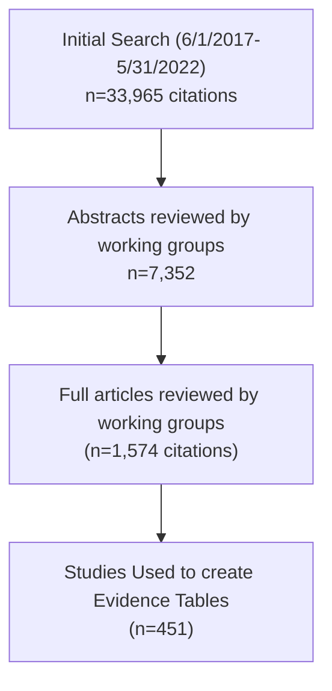

The image shows a presentation slide with a background featuring several antique glass medicine bottles on the left side. The main text is centered on a light blue gradient background.

# Best Practices: Using the Beers Criteria for Safe Prescribing

Dr. Janet P. McMillan, APRN-BC
Psychiatric Nurse Practitioner
Hattiesburg, MS

1

# Medications in the Elderly

> Seniors (those aged **65** years and older) comprise **13.7%** of the US population but uses 40% of all prescription drugs.

> People aged **65-69** years fill an average of **14** prescriptions per year and adults aged **80-84** years average **18** prescriptions per year.

> <mark>Studies show that over **90%** of adults over age 65 take at least one prescription medication, while **more than 66%** take more than three prescriptions a month.</mark>

2

# Why Discuss the Beers Criteria

> The Beers Criteria is a widely accepted evidence based resource for identifying potentially inappropriate medications.

> Many clinicians either feel overwhelmed by the amount of information on the tables or disregard it as not being helpful in making an informed treatment decision.

> We are going to review the purpose and components of the Beers Criteria and provide examples of how it might be helpful in your practice when working with adults over the age of 65.

3

# Introduction to the Beers Criteria

*   The Beers Criteria for Potentially Inappropriate Medication Use in Older Adults is a list of medications that healthcare providers reference to safely prescribe medications for people above age 65.
*   Healthcare providers use the Beers Criteria as a guide **to do no harm.**
*   It has been in use since 1991. The American Geriatrics Society revises this list every three years. The latest revision is 2023
*   You can find this **resource at GeriatricsCareOnline.org.** Search for Beers Criteria. There is an **app called AGS Beers** that also has some resources.

4

# Mark H Beers, MD 1954-2009

The image shows a portrait of Mark H Beers, MD, a man with glasses and a red bow tie, wearing a dark suit. To the left of the portrait is a background image of several antique glass apothecary bottles.

> “A ballet-dancing opera critic who hiked the Alps and took up rowing after diabetes cost him his legs”

* MD, Univ of Vermont
* First med student to do a geriatrics elective at Harvard’s new Division on Aging
* Geriatric Fellowship, Harvard
* Faculty, UCLA/RAND
* Co-editor, Merck Manual of Geriatrics
* Editor in Chief, Merck Manuals

5

# Original Use of the Beers Criteria

* Evaluate inappropriate prescriptions used in nursing home residents in "common" situations, but under "certain circumstances" might be appropriate
* Result of clinical research on use of Potentially Inappropriate medications (PIMs)
* Helped agencies focus on quality improvement initiatives to prescribe safer mediations for the elderly.
* Tool for the education of students, residents, and other health care personnel.

6

# Purpose of the AGS Beers Criteria®

> To identify drugs that are potentially inappropriate in older adults:
> - 1) Independent of diagnosis
> - 2) Considering diagnosis
> - 3) Drug-drug interactions
> - 4) Renal dosage considerations.

> To reduce adverse drug events and drug related problems and improve medication selection and medication use in older adults

> Designed for use in any clinical setting; also used as an educational, quality and research tool

7

The image shows a collection of vintage glass apothecary bottles on the left side of the slide.

# How is the List Updated

* The American Geriatrics Society (AGS) creates the Beers Criteria list by reviewing new medical evidence published since the last revision.
* A panel of experts looks at clinical trials and research studies to revise the last published list.
* During the review process, the AGS panel may add, remove or change medications on the list based on published evidence of the safety of each medication.

8

# Panel Members, Voting Members

* Todd P. Semla, PharmD, MS, BCPG, FCCP, AGSF (Co-Chair)
* Michael Steinman, MD, AGSF (Co-Chair)
* Judith Beizer, PharmD, BCGP, FASCP, AGSF
* Nicole Brandt, PharmD, MBA, BCPP, BCGP, FASCP
* Catherine E. DuBeau, MD
* Donna Fick, PhD, RN, FGSA, AGSF, FAAN
* Nina Flanagan, PhD, GNP-BC, APHM-BC
* Claudene George, MD, MS, RPh
* Holly Holmes, MD, MS, AGSF
* Peter Hollmann, MD, AGSF
* Rosemary Laird, MD, MHSA, AGSF
* Sunny Linnebur, PharmD, FCCP, BCPS, BCGP, FASCP

9

# Assembling the Evidence

SEARCH TERMS: ADE, inappropriate drug use, medication errors, polypharmacy x age/human/English

10

The image shows a collection of vintage glass apothecary bottles on the left side of the slide.

# The Five Sections of the Beers Criteria

1. Medications considered potentially inappropriate for people over the age of 65 (Table 2).
2. Medications to avoid among people with certain health conditions (Table 3).
3. Medications to avoid that cause drug interactions when combined with other medications (Table 5).
4. Medications to avoid due to harmful side effects that outweigh the benefits (Table 4).
5. Medications to use at limited doses or avoided due to their effects on **kidney** function or renal impairment (Table 6).

11

# What Medications are/are not on the List

*   There are **about 100 medications on the list** from almost all categories of medications.
*   Drugs are divided into **categories** and listed with the reason the medication is not recommended as well as why it's not recommended.
*   The list is **not** all inclusive. The list is **not** intended for people in hospice or nearing end of life.
*   The list does **not** contain medications with risks that are not unique for the elderly or medications that are used infrequently.

12

# When Should Providers Use the Beers Criteria?

* The Beers Criteria is evidence-based and a healthcare provider should use the list when treating and prescribing medication to a person who’s over age 65.
* The provider should review the complete medical history, health status and current list of medications and/or supplements the patient is taking to determine if a new or prescribed medication is safe.

The image shows a collection of vintage apothecary bottles on the left and a graphic of a clipboard with three checked boxes on the right.

13

# Key Principles on How To Use the AGS Beers Criteria®

The image shows several antique glass apothecary bottles on the left side of the slide. On the right side, there is a graphic of a magnifying glass over the word "INVESTIGATE" in green capital letters.

*   Medications in the AGS Beers Criteria® are **potentially inappropriate, not definitely inappropriate.**
*   Read the **rationale and recommendations statements.** The caveats and guidance listed are important.
*   **Understand why** medications are included in the AGS Beers Criteria®, and adjust your approach to those medications accordingly.

14

The image shows a slide with a blue gradient background and a decorative border on the left featuring several antique glass apothecary bottles of various shapes, sizes, and colors (clear, green, and amber).

# How Does the Beers Criteria Help?

* The Beers criteria is compiled to help providers make better informed decisions about prescribing medications to patients over the age of 65.
* It is a guideline to identify medications for which the risks of their use may outweigh the benefits.
* The criteria also underscore the need for a team approach to prescribing medications in high risk populations by consulting other providers and pharmacists as well as exploring non-pharmacological options.

15

The image shows a slide with a blue background and a decorative border on the left featuring various antique glass medicine bottles in shades of green, amber, and blue.

# How Not to Use the Beers Criteria

*   The Beers Criteria focuses on a wide population to identify safety risks of prescription medications; therefore, it isn’t person-specific.
*   The Beers Criteria doesn’t take into consideration a person’s general health, all underlying medical conditions or circumstances that may lead a provider to choose a specific medication.
*   It should not be used to supersede clinical judgement and make decisions on behalf of a skilled and experienced healthcare provider.

16

# Can I Prescribe a Medication the List?

* If you choose to prescribe a potentially inappropriate medication on the Beers Criteria, **take into account the overall health** and setting in which the medication is being prescribed.
* If there are no other options to choose another type of medication than one on the Beers Criteria, it is important to closely **monitor the patient during treatment** to make sure the medication is safe and there are no serious side effects.

17

# What’s New to the 2023 Update?

* Removed drugs considered to be low-usage
    - Defined low use as <4000 U.S. Medicare beneficiaries aged 65 years or older receiving the drug in 2020 based on data from Medicare Part D Public Use Files
    - Drugs removed due to low-usage are still considered potentially inappropriate
* An online appendix compiling all drugs removed from all previous AGS Beers Criteria®, accessible via the JAGS article (Table 8).
* Section on deprescribing and helpful resources

18

# AGS Beers Criteria® Tables

* Table 1—Designation of quality of evidence and strength of recommendations
* Table 2 – **PIM** list (with some selective caveats)
* Table 3 – PIMs due to Drug – Disease/Syndrome Interaction
* Table 4 – Medications to be **used with caution**
* Table 5 – Potentially Clinically Important Drug–Drug Interactions
* Table 6 – Medications that should be avoided or have dosage reduced with varying levels of kidney function
* Table 7 – Drugs with strong anticholinergic properties
* Table 8 – Medications Removed since 2019
* Table 9 – Medications Added since 2019
* Table 10 – Medications Moved or Modified since 2019

19

# Table Examples and Abbreviations

> The following slides are examples of the information that can be found in the 2023 Beers Criteria.

> Some Abbreviations used in the tables include:
- PIM = Potentially Inappropriate Medications
- TC = Therapeutic Category
- OcE = Quality of Evidence
- SoR = Strength of Recommendation
- CrCL = Creatinine Clearance

20

# Table 2. Potentially Inappropriate Medications

<table>
  <tbody>
    <tr>
        <td>Organ System or TC or Drug</td>
        <td>Rationale</td>
        <td>Recommend.</td>
        <td>QoE</td>
        <td>SoR</td>
    </tr>
    <tr>
        <th>Aspirin for primary prevention of cardiovascular disease</th>
        <th>Risk of major bleeding from aspirin increases markedly in older age. Studies suggest lack of net benefit and potential for net harm when initiated for primary prevention in older adults. There is less evidence about stopping aspirin among long-term users, although similar principles as for initiation may apply. Note: Aspirin is generally indicated for secondary prevention in older adults with established cardiovascular disease.</th>
        <th>Avoid initiating aspirin for primary prevention of cardiovascular disease. Consider deprescribing aspirin in older adults already taking it for primary prevention.</th>
        <th>High</th>
        <th>Strong</th>
    </tr>
    <tr>
        <th>Antipsychotics (conventional or atypical)</th>
        <th>Increase CVA risk; increased cognitive decline and mortality in dementia</th>
        <th>Avoid unless danger to self/others and non pharm has failed</th>
        <th>Moderate</th>
        <th>Strong</th>
    </tr>
    <tr>
        <th>Benzodiazepines Short and long acting</th>
        <th>Risk cognitive effects and injury (fall/MVA); may be appropriate, eg EtOH withdrawal</th>
        <th>Avoid</th>
        <th>Moderate</th>
        <th>Strong</th>
    </tr>
  </tbody>
</table>

21

# Table 2. Potentially Inappropriate Medications

<table>
<thead>
<tr>
<th>Organ System or TC or Drug</th>
<th>Rationale</th>
<th>Recommendation</th>
<th>QoE</th>
<th>SoR</th>
</tr>
</thead>
<tbody>
<tr>
<td>Sulfonylureas (all, including short- and longer-acting)</td>
<td>Sulfonylureas have a higher risk of cardiovascular events, all-cause mortality, and hypoglycemia than alternative agents. Sulfonylureas may increase the risk of cardiovascular death and ischemic stroke. Long-acting agents (e.g., glyburide, glimepiride) confer higher risk of prolonged hypoglycemia than short-acting agents (e.g., glipizide).</td>
<td>Avoid sulfonylureas as first- or second-line monotherapy or add-on therapy unless there are substantial barriers to use of safer and more effective agents. If a sulfonylurea is used, choose short-acting agents (e.g., glipizide).</td>
<td>Hypoglycemia: High. CV events and all-cause mortality: Moderate. CV death and ischemic stroke: Low</td>
<td>Strong</td>
</tr>
<tr>
<td>Skeletal Muscle Relaxants</td>
<td>Muscle relaxants typically are poorly tolerated by older adults due to anticholinergic adverse effects, sedation, increased risk of fractures; effectiveness at doses tolerated by older adults questionable. Does not apply to skeletal muscle relaxants used for management of spasticity (i.e., baclofen and tizanidine) although these drugs can also cause substantial adverse effects.</td>
<td>Avoid</td>
<td>Moderate</td>
<td>Strong</td>
</tr>
</tbody>
</table>

22

# Table 3. Drug-disease/syndrome Interactions

<table>
  <thead>
    <tr>
        <th>Disease or Syndrome</th>
        <th>Drug</th>
        <th>Rationale</th>
        <th>Recommendation</th>
        <th>QoE</th>
        <th>SoR</th>
    </tr>
  </thead>
  <tbody>
    <tr>
        <td>Delirium</td>
        <td>Anticholinergics Antipsychotics Benzodiazepines Corticosteroids (oral and parenteral) H2-receptor antagonists • Cimetidine • Famotidine • Nizatidine Z-drugs • Eszopiclone • Zaleplon • Zolpidem Opioids</td>
        <td>Avoid in older adults with or at high risk of delirium because of potential of inducing or worsening delirium. Antipsychotics: Corticosteroids Opioids</td>
        <td>Avoid, except in situations listed under rationale statement.</td>
        <td>H2-receptor antagonists – Low.  All others – Moderate</td>
        <td>Strong</td>
    </tr>
  </tbody>
</table>

23

The image shows a collection of vintage apothecary bottles on the left side, including a large brown ribbed bottle, a tall clear bottle, and a small blue bottle with a label.

# Table 4. Use With Caution

* Drugs marked "Use With Caution" do not carry the same weight as the main criteria, i.e., not marked "Avoid"
* Some signal of harm or concern is present, but:
    - the evidence, balance of benefits of harms, and/or clinical applicability is insufficiently strong to merit inclusion in the main criteria, or
    - may not outweigh the drug's potential benefit.

24

# Table 4. Use with Caution

<table>
  <tbody>
    <tr>
        <td>Drug</td>
        <td>Rationale</td>
        <td>Recommendation</td>
        <td>QoE</td>
        <td>SoR</td>
    </tr>
    <tr>
        <th>Dabigatran for long-term treatment of nonvalvular afib or VTE</th>
        <th>Increased risk of GI bleeding compared with warfarin and of GI bleeding and major bleeding compared with apixaban in older adults when used for long term treatment of nonvalvular atrial fibrillation or VTE</th>
        <th>Use caution in selecting dabigatran over other DOACs (e.g., apixaban) for long-term treatment of nonvalvular atrial fibrillation or VTE.</th>
        <th>Moderate</th>
        <th>Strong</th>
    </tr>
    <tr>
        <th>Drugs linked to SIADH/ Hyponatremia (eg SSRI, TCA, CBZ, antipsychotics)</th>
        <th>May exacerbate or cause SIADH/ hyponatremia; monitor sodium level</th>
        <th>Use with caution</th>
        <th>Moderate</th>
        <th>Strong</th>
    </tr>
  </tbody>
</table>

25

## Table 4. Use with Caution

<table>
<thead>
<tr>
<th>Drug</th>
<th>Rationale</th>
<th>Recommendation</th>
<th>QoE</th>
<th>SoR</th>
</tr>
</thead>
<tbody>
<tr>
<td>Ticagrelor</td>
<td>Increase the risk of major bleeding in older adults compared with clopidogrel, especially among those 75 years old and older. However, this risk may be offset by CV benefits in select patients.</td>
<td>Use with caution, particularly in adults 75 years old and older. If prasugrel is used, consider lower dose (5 mg) for those 75 years old and older.</td>
<td>Moderate</td>
<td>Strong</td>
</tr>
<tr>
<td>SGLT2 Inhibitors</td>
<td>Older adults may be at increased risk of: Urogenital infections, particularly women in the 1st month of treatment. Euglycemic DKA</td>
<td>Use with caution. Monitor patients for urogenital infections and ketoacidosis.</td>
<td>Moderate</td>
<td>Weak</td>
</tr>
</tbody>
</table>

26

# Table 5. Drug–Drug Interactions

<table>
<thead>
<tr>
<th>Object Drug and Class Interacting Drug and Class</th>
<th>Risk Rationale</th>
<th>Recommendation</th>
<th>QoE</th>
<th>SoR</th>
</tr>
</thead>
<tbody>
<tr>
<td>Opioids</td>
<td>Benzodiazepines</td>
<td>Increased risk of overdose and adverse events.</td>
<td>Avoid.</td>
<td>Moderate</td>
<td>Strong</td>
</tr>
<tr>
<td>Opioids</td>
<td>Gabapentin Pregabalin</td>
<td>Increased risk of sedation-related adverse events; including respiratory depression and death</td>
<td>Avoid; except when transitioning from opioids, or when using gabapentinoids to reduce opioid dose. Caution should be used in all circumstances.</td>
<td>Moderate</td>
<td>Strong</td>
</tr>
<tr>
<td>Anticholinergic</td>
<td>Anticholinergic</td>
<td>Use of more >1 drug w/ anti-cholinergic properties increases risk of cog. decline, delirium, and falls/fractures.</td>
<td>Avoid, minimize number of anticholinergic drugs (Table 7)</td>
<td>Moderate</td>
<td>Strong</td>
</tr>
</tbody>
</table>

27

# Table 5. Drug–Drug Interactions

<table>
  <tbody>
    <tr>
        <td>Object Drug and Class</td>
        <td>Interacting Drug and Class</td>
        <td>Risk Rationale</td>
        <td>Recommendation</td>
        <td>QoE</td>
        <td>SoR</td>
    </tr>
    <tr>
        <th>Antiepileptics (including gabapentinoids) Antidepressants (TCAs, SSRIs, and SNRIs)  Antipsychotics  Benzodiazepines  Nonbenzodiazepine  benzodiazepine receptor agonist hypnotics (i.e., “Z-drugs”)  Opioids  Skeletal muscle relaxants</th>
        <th>Any combination of 3 of these CNS-active drugs</th>
        <th>Increased risk of falls and of fracture with the concurrent use of 3 CNS-active agents</th>
        <th>Avoid concurrent use of ≥3 CNS-active drugs (among types as listed at left); minimize number of CNS-active drugs.</th>
        <th>High</th>
        <th>Strong</th>
    </tr>
  </tbody>
</table>

28

# Table 6. Medications That Should Be Avoided...Due to Kidney Function

<table>
  <thead>
    <tr>
        <th>Medication Class and Medication</th>
        <th>CrCL, mL/min, at Which Action Required</th>
        <th>Rationale</th>
        <th>Recommendation</th>
        <th>QoE</th>
        <th>SoR</th>
    </tr>
  </thead>
  <tbody>
    <tr>
        <td colspan="6">Central nervous system and analgesics</td>
    </tr>
    <tr>
        <td>Baclofen</td>
        <td>eGFR &lt;60</td>
        <td>Increased risk of encephalopathy requiring hospitalization in older adults with eGFR &lt;60 mL/min or who require chronic dialysis.</td>
        <td>Avoid baclofen in older adults with impaired kidney function (eGFR &lt;60 mL/min). When baclofen cannot be avoided, use the lowest effective dose and monitor for signs of CNS toxicity, including altered mental status.</td>
        <td>Moderate</td>
        <td>Strong</td>
    </tr>
    <tr>
        <td>NSAIDs</td>
        <td>&lt;30</td>
        <td>May increase risk of acute kidney injury and further decline of kidney function.</td>
        <td>Avoid</td>
        <td>Moderate</td>
        <td>Strong</td>
    </tr>
  </tbody>
</table>

29

The image shows a presentation slide with a blue gradient background and a decorative left border featuring several antique glass apothecary bottles of various shapes and colors (clear, green, amber, and blue).

# The Most Common Adverse Effects in the Elderly

> In general, the most common adverse drug effects seen in the elderly population include:
> - Confusion
> - Hallucinations
> - Falls
> - Bleeding

> The most troublesome category of medications associated with at least 3 of these effects are psychotropic medications.

30

# Understanding the Scope of the Problem

* Psychotropic medications are more prevalent among older adults than any other age group.
* **More than half** of older adults who are admitted to nursing homes receive psychotropic medications within two weeks of their admission.
* In fact, in a study of older adults with dementia in nursing homes and psychiatric care geriatric units, researchers found the **87% of patients were taking 1 psychotropic medication, more than 10% were taking 4 or more psychotropic medications.**

31

The image shows a slide with a background featuring several antique glass medicine bottles on the left side.

# What Are Psychotropic Medications?

*   Psychotropic medication is a broad term referring to **medications that affect mental function, behavior, and experience.**
*   These medications are typically administered to older adults to manage symptoms of **anxiety, depression, psychological distress, pain, and/or insomnia.**
*   Some of the most commonly prescribed categories of medications include **anti-anxiety medications (benzodiazepines), antidepressants, analgesics, and antipsychotic medications.**

32

# Benzodiazepines

The image shows a shelf in a pharmacy containing several bottles of Alprazolam Tablets, USP. The bottles are of various sizes and dosages, including 0.5 mg, 1 mg, and 2 mg.

The most prominent bottle in the foreground has the following label information:

<table>
  <tbody>
    <tr>
        <td>NDC 0228-2029-96</td>
        <td rowspan="2">CIV</td>
        <td>0.5 mg</td>
    </tr>
    <tr>
        <td>Alprazolam Tablets, USP</td>
        <td colspan="2">[Image of a round, peach-colored tablet]</td>
    </tr>
    <tr>
        <td>PHARMACIST: Dispense the Medication Guide provided separately to each patient.</td>
        <td colspan="2">1,000 Tablets Rx Only</td>
    </tr>
    <tr>
        <td>M Actavis</td>
        <td colspan="2">[Blue color band at bottom]</td>
    </tr>
  </tbody>
</table>

The side of the label on the 0.5 mg bottle contains the following text:
Each Tablet Contains: Alprazolam... 0.5 mg.
Usual Dosage: See accompanying prescribing information.
Dispense in tight, light-resistant container as defined in the USP.
Keep out of reach of children.
Store at 20° to 25°C (68° to 77°F) [See USP Controlled Room Temperature].
Manufactured by: Watson Pharma Private Limited, Verna, Salcette Goa 403 722 INDIA.
Distributed by: Actavis Pharma, Inc., Parsippany, NJ 07054 USA.
Rev. 08/2015

Another bottle visible on the shelf (2 mg dosage) has the following label information:
<table>
  <tbody>
    <tr>
        <td>ALWAYS DISPENSE WITH MEDICATION GUIDE NDC 59762-3722-3 500 Tablets</td>
        <td rowspan="2">CIV</td>
    </tr>
    <tr>
        <td>alprazolam tablets, USP 2 mg</td>
    </tr>
    <tr>
        <td>GREENSTONE® BRAND</td>
        <td></td>
    </tr>
  </tbody>
</table>

33

# What Does the Beers Criteria Say About BZDs?

* Check Table 2 to see the PIMs for that category—Benzodiazepines.
* The second column gives us the reasons to avoid these medications
* Take each part of the rationale one sentence at a time and determine how you can apply this information to your patient situation.

34

# 1. Using the Information in the Table

> **Rationale to Avoid:** The use of benzodiazepines exposes users to **risks of abuse, misuse, and addiction. Concomitant use of opioids** may result in profound sedation, respiratory depression, coma, and death.
> - If the patient is not well-known to you, you could use a screening instrument such as the Simple Screening Instrument for Alcohol and Other Drugs (SSI-AOD) to determine if there is a risk for potential misuse.
> - Check the medication list to see if the patient has been prescribed any opioids.

> Everything looks good here and does not apply to your patient, so go to the next rationale statement.

35

# 2. Using the Information in the Table

> **Rationale to Avoid: Older adults** have increased sensitivity to benzodiazepines and decreased metabolism of long-acting agents; the continued use of benzodiazepines may lead to **clinically significant physical dependence. In general,** all benzodiazepines increase the risk of cognitive impairment, delirium, falls, fractures, and motor vehicle crashes in older adults.

> This would apply to your patient, so read the next statement and make a determination if this category of medications would be appropriate for your patient.

36

# 3. Using the Information in the Table

*   **Caveat:** May be appropriate for seizure disorders, rapid eye movement sleep behavior disorder, benzodiazepine withdrawal, ethanol withdrawal, severe generalized anxiety disorder, and periprocedural anesthesia.
*   You decide, based on this statement, that your patient has anxiety and could benefit from some intervention—but has never taken benzodiazepines before.
*   The **recommendation** (column 3) is to avoid medications in this category. The **quality of evidence** (column 4) is moderate and the **strength of the recommendation** (column 5) is strong. But you need to treat the patient’s symptoms.
*   Based on this information, we may want to consider another treatment option.

37

# Are Antihistamines OK?

> Often patients may consider OTC medications to help reduce symptoms of anxiety—mainly insomnia.

> These drugs contain diphenhydramine, which is also on the Beers list of medications that should be avoided.

The image shows a box of Tylenol PM Extra Strength. The packaging includes the following text:

**TYLENOL® PM**
Extra Strength
Pain Reliever / Sleep Aid
Acetaminophen, Diphenhydramine HCl
Gelcaps
Non-habit forming
Pull out here
* Helps you sleep
* Relieves your pain
* Non-habit forming
34 Pouches of 2 Gelcaps Each

38

The image shows a slide with a background featuring several antique glass apothecary bottles on the left side.

# Anticholinergic Medications (Beers list)

* **Risk Rationale:** Use of more than one medication with anticholinergic properties increases the risk of cognitive decline, delirium, and falls or fractures.
* **Recommendation:** Avoid; minimize the number of anticholinergic drugs
* **Quality of Evidence** is moderate and the **strength of the recommendation** is strong. So..maybe we need to look for yet another option.

39

# What is the Alternative?

* First of all be sure that the symptom you are treating is indeed anxiety.
* Recognizing and being able to differentiate anxiety from other underlying medical illnesses such as cardiac disorders, endocrine disorders withdrawal from alcohol, caffeine or nicotine can be difficult because patients may exhibit similar symptoms.
* Many elderly patients have undiagnosed depression, which can present with atypical symptoms similar to an anxiety disorder, or patients may have comorbid anxiety and depression.

40

The image shows a collection of vintage glass apothecary bottles on the left side of the slide.

# If A Benzodiazepine Medication is Needed...

*   If the patient **has been taking benzodiazepines** long-term, closely monitor them for cognitive and/or functional decline using screening tools such as the MMSE.
*   Talk to the patient and the family about **deprescribing** the benzodiazepine medication (more about deprescribing later).
*   **Fall risk should be assessed**, as well as symptoms of increasing **tolerance and/or dependence**.

41

# Non-Pharmacological Management of Anxiety

> Non-pharmacological interventions such as activity-based therapies (music, art, dance, drama), reality orientation, reminiscence, validation, and multi sensory stimulation should be explored to ameliorate symptoms of anxiety and insomnia prior to reliance on anxiolytic medications.

> Treatments for generalized anxiety disorder overlap greatly with those for depression.

> Work with the family to help monitor progress and maintain social ties.

42

# Antipsychotic Medications

The image shows several prescription medication bottles for antipsychotic and antidepressant drugs, surrounded by loose pills and capsules.

<table>
  <tbody>
    <tr>
        <td>Bottle Name</td>
        <td>Active Ingredient</td>
        <td>Dosage</td>
        <td>Quantity / Form</td>
        <td>Manufacturer / Details</td>
    </tr>
    <tr>
        <td>Zoloft®</td>
        <td>(sertraline HCl)</td>
        <td>100 mg*</td>
        <td>30 Tablets</td>
        <td>NDC 0049-4910-30 Rx only Pfizer Roerig</td>
    </tr>
    <tr>
        <td>PAXIL®</td>
        <td>PAROXETINE HCl TABLETS</td>
        <td>20mg</td>
        <td>30 Tablets</td>
        <td>NDC 0029-3211-13 GlaxoSmithKline</td>
    </tr>
    <tr>
        <td>ABILIFY®</td>
        <td>(aripiprazole)</td>
        <td>[Not clearly visible]</td>
        <td>30 Tablets</td>
        <td>NDC 59148-008-13 Rx only</td>
    </tr>
    <tr>
        <td>Geodon®</td>
        <td>(ziprasidone HCl)</td>
        <td>80 mg*</td>
        <td>60 Capsules</td>
        <td>NDC 0049-3990-60 Pfizer Roerig</td>
    </tr>
    <tr>
        <td>RISPERDAL®</td>
        <td>(RISPERIDONE) TABLETS</td>
        <td>4 mg</td>
        <td>[Not specified]</td>
        <td>NDC 50458-304-06 Each tablet contains: Risperidone 4mg JANSSEN</td>
    </tr>
    <tr>
        <td>SeroQUEL®</td>
        <td>quetiapine fumarate</td>
        <td>100 mg tablets</td>
        <td>100 tablets</td>
        <td>NDC 0310-0271-10 Rx only AstraZeneca</td>
    </tr>
  </tbody>
</table>

43

The image shows a presentation slide with a background featuring several antique glass medicine bottles on the left side.

# Antipsychotic Medications

* Antipsychotic medications, typically given for psychotic symptoms, are also frequently administered to manage disruptive behavior in older adults with cognitive impairment.
* Antipsychotic medications include both typical and atypical drugs including Haldol, Seroquel, and Risperdal.
* These medications may be contraindicated for certain types of dementia and carry a greater risk of potentially lethal side effects in older adults.

44

# What Beers Recommends About Antipsychotics

* Increased risk of stroke and greater rate of cognitive decline and mortality in persons with dementia. Additional evidence suggests an association of increased risk between antipsychotic medication and mortality independent of dementia.
* Avoid antipsychotics for behavioral problems of dementia or delirium unless documented nonpharmacologic options (e.g., behavioral interventions) have failed and/or the patient is threatening substantial harm to self or others. If used, periodic deprescribing attempts should be considered to assess ongoing need and/or the lowest effective dose.

45

# There are Some Possible Exceptions

* **Rationale:** Avoid, except in FDA-approved indications such as schizophrenia, bipolar disorder, Parkinson Disease psychosis (see Table 3), adjunctive treatment of major depressive disorder, or for short-term use as an antiemetic.
* The **Quality of Evidence** is moderate and the **Strength of the Recommendation** is strong.
* If the patient has a true psychotic disorder (as indicated above), then antipsychotics are the best approach. But use them with caution closely monitor for side effects.

46

# Older Adults Have Greater Risk...

* Antipsychotic medications have serious side effects that can affect quality of life, including tardive dyskinesia, acute extrapyramidal side effects, and neuroleptic malignant syndrome.
* Tardive dyskinesia involves abnormal muscle movements in the face, eyes, mouth, tongue, and limbs and can develop in **30% to 50% of patients**, even at low drug dosages for short periods of time.
* It can last for several years and, in some cases, is irreversible even after the medication has been discontinued.

47

# Extrapyramidal Symptoms (EPS)

* EPS include drug-induced parkinsonism, dystonia, and akathisia. Between 50% and 75% of all patients taking typical antipsychotic drugs experience EPS; however, elderly patients are at higher risk.
* **Parkinsonism and akathisia** consist of lack of or slowed movement, depressed affect, salivation, expressionless face, tremor, and shuffling gait.
* **Dystonia** is characterized by muscle rigidity, contracted neck and eye muscles, and jaw and muscle soreness.
* **Akathisia** is characterized by pacing and restlessness. Increased risk of suicide is associated with akathisia.

48

# Life-Threatening Side Effects

* **Neuroleptic malignant syndrome** involves high fever, rigidity, altered consciousness, and autonomic system instability including unstable hypertension, tachycardia, sweating, pallor.
* NMS can be potentially fatal if not recognized and treated.
* Conditions such as neurological illness, dehydration, malnutrition, exhaustion, agitation, and dementia are considered risk factors that make older adults more vulnerable to the development of neuroleptic malignant syndrome.

49

# Anticholinergic Effects

* Older adults are also more susceptible to the anticholinergic and cardiovascular effects of typical antipsychotic drugs.
* These include dry mouth, constipation, blurred vision, urinary retention, hypotension, and cardiac conduction delay (specifically Q-T prolongation).

## Anticholinergic Toxidrome

The following illustration describes the symptoms of Anticholinergic Toxidrome using common mnemonics:

* **"HOT as a Desert"**: hyperthermia (represented by a bright sun)
* **"Blind as a Bat"**: I can't see! (represented by a bat and an eye with dilated pupils/mydriasis)
* **"Mad as a Hatter"**: confused (represented by the Mad Hatter character)
* **"Dry as a Bone"**: dry mouth, urinary retention (represented by an open mouth and a prohibited symbol over a water drop)
* **"Red as a Beet"**: flushed skin (represented by a beet)
* **Other symptoms shown on the character:**
    * Shaking
    * Grabbing invisible objects (hallucinations)
    * Tachycardia (represented by a heart symbol)
    * Absent bowel sounds (represented by a prohibited symbol over a musical note/sound icon)

KLOSSandBRUCE.com
50

# Atypicals are Only Slightly Better...

* Atypical antipsychotic medications generally produce fewer of the adverse effects commonly associated with the typical antipsychotic medications.
* However, **black box warnings** regarding the use of these medications with older adults due to the cardiac and cerebrovascular risks associated with their use in patients with dementia should be considered.

> **WARNING: INCREASED MORTALITY IN ELDERLY PATIENTS WITH DEMENTIA-RELATED PSYCHOSIS**
> *See full prescribing information for complete boxed warning.*
> **Elderly patients with dementia-related psychosis treated with antipsychotic drugs are at an increased risk of death. RISPERDAL® is not approved for use in patients with dementia-related psychosis. (5.1)**

51

# Use Extreme Caution with Dementia

* Certain antipsychotic medications may be used for behavior management in Alzheimer’s patients, as well as those with other types of dementia.
* However, there are no FDA approved medications for treating behavioral issues associated with Alzheimer’s. In fact, **antipsychotic** medications can precipitate severe reactions and may double or triple the rate of mortality in patients who have **dementia with Lewy bodies**.
* Consider whether the behavior needs treatment AND the type of dementia the patient has before prescribing these meds.

52

# So What are Some Safe Options?

> Nonpharmacological strategies for patients experiencing psychosis to minimize agitation and disruptive behavior include:
* Sensory enhancement (music therapy and aromatherapy)
* Socialization (reminiscence, simulated presence therapy)
* Social support and contact (talking with the person, video or audio types of family members, pet therapy)
* Engaging activities (stimulation, activity and engagement)
* Relief from discomfort (pain, hearing or vision problems, positioning, and addressing activity of daily living needs).

53

The image shows a collection of vintage glass apothecary bottles on the left side of the slide.

# When Antipsychotics are Needed...

*   When prescribed, the patient should be monitored for over-sedation, orthostatic hypotension, unsteadiness, and extrapyramidal symptoms.
*   Use of the AIMS (abnormal involuntary movements scale) is recommended **before treatment at baseline**, at **4** weeks, **8** weeks, and **every 6 months** thereafter.
*   They should be prescribed only when necessary, reviewed regularly for continued need, and discontinued as soon as possible.

54

# Proceed With Caution...

*   The introduction of psychotropic medications in older adults should be done with caution...
*   Start low (1/2 to 1/3 of the usual dose) and go slow.
*   Documentation regarding the reasons for prescribing and continuing psychotropic medications should be a part of the patient's ongoing clinical record.

The image on the left shows several glass apothecary bottles of various sizes and colors (amber, clear, and light green).

The image on the right shows a winding road with the word "SLOW" painted in large white letters on the asphalt. There is a road sign indicating a curve ahead.

55

The image shows a slide with a blue background and a decorative border on the left featuring several antique glass apothecary bottles of various shapes, sizes, and colors (amber, clear, and light green).

# Cover All the Bases

* Documentation should also be present indicating that other potential causes of disruptive behavior, such as delirium, pain, fatigue, hunger, incontinence, and infection, have been explored.
* Close monitoring for side effects and documentation of both pharmacological and non-pharmacological interventions, including their effectiveness, is essential.
* Monitoring for metabolic side effects is also important when prescribing antipsychotic medications.

56

# Pain in Older Adults

The image shows an elderly woman standing in the center, with various types of pain and their prevalence percentages indicated by lines pointing to different parts of her body.

<table>
  <tbody>
    <tr>
        <td>Prevalence</td>
        <td>Pain Type</td>
        <td>Body Area Indicated</td>
    </tr>
    <tr>
        <td>40%</td>
        <td>Musculoskeletal pain</td>
        <td>General upper body area</td>
    </tr>
    <tr>
        <td>65%</td>
        <td>Osteoarthritic neck and back pain</td>
        <td>Neck and lower back</td>
    </tr>
    <tr>
        <td>35%</td>
        <td>Peripheral neuropathic pain (due to diabetes or post-herpetic neuralgia)</td>
        <td>Hands and feet</td>
    </tr>
    <tr>
        <td>15%-25%</td>
        <td>Chronic joint pain</td>
        <td>Elbow and knee</td>
    </tr>
  </tbody>
</table>

57

# Pain in an Issue in Older Adults

* Pain is a common complaint of the elderly. As the number of individuals older than 65 years continues to rise, frailty and chronic diseases associated with pain will likely increase.
* In some settings, the prevalence of pain among older adults may be as high as 80%.
* The elderly are often either untreated or undertreated for pain. The consequences of undertreatment for pain can have a negative impact on the health and quality of life of the elderly, resulting in depression, anxiety, social isolation, cognitive impairment, immobility, and sleep disturbances.

58

The image shows a slide with a background featuring several antique glass apothecary bottles on the left side. The main content area has a blue gradient background with text.

# Challenges with Accurate Pain Assessment

* Pain may present atypically, particularly in the cognitively impaired. Older adults frequently fail to report pain because they may view that it is an expected part of old age.
* Because biologic markers are not available, self-reporting is viewed as the best evidence for the presence of pain and the optimal way to assess pain.
* Pain can be assessed, even in those with dementia, using simple questions and screening tools.

59

The image shows a collection of vintage glass apothecary bottles on the left side against a blue-grey gradient background.

# The Chronic Pain Challenge

> Chronic pain is a complex clinical issue requiring an individualized, multifaceted approach. Contributing to the complexity is the fact that chronic pain is not limited to a particular disease state but rather spans a multitude of conditions, with varied etiologies and presentations.

> Even though adverse drug reactions in the elderly are a significant risk, pharmacologic intervention for pain management is the principal treatment modality for pain.

60

# What Beers Says About Opioids

> **Rationale:** Emerging data highlights an association between opioid administration and delirium. For older adults with pain, use a balanced approach, including the use of validated pain assessment tools and multimodal strategies that include nondrug approaches to minimize opioid use.

> When combined with other CNS-active medications, opioids should be avoided except for pain management in the setting of severe acute pain.

> The **Quality of Evidence** is moderate and the **Strength of Recommendation** is strong.

61

# What Does the Evidence Tell Us?

> In a report released in 2014 by the NIH, there was no evidence to support the long-term use of opioids in the management of chronic non-cancer pain.

> In fact, when a variety of studies were reviewed, different opioids were studied, there was no difference in the efficacy of any of the opioid pain relievers for chronic pain.

> Despite being "managed" with around-the-clock dosages of opioid pain medications, patients still reported significant negative impact on daily life functioning.

62

# So What is the Best Approach?

> The NIH Report calls for better assessment of the type of pain being experienced by the pain so that interventions can be individually tailored to the patient’s needs.

> Use an interdisciplinary team approach to address the needs of the patient and the family to help manage other issues that result from year of undertreated chronic pain.

> Prescribe medications, other than opioids, to manage pain needs including certain antidepressants and anticonvulsants.

> Deprescribe opioids currently being administered to “manage” chronic pain.

63

# But If Opioids are Needed...

* After all the other possibilities for pain have been rules out and other non-pharmacologic measures to reduce pain have been attempted, using opioids short-term may be indicated.
* You can screen for the potential for misuse by using something like the Opioid Risk Tool prior to initiating opioid therapy. The ORT can be administered and scored in less than 1 minute and has been validated in both male and female patients.
* A score of 3 or lower indicates low risk; 4 to 7 indicates moderate risk; and 8 or higher indicates a high risk for opioid abuse

64

The image shows a slide with a blue gradient background and a decorative image on the left side featuring several antique glass apothecary bottles of various shapes, sizes, and colors (clear, green, and amber).

# Start Low and Go Slow (Again...)

*   The general approach should be to start with nonopioid medications for treating patients with mild pain, advancing to opioids for those with moderate to severe pain.
*   The selection of the agent should be determined by targeting the underlying pathophysiology if possible. For example, if pain is due primarily to inflammation, an anti-inflammatory agent should be given. However, if pain is predominantly neuropathic, an anticonvulsant might be used.
*   At times, combinations of analgesics may be required.

65

The image shows a collection of vintage glass apothecary bottles on the left side of the slide.

# Alternatives to Opioids for Pain Management

* Most mild or moderate pain is of musculoskeletal origin and responds well to acetaminophen given around-the-clock provided that both renal and hepatic functions are normal.
* Long-term use of NSAIDs, when combined with proton-pump inhibitors, may also be an effective option in many patients.
* Because of their association with a lower incidence of gastrointestinal bleeding, selective COX-2 inhibitors have been viewed as a safer alternative to the other NSAIDs; however, recent concern about their association with heart disease and stroke has dampened their acceptance.

66

# Reducing Medication Burden

* If the patient has medications that have been identified as potentially inappropriate, another aspect of responsible prescribing is deprescribing.
* Deprescribing involves a collaborative effort with you, the prescriber/deprescriber, the patient, and the family.
* The goal of deprescribing is to support evidence-based care and improve/maintain the well-being and quality of life for our patients.

67

The image shows a collection of vintage apothecary bottles on the left side, including a tall clear glass bottle, a brown ribbed glass bottle, and a small blue bottle with a cork.

# What is Deprescribing

* Deprescribing is the planned and supervised process of dose reduction or stopping a medication that might be causing harm, or no longer be of benefit.
* Deprescribing is part of good prescribing – backing off when doses are too high, or stopping medications that are no longer needed and decisions are based on both clinical and empirical knowledge and not just convenience.
* For more information go to deprescribing.org. This website houses and contains links to useful <u>resources</u>, including guidelines and plain language information for patients.

68

The image shows a slide with a background featuring several antique glass medicine bottles on the left side. The main content area has a light blue gradient background with text.

# Why Deprescribing May be a Good Idea

> The use of some medication, especially as people get older or more ill, can cause more harm than good.

> Optimizing medication through targeted deprescribing is a vital part of managing chronic conditions, avoiding adverse effects, and improving outcomes.

> The goal of deprescribing is to reduce medication burden and maintain or improve quality of life.

69

The image shows a presentation slide with a background featuring several antique glass apothecary bottles on the left side.

# Challenges of Deprescribing

* Communication gaps & misunderstandings
* Patient reluctance/fear of stopping,
* Coordination among clinicians,
* Reluctance to stop a medication prescribed by another provider
* Dosage tapering
* Withdrawal symptoms
* Conveying stop orders to pharmacies

70

The image shows a collection of vintage apothecary bottles on the left side of the frame.

# Pearls for Geriatric Prescribing

> Always investigate new symptoms to determine the root cause. It could be a manifestation of a serious problem or an adverse drug reaction.

> Determine if a medication is really needed. Sometimes a non-pharmacologic approach will work.

> Prescribe the lowest effective dose for the shortest period of time.

> Review medications at each visit and don’t forget herbals, vitamins, and other supplements.

71

# General Take Home Pearls

* Don’t let “the perfect” be the enemy of “the good”—you may not find the perfect medication; just one that is safe and effective.
* The AGS Beers Criteria® is only part of appropriate prescribing—clinical judgment and expertise are the most important
* Target initiatives to high prevalence/high severity meds—understand prescribing practices/challenges in your area
* Shared decision-making in selecting and changing treatment regimens is critical—consult pharmacists and other professionals.
* Stopping meds should be done with same consideration as starting
* AGS Beers Criteria® = Patient-centered care

72

The image shows a meme featuring a skeptical-looking baby with a furrowed brow. The background of the meme shows a dinosaur skeleton. To the left of the meme, there is a decorative border featuring several vintage glass bottles of various shapes, sizes, and colors (amber, clear, and blue).

**PRESENTATION FINISHED**

**...ANY QUESTIONS?**

makeameme.org

73