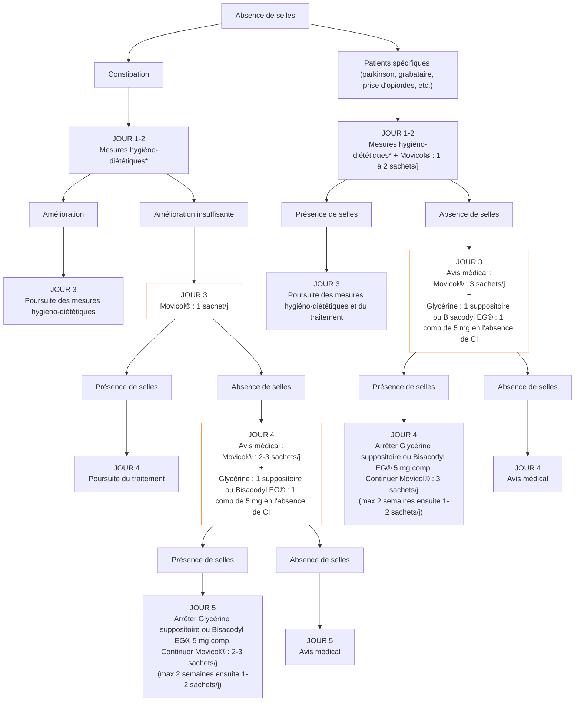
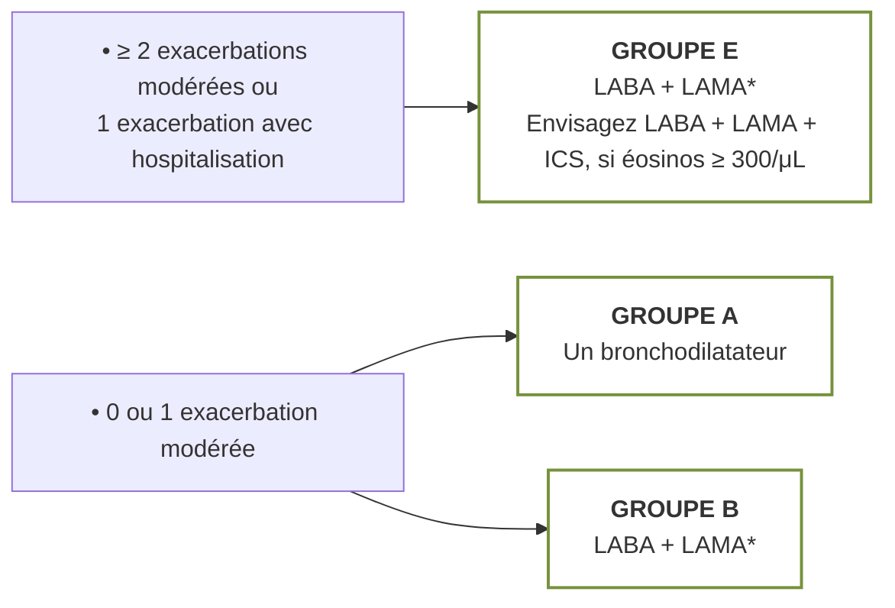
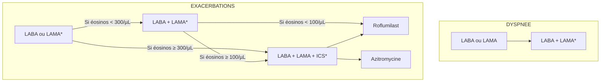
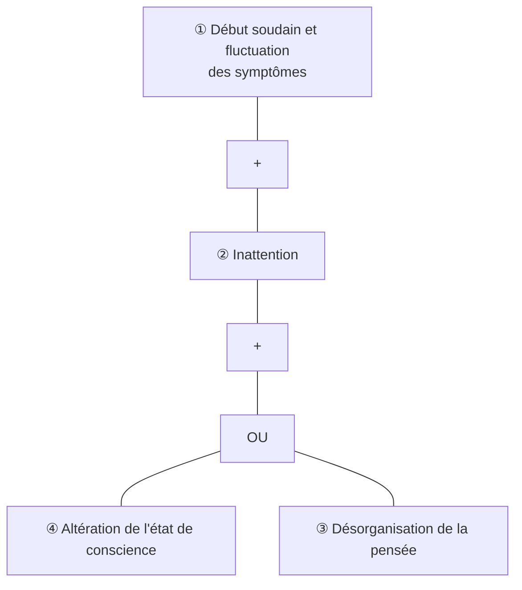
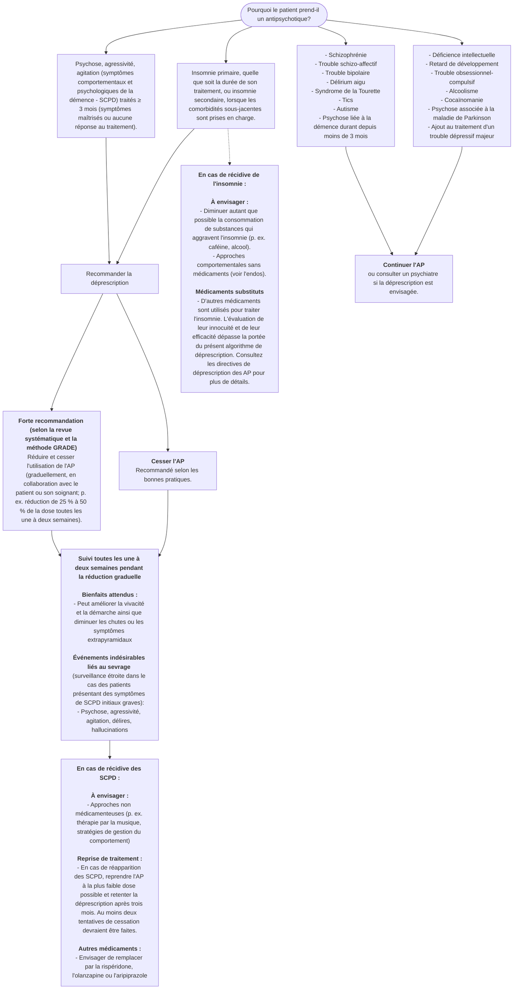
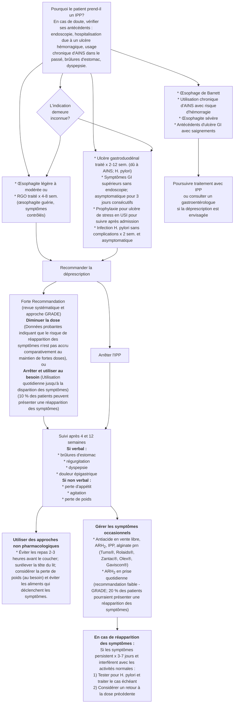

```mermaid
graph TD
    Start[<b>Pourquoi le patient prend-il un BZRA?</b><br/>En cas de doute, vérifier ses antécédents: anxiété, consultations antérieures en psychiatrie, amorcé en milieu hospitalier<br/>pour traiter un trouble du sommeil, ou une réaction de deuil.]
    
    Start --> Group1["* Insomnie seule OU insomnie avec gestion de comorbidités sous-jacentes<br/><b>Pour ceux dont l'âge ≥ 65 ans :</b> prise de BZRA, indépendamment de la durée (éviter comme traitement de première<br/>ligne chez les personnes âgées)<br/><b>Entre 18-64 ans :</b> prise de BZRA > 4 semaines"]
    
    Start --> Group2["* Autres problèmes de sommeil (p. ex. syndrome des jambes<br/>sans repos)<br/>* Anxiété non gérée, dépression, problème de santé physique<br/>ou mentale qui pourrait causer ou aggraver l'insomnie<br/>* Benzodiazépines spécifiquement efficaces contre l'anxiété<br/>* Sevrage alcoolique"]

    Group1 --> Impliquer["<b>Impliquer les patients</b> (Discuter avec eux des risques potentiels, avantages, plan de sevrage,<br/>symptômes et durée)"]
    
    Impliquer --> Recommander["# Recommander la déprescription"]
    
    Recommander --> Reduire["## Réduire les doses puis cesser la prise du BZRA<br/>(Réduire graduellement les doses en collaboration avec le patient; p.ex. ~25 % à chaque quinzaine et, si possible,<br/>12,5 % de réduction vers la fin et/ou planification de jours sans médicament)<br/>* <b>Patients âgés de plus de 65 ans</b> (forte recommandation selon une revue systématique et approche GRADE)<br/>* <b>Patients âgés entre 18-64 ans</b> (recommandation faible selon une revue systématique et approche GRADE)<br/>* Offrir des conseils sur les comportements liés au sommeil; envisager la TCC, si disponible<br/>(voir au verso)"]
    
    Reduire --> Suivi["## Suivi toutes les 1-2 semaines pendant la réduction<br/>## des doses<br/><b>Bienfaits attendus</b><br/>* Peut améliorer la vigilance et la cognition; peut diminuer la sédation diurne et les chutes<br/><b>Symptômes de sevrage</b><br/>* Insomnie, anxiété, irritabilité, sudation, symptômes gastro-intestinaux<br/>(tous sont habituellement légers et durent de quelques jours à quelques semaines)"]

    Group2 --> Continuer["## Continuer BZRA<br/>* Minimiser l'utilisation de substances qui<br/>aggravent l'insomnie (caféine, alcool, etc.)<br/>* Traiter les troubles sous-jacents<br/>* Envisager la consultation d'un psychologue,<br/>psychiatre, spécialiste du sommeil"]

    Suivi --> Approches["Utiliser des<br/>approches non<br/>pharmacologiques<br/>pour gérer l'insomnie<br/><br/>Utiliser des<br/>approches<br/>comportementales<br/>et/ou TCC (voir au<br/>verso)"]
    
    Approches --> Reapparition["<b>En cas de réapparition des symptômes :</b><br/><b>Envisager</b><br/>* Maintien de la dose de BZRA actuelle pour 1-2 semaines,<br/>puis reprendre la réduction des doses très graduellement<br/><b>Autres médicaments</b><br/>* D'autres médicaments peuvent être utilisés pour gérer<br/>l'insomnie. L'évaluation de leur innocuité et efficacité<br/>dépasse le cadre du présent algorithme.<br/>Pour de plus amples renseignements, consulter les lignes<br/>directrices pour la déprescription de BZRA."]
```

<table>
  <tbody>
    <tr>
        <td>H.U.B</td>
        <td>HÔPITAL UNIVERSITAIRE DE BRUXELLES ACADEMISCH ZIEKENHUIS BRUSSEL</td>
        <td>INSTITUT JULES BORDET INSTITUUT Hôpital Erasme H ULB Hôpital Universitaire des Enfants Reine Fabiola Universitair Kinderziekenhuis Koningin Fabiola</td>
    </tr>
  </tbody>
</table>

# Les critères STOPP/START

## Outil d’aide à la détection de la prescription médicamenteuse inappropriée chez la personne âgée de 65 ans ou plus

### 2024

<table>
  <thead>
    <tr>
        <th>Personnes de contact</th>
        <th>BIP</th>
    </tr>
  </thead>
  <tbody>
    <tr>
        <td>Hotline Gériatrie *(disponible les jours ouvrables de 8h30 à 18h)*</td>
        <td>02/5558983</td>
    </tr>
    <tr>
        <td>Pharmacie</td>
        <td>02/5553911</td>
    </tr>
  </tbody>
</table>

2

> **Les recommandations reprises dans ce guide ont été élaborées à partir de l’article « STOPP/START criteria for potentially inappropriate prescribing in older people: version 3 », puis adaptées par des médecins et des pharmaciens de l’Hôpital Universitaire de Bruxelles à destination des prestataires de soins hospitaliers. L’exploitation de ces données dans d’autres centres est de la responsabilité du médecin prescripteur.**

Denis O’Mahony *et al.*, STOPP/START criteria for potentially inappropriate prescribing in older people: version 3.
European Geriatric Medicine, 2023; 14, 625–632.
doi 10.1007/s41999-023-00777-y.

3

# Table des matières

<table>
  <tbody>
    <tr>
        <td>Abréviations</td>
        <td>6</td>
        <td></td>
    </tr>
    <tr>
        <td>**Liste des critères STOPP**</td>
        <td>9</td>
        <td></td>
    </tr>
    <tr>
        <td>*</td>
        <td>Système cardiovasculaire</td>
        <td>10</td>
    </tr>
    <tr>
        <td>*</td>
        <td>Système digestif</td>
        <td>14</td>
    </tr>
    <tr>
        <td>*</td>
        <td>Système endocrinien</td>
        <td>15</td>
    </tr>
    <tr>
        <td>*</td>
        <td>Système musculo-squelettique</td>
        <td>16</td>
    </tr>
    <tr>
        <td>*</td>
        <td>Système nerveux central et psychotropes</td>
        <td>18</td>
    </tr>
    <tr>
        <td>*</td>
        <td>Système respiratoire</td>
        <td>22</td>
    </tr>
    <tr>
        <td>*</td>
        <td>Système urinaire</td>
        <td>23</td>
    </tr>
    <tr>
        <td>*</td>
        <td>Fonction rénale et prescriptions</td>
        <td>24</td>
    </tr>
    <tr>
        <td>*</td>
        <td>Médicaments augmentant le risque de chute</td>
        <td>25</td>
    </tr>
    <tr>
        <td>*</td>
        <td>Médicaments antalgiques</td>
        <td>26</td>
    </tr>
    <tr>
        <td>**Liste des critères START**</td>
        <td>27</td>
        <td></td>
    </tr>
    <tr>
        <td>*</td>
        <td>Système cardiovasculaire</td>
        <td>28</td>
    </tr>
    <tr>
        <td>*</td>
        <td>Système digestif</td>
        <td>30</td>
    </tr>
  </tbody>
</table>

4

# Table des matières

<table>
  <tbody>
    <tr>
        <td>*Recommandations pour la prise en charge de la constipation dans le service de Gériatrie*</td>
        <td>32</td>
        <td></td>
    </tr>
    <tr>
        <td>Système endocrinien - rénal</td>
        <td>33</td>
        <td></td>
    </tr>
    <tr>
        <td>Système musculo-squelettique</td>
        <td>34</td>
        <td></td>
    </tr>
    <tr>
        <td>Système nerveux central</td>
        <td>35</td>
        <td></td>
    </tr>
    <tr>
        <td>Système respiratoire</td>
        <td>36</td>
        <td></td>
    </tr>
    <tr>
        <td>*Initier un traitement*</td>
        <td>37</td>
        <td></td>
    </tr>
    <tr>
        <td>*Poursuivre un traitement : critères GOLD 2023*</td>
        <td>38</td>
        <td></td>
    </tr>
    <tr>
        <td>Système urogénital</td>
        <td>39</td>
        <td></td>
    </tr>
    <tr>
        <td>Vaccinations</td>
        <td>40</td>
        <td></td>
    </tr>
    <tr>
        <td>Antalgiques</td>
        <td>41</td>
        <td></td>
    </tr>
    <tr>
        <td></td>
        <td>*Algorithme décisionnel de la douleur nociceptive*</td>
        <td>42</td>
    </tr>
    <tr>
        <td>**Annexe :** Les β-bloquants</td>
        <td>44</td>
        <td></td>
    </tr>
    <tr>
        <td>**Annexe :** Recommandations de prise en charge du delirium</td>
        <td>45</td>
        <td></td>
    </tr>
    <tr>
        <td>**Annexe :** Passage d’un analgésique à un autre</td>
        <td>47</td>
        <td></td>
    </tr>
    <tr>
        <td>**Annexe :** Algorithmes pour la déprescription</td>
        <td>48</td>
        <td></td>
    </tr>
  </tbody>
</table>

5

# Abréviations

<table>
  <tbody>
    <tr>
        <td>**AINS**</td>
        <td>anti-inflammatoire non stéroïdien</td>
    </tr>
    <tr>
        <td>**ARA II**</td>
        <td>antagoniste des récepteurs de l’angiotensine II</td>
    </tr>
    <tr>
        <td>**AV**</td>
        <td>atrio-ventriculaire</td>
    </tr>
    <tr>
        <td>**AVC**</td>
        <td>accident vasculaire cérébral</td>
    </tr>
    <tr>
        <td>**AVK**</td>
        <td>anti-vitamine K</td>
    </tr>
    <tr>
        <td>**CI**</td>
        <td>contre-indication</td>
    </tr>
    <tr>
        <td>**HFpEF**</td>
        <td>insuffisance cardiaque à fraction d'éjection préservée</td>
    </tr>
    <tr>
        <td>**HFrEF**</td>
        <td>insuffisance cardiaque à fraction d'éjection altérée</td>
    </tr>
    <tr>
        <td>**HPB**</td>
        <td>hypertrophie bénigne de la prostate</td>
    </tr>
    <tr>
        <td>**HTA**</td>
        <td>hypertension artérielle</td>
    </tr>
    <tr>
        <td>**IDT**</td>
        <td>inhibiteur direct de la thrombine</td>
    </tr>
    <tr>
        <td>**IEC**</td>
        <td>inhibiteur de l’enzyme de conversion</td>
    </tr>
    <tr>
        <td>**IFXa**</td>
        <td>inhibiteur du facteur Xa</td>
    </tr>
    <tr>
        <td>**IPP**</td>
        <td>inhibiteur de la pompe à protons</td>
    </tr>
    <tr>
        <td>**IR**</td>
        <td>insuffisance rénale</td>
    </tr>
    <tr>
        <td>**ISRS**</td>
        <td>inhibiteur sélectif de recapture de la sérotonine</td>
    </tr>
    <tr>
        <td>**PDE-5**</td>
        <td>5-phosphodiestérase</td>
    </tr>
    <tr>
        <td>**OMI**</td>
        <td>œdème des membres inférieurs</td>
    </tr>
    <tr>
        <td>**SNG**</td>
        <td>sonde naso-gastrique</td>
    </tr>
    <tr>
        <td>**TAd**</td>
        <td>tension artérielle diastolique</td>
    </tr>
    <tr>
        <td>**TAs**</td>
        <td>tension artérielle systolique</td>
    </tr>
    <tr>
        <td>**TVP**</td>
        <td>thrombose veineuse profonde</td>
    </tr>
    <tr>
        <td>**VEMS**</td>
        <td>volume expiratoire maximale par seconde</td>
    </tr>
  </tbody>
</table>

6

# Introduction

L’application des critères STOPP/START permet de détecter la prescription médicamenteuse potentiellement inappropriée chez les personnes de 65 ans ou plus.

**Cet outil est une aide à la prescription et ne remplace en rien l’expertise du clinicien.**

N’hésitez pas à contacter un gériatre : (02/55)58983

7

<table>
    <tr>
        <td>**STOP**</td>
        <td>La prise de ces médicaments est potentiellement inappropriée chez les $\ge$ 65 ans dans les circonstances décrites.</td>
    </tr>
    <tr>
        <td>**START**</td>
        <td>Les traitements médicamenteux proposés doivent être envisagés lorsqu'ils sont omis sans justification clinique valide chez les $\ge$ 65 ans.</td>
    </tr>
</table>> Seuls les principes actifs disponibles au formulaire thérapeutique de l'hôpital Erasme à l'édition actuelle sont cités dans ce carnet.
> Liste non exhaustive des principes actifs.

8

# Liste des critères STOPP (Screening Tool of Older Person’s Prescriptions)

<table>
  <thead>
    <tr>
        <th>Circonstances</th>
        <th>Prescription potentiellement inappropriée chez les ≥ 65 ans</th>
    </tr>
  </thead>
  <tbody>
    <tr>
        <td>Indication de prescription</td>
        <td>STOP Si un médicament est sans indication clinique valable ou durée trop longue ou doublon</td>
    </tr>
    <tr>
        <td>Médicament à effet anticholinergique</td>
        <td>STOP Si ≥ 2 médicaments à effet anticholinergique sont prescrits</td>
    </tr>
  </tbody>
</table>
<table>
  <tbody>
    <tr>
        <td>Limited data so unable to score</td>
        <td colspan="2">Drugs with AEC score of 0</td>
        <td>Drugs with AEC score of 1</td>
        <td>Drugs with AEC score of 2</td>
        <td>Drugs with AEC score of 3</td>
        <td></td>
    </tr>
    <tr>
        <td>Alendronic Acid</td>
        <td>Rivaroxaban</td>
        <td>Alprazolam</td>
        <td>Lovastatin</td>
        <td>Amiodarone</td>
        <td>Chlorphenamine</td>
        <td>Amitriptyline</td>
    </tr>
    <tr>
        <td>Allopurinol</td>
        <td>Rosuvastatin</td>
        <td>Amlodipine</td>
        <td>Meloxicam</td>
        <td>Aripiprazole</td>
        <td>Dimenhydrinate</td>
        <td>Atropine</td>
    </tr>
    <tr>
        <td>Anastrozole</td>
        <td>Spironolactone</td>
        <td>Amoxycillin</td>
        <td>Metoclopramide</td>
        <td>Bromocriptine</td>
        <td>Diphenhydramine</td>
        <td>Clomipramine</td>
    </tr>
    <tr>
        <td>Apixaban</td>
        <td>Tamoxifen</td>
        <td>Aspirin</td>
        <td>Metoprolol</td>
        <td>Carbamazepine</td>
        <td>Disopyramide</td>
        <td>Clozapine</td>
    </tr>
    <tr>
        <td>Baclofen</td>
        <td>Topiramate</td>
        <td>Atenolol</td>
        <td>Moclobemide</td>
        <td>Citalopram</td>
        <td>Levomepromazine (methotrimeprazine)</td>
        <td>Hyoscine hydrobromide</td>
    </tr>
    <tr>
        <td>Bisoprolol</td>
        <td>Tizanidine</td>
        <td>Atorvastatin</td>
        <td>Morphine</td>
        <td>Diazepam</td>
        <td>Olanzapine</td>
        <td>Imipramine</td>
    </tr>
    <tr>
        <td>Bumetanide</td>
        <td>Verapamil</td>
        <td>Buproprion</td>
        <td>Naproxen</td>
        <td>Domperidone</td>
        <td>Paroxetine</td>
        <td>Nortriptyline</td>
    </tr>
    <tr>
        <td>Captopril</td>
        <td>Zopiclone</td>
        <td>Cetirizine</td>
        <td>Omeprazole</td>
        <td>Fentanyl</td>
        <td>Pethidine</td>
        <td>Oxybutynin</td>
    </tr>
    <tr>
        <td>Carvedilol</td>
        <td></td>
        <td>Ciprofloxacin</td>
        <td>Paracetamol</td>
        <td>Fluoxetine</td>
        <td>Pimozide</td>
        <td>Procyclidine</td>
    </tr>
    <tr>
        <td>Chlortalidone</td>
        <td></td>
        <td>Clopidogrel</td>
        <td>Pantoprazole</td>
        <td>Hydroxyzine</td>
        <td>Quetiapine</td>
        <td>Promethazine</td>
    </tr>
    <tr>
        <td>Clarithromycin</td>
        <td></td>
        <td>Darifenacin</td>
        <td>Pravastatin</td>
        <td>Iloperidone</td>
        <td>Tolterodine</td>
        <td>Trihexyphenidryl (benzhexol)</td>
    </tr>
    <tr>
        <td>Clonazepam</td>
        <td></td>
        <td>Diclofenac</td>
        <td>Propranolol</td>
        <td>Lithium</td>
        <td></td>
        <td></td>
    </tr>
    <tr>
        <td>Codeine</td>
        <td></td>
        <td>Diltiazem</td>
        <td>Rabeprazole</td>
        <td>Mirtazapine</td>
        <td></td>
        <td></td>
    </tr>
    <tr>
        <td>Colchicine</td>
        <td></td>
        <td>Enalapril</td>
        <td>Ranitidine</td>
        <td>Prednisolone</td>
        <td></td>
        <td></td>
    </tr>
    <tr>
        <td>Dabigatran</td>
        <td></td>
        <td>Entacapone</td>
        <td>Risperidone</td>
        <td>Quinidine</td>
        <td></td>
        <td></td>
    </tr>
    <tr>
        <td>Dexamethasone</td>
        <td></td>
        <td>Fexofenadine</td>
        <td>Simvastatin</td>
        <td>Sertindole</td>
        <td></td>
        <td></td>
    </tr>
    <tr>
        <td>Digoxin</td>
        <td></td>
        <td>Fluvoxamine</td>
        <td>Theophylline</td>
        <td>Sertraline</td>
        <td></td>
        <td></td>
    </tr>
    <tr>
        <td>Erythromycin</td>
        <td></td>
        <td>Furosemide</td>
        <td>Thyroxine</td>
        <td>Solifenacin</td>
        <td></td>
        <td></td>
    </tr>
    <tr>
        <td>Flavoxate*</td>
        <td></td>
        <td>Gabapentin</td>
        <td>Tramadol</td>
        <td></td>
        <td></td>
        <td></td>
    </tr>
    <tr>
        <td>Irbesartan</td>
        <td></td>
        <td>Gliclazide</td>
        <td>Trazodone</td>
        <td></td>
        <td></td>
        <td></td>
    </tr>
    <tr>
        <td>Lansoprazole</td>
        <td></td>
        <td>Haloperidol</td>
        <td>Trimethoprim</td>
        <td></td>
        <td></td>
        <td></td>
    </tr>
    <tr>
        <td>Levetiracetam</td>
        <td></td>
        <td>Ibuprofen</td>
        <td>Venlafaxine</td>
        <td></td>
        <td></td>
        <td></td>
    </tr>
    <tr>
        <td>Metformin</td>
        <td></td>
        <td>Ketorolac</td>
        <td>Valproate</td>
        <td></td>
        <td></td>
        <td></td>
    </tr>
    <tr>
        <td>Methotrexate</td>
        <td></td>
        <td>Lamotrigine</td>
        <td>Warfarin</td>
        <td></td>
        <td></td>
        <td></td>
    </tr>
    <tr>
        <td>Nitrofurantoin</td>
        <td></td>
        <td>Levadopa</td>
        <td>Zolpidem</td>
        <td></td>
        <td></td>
        <td></td>
    </tr>
    <tr>
        <td>Oxcarbazepine</td>
        <td></td>
        <td>Lisinopril</td>
        <td></td>
        <td></td>
        <td></td>
        <td></td>
    </tr>
    <tr>
        <td>Oxycodone</td>
        <td></td>
        <td>Loperamide</td>
        <td></td>
        <td></td>
        <td></td>
        <td></td>
    </tr>
    <tr>
        <td>Phenytoin</td>
        <td></td>
        <td>Loratadine</td>
        <td></td>
        <td></td>
        <td></td>
        <td></td>
    </tr>
    <tr>
        <td>Pregabalin</td>
        <td></td>
        <td>Lorazepam</td>
        <td></td>
        <td></td>
        <td></td>
        <td></td>
    </tr>
    <tr>
        <td>Ramipril</td>
        <td></td>
        <td>Losartan</td>
        <td colspan="4"></td>
    </tr>
  </tbody>
</table>

*   🔴 **3 - retrait et surveillance ou échange**
*   🟠 **2 - retrait et surveillance ou échange**
*   🟡 **1 - usage prudent**
*   🟢 **0 - utilisation sûre**

> Calculateur de score anticholinergique : medichec

\*These drugs have confirmed anticholinergic activity but the extent and clinical significance of this is unknown

Bishara D. et al., Anticholinergic effect on cognition (AEC) of drugs commonly used in older people, Int J Geriatr Psychiatry, 2017;32: 650–656. 10.1002/gps.4507
9

# Système cardiovasculaire

<table>
  <thead>
    <tr>
        <th>Médicament</th>
        <th>Prescription potentiellement inappropriée chez les ≥ 65 ans</th>
    </tr>
  </thead>
  <tbody>
    <tr>
        <td>Amiodarone</td>
        <td>STOP Si en 1ère intention pour une tachycardie supra-ventriculaire</td>
    </tr>
    <tr>
        <td>Antagoniste de l'aldostérone (spironolactone)</td>
        <td>STOP Si associé aux IEC ou ARA II ou amiloride en l'absence d'une surveillance de la kaliémie (≤6 mois), risque d'hyperkaliémie sévère</td>
    </tr>
    <tr>
        <td>Antihypertenseur à action centrale (méthyldopa, clonidine, moxonidine)</td>
        <td>STOP Sauf si intolérance ou inefficacité des autres classes d'antihypertenseurs</td>
    </tr>
    <tr>
        <td rowspan="5">β- bloquant</td>
        <td>STOP Si associé au vérapamil ou au diltiazem</td>
    </tr>
    <tr>
        <td>STOP Si bradycardie (&lt; 50 bpm), bloc AV du 2ème ou 3ème degré</td>
    </tr>
    <tr>
        <td>STOP Si asthme traité par un bronchodilatateur **sauf** si β-bloquant cardiosélectif par voie orale ou locale *(bisoprolol, esmolol, métoprolol, nébivolol) (cf. p 44)*</td>
    </tr>
    <tr>
        <td>STOP Si diabète avec fréquents épisodes hypoglycémiques</td>
    </tr>
    <tr>
        <td>STOP Si monothérapie pour une HTA non compliquée</td>
    </tr>
  </tbody>
</table>

10

<table>
  <tbody>
    <tr>
        <td>Médicament</td>
        <td>Prescription potentiellement inappropriée chez les ≥ 65 ans</td>
    </tr>
    <tr>
        <td>Digoxine</td>
        <td>STOP Si décompensation d’insuffisance cardiaque avec HFpEF conservée STOP Si bradycardie (&lt; 50 bpm), bloc AV du 2ème ou 3ème degré STOP Si en 1ère intention &gt; 3 mois en *rate control* d’une FA</td>
    </tr>
    <tr>
        <td>Diurétique de l’anse (furosémide)</td>
        <td>STOP Si en 1ère intention pour une HTA STOP Si HTA en présence d’une incontinence urinaire STOP Si OMI d’origine périphérique *(&lt;span style="color:red"&gt;sauf&lt;/span&gt; si insuffisance cardiaque, hépatique, rénale ou syndrome néphrotique : préférer bas de contention et élévation des jambes)*</td>
    </tr>
    <tr>
        <td>Diurétique thiazidique ou apparenté (indapamide)</td>
        <td>STOP Si troubles électrolytiques : K+ &lt; 3,0 mmol/L, Na+ &lt; 130 mmol/L, Ca2+ corrigé &gt; 2,65 mmol/L STOP Si arthrite microcristalline (goutte)</td>
    </tr>
    <tr>
        <td>IEC ou ARA II (captopril, lisinopril, périndopril ou candésartan, losartan, telmisartan)</td>
        <td>STOP Si antécédent d’hyperkaliémie (K+ &gt; 5.5 mmol/l) STOP Si hypotension orthostatique persistante</td>
    </tr>
    <tr>
        <td>Inhibiteur PDE-5 (sildénafil, tadalafil)</td>
        <td>STOP Si décompensation cardiaque sévère avec hypotension *(TAs &lt; 90 mmHg)* STOP Si angor traité par des dérivés nitrés</td>
    </tr>
    <tr>
        <td>Vérapamil/diltiazem</td>
        <td>STOP Si décompensation cardiaque de classe III ou IV *(péjoration possible d’une HFrEF)* STOP Si bradycardie (&lt; 50 bpm), bloc AV du 2ème ou 3ème degré</td>
    </tr>
  </tbody>
</table>

11

# Système cardiovasculaire

<table>
  <tbody>
    <tr>
        <td>Médicament</td>
        <td>Prescription potentiellement inappropriée chez les ≥ 65 ans</td>
    </tr>
    <tr>
        <td>Antiagrégant plaquettaire (aspirine, clopidogrel, dipyridamole)</td>
        <td>STOP Si risque hémorragique significatif *(HTA sévère non contrôlée, diathèse hémorragique ou récent épisode de saignement spontané important)*</td>
    </tr>
    <tr>
        <td></td>
        <td>STOP Si associé à un anticoagulant oral *(AVK, IDT ou IFXa)* pour une artériopathie stable *(coronarienne, cérébro-vasculaire ou périphérique)*</td>
    </tr>
    <tr>
        <td></td>
        <td>STOP Si ticlopidine : dans tous les cas</td>
    </tr>
    <tr>
        <td></td>
        <td>STOP Si utilisé comme alternative à un anticoagulant pour traitement de la FA</td>
    </tr>
    <tr>
        <td>Anticoagulant oral (AVK : acénocoumarol, IDT : dabigatran ou IFXa: apixaban, édoxaban, rivaroxaban)</td>
        <td>STOP Si risque hémorragique significatif *(HTA sévère non contrôlée, diathèse hémorragique ou récent épisode de saignement spontané important)*</td>
    </tr>
    <tr>
        <td></td>
        <td>STOP &gt; 6 mois pour une 1ère TVP sans facteur de risque de thrombophilie identifié</td>
    </tr>
    <tr>
        <td></td>
        <td>STOP &gt; 12 mois pour un 1er épisode d’embolie pulmonaire sans facteur de risque de thrombophilie identifié</td>
    </tr>
    <tr>
        <td></td>
        <td>STOP AVK en 1ère ligne pour une FA *(sauf si valve cardiaque mécanique, sténose mitrale sévère à modérée ou DFG &lt; 15 ml/min/1.73m²)*</td>
    </tr>
    <tr>
        <td></td>
        <td>STOP Dabigatran associé au diltiazem ou vérapamil *(risque majoré de saignement)*</td>
    </tr>
    <tr>
        <td></td>
        <td>STOP IDT ou IFXa en présence d’un inhibiteur de la glycoprotéine P *(amiodarone, azithromycine, carvedilol, cyclosporine, itraconazole, macrolides, quinine, ranolazine, tamoxifen, ticagrelor, verapamil)*</td>
    </tr>
    <tr>
        <td>Vasodilatateur</td>
        <td>STOP Si hypotension orthostatique persistante</td>
    </tr>
  </tbody>
</table>

12

# Système cardiovasculaire

<table>
  <thead>
    <tr>
        <th>Médicament</th>
        <th>Prescription potentiellement inappropriée chez les ≥ 65 ans</th>
    </tr>
  </thead>
  <tbody>
    <tr>
        <td>Aspirine</td>
        <td rowspan="4">STOP Si dose &gt; 100 mg/j au long cours STOP Si associée au clopidogrel &gt; 4 semaines en prévention secondaire des AVC *(sauf si syndrome coronarien aigu concomitant, stent coronarien &lt; 12 mois, ou sténose carotidienne serrée symptomatique)* STOP Si associée à un anticoagulant oral *(AVK, IDT ou IFXa)* pour une fibrillation auriculaire STOP Si prévention primaire des maladies cardiovasculaires</td>
    </tr>
    <tr>
        <td>Médicament qui allonge l’intervalle QTc</td>
        <td rowspan="2">STOP Si allongement QTc connu *(&gt; 450 msec chez les hommes et &gt; 470 msec chez les femmes)* STOP Quinolones, macrolides, ondansetron, citalopram &gt;20mg/j, escitalopram &gt;10mg/j, antidépresseurs tricycliques, lithium, halopéridol, digoxine, anti-arythmiques de classe 1A et 3, tizanidine, phénothiazines, astemizole, mirabegron</td>
    </tr>
    <tr>
        <td>Statine</td>
        <td>STOP Si prévention primaire chez un patient de ≥ 85 ans, fragile avec une espérance de vie &lt; 3 ans</td>
    </tr>
    <tr>
        <td>Antihypertenseurs</td>
        <td>STOP Si sténose aortique sévère *(risque d’hypotension artérielle et syncope)*</td>
    </tr>
    <tr>
        <td>Corticostéroïdes</td>
        <td>STOP Si insuffisance cardiaque nécessitant diurétiques de l’anse</td>
    </tr>
  </tbody>
</table>

13

# Système digestif

<table>
  <thead>
    <tr>
        <th>Médicament</th>
        <th>Prescription potentiellement inappropriée chez les ≥ 65 ans</th>
    </tr>
  </thead>
  <tbody>
    <tr>
        <td>Fer élément</td>
        <td>STOP Si dose &gt; 200 mg/j par voie orale</td>
    </tr>
    <tr>
        <td>IPP</td>
        <td>STOP Si dose maximale &gt; 8 semaines pour une œsophagite peptique ou un ulcère gastroduodénal non compliqués</td>
    </tr>
    <tr>
        <td>Médicament à effet constipant (anticholinergiques, fer *per os*, opiacés, verapamil, antiacides à base d'aluminium)</td>
        <td>STOP Si constipation chronique lorsque des alternatives existent</td>
    </tr>
    <tr>
        <td>Métoclopramide/ Prochlorpérazine</td>
        <td>STOP Si symptômes extrapyramidaux</td>
    </tr>
    <tr>
        <td>Corticostéroïdes</td>
        <td>STOP Si antécédent d’ulcère peptique ou œsophagite érosive *(risque de rechute)* sans traitement par IPP</td>
    </tr>
    <tr>
        <td>Antiagrégant plaquettaire ou anticoagulant</td>
        <td>STOP Si antécédent d'ectasie vasculaire antrale gastrique *(GAVE ou « watermelon stomach »)*</td>
    </tr>
    <tr>
        <td>Neuroleptique</td>
        <td>STOP Si dysphagie *(risque accru de pneumonie d’inhalation)*</td>
    </tr>
    <tr>
        <td>Acétate de mégestrol</td>
        <td>STOP Si prescrit comme orexigène</td>
    </tr>
  </tbody>
</table>

14

# Système endocrinien

<table>
  <thead>
    <tr>
        <th>Médicament</th>
        <th>Prescription potentiellement inappropriée chez les ≥ 65 ans</th>
    </tr>
  </thead>
  <tbody>
    <tr>
        <td rowspan="3">Œstrogène (per os ou transdermique)</td>
        <td>STOP Si antécédent de cancer du sein ou d’épisode thromboembolique veineux</td>
    </tr>
    <tr>
        <td>STOP <mark>Sauf</mark> si associé aux progestatifs chez une patiente non hystérectomisée</td>
    </tr>
    <tr>
        <td>STOP Si associé aux progestatifs en présence d'une artériopathie coronaire, cérébrale ou périphérique</td>
    </tr>
    <tr>
        <td>Sulphonylurée à longue durée d’action (glibenclamide, gliclazide à libération prolongée)</td>
        <td>STOP Si diabète de type 2 *(risque d'hypoglycémies prolongées)*</td>
    </tr>
    <tr>
        <td>Thiazolidinédione</td>
        <td>STOP Si insuffisance cardiaque *(risque de décompensation)*</td>
    </tr>
    <tr>
        <td>Inhibiteur SGLT2 (canagliflozine, dapagliflozine, empagliflozine, ertugliflozine)</td>
        <td>STOP Si hypotension symptomatique</td>
    </tr>
    <tr>
        <td>Lévothyroxine</td>
        <td>STOP Si hypothyroïdie subclinique avec TSH &lt; 10mU/L *(risque de thyrotoxicose)*</td>
    </tr>
    <tr>
        <td>Analogues de la vasopressine (desmopressine, vasopressine)</td>
        <td>STOP Si incontinence urinaire ou pollakiurie</td>
    </tr>
  </tbody>
</table>

15

# Système musculo-squelettique
Anatomical illustration of human back and shoulder muscles.

<table>
  <tbody>
    <tr>
        <td>Médicament</td>
        <td>Prescription potentiellement inappropriée chez les ≥ 65 ans</td>
    </tr>
    <tr>
        <td rowspan="7">AINS (diclofénac, ibuprofène, naproxène, piroxicam)</td>
        <td>STOP Si antécédent d’ulcère gastroduodénal ou de saignement digestif, sans traitement par IPP ou anti-H2 *(sauf si COX-2 sélectifs)*</td>
    </tr>
    <tr>
        <td>STOP Si HTA sévère (PAS &gt;170 et/ou PAD &gt;100 mmhg) ou insuffisance cardiaque nécessitant diurétiques de l’anse</td>
    </tr>
    <tr>
        <td>STOP Si traitement en 1ère intention d’une douleur arthrosique &gt; 3 mois</td>
    </tr>
    <tr>
        <td>STOP Si traitement de fond d’une goutte &gt; 3 mois **sauf** si CI à un inhibiteur de la xanthine-oxydase *(allopurinol)*</td>
    </tr>
    <tr>
        <td>STOP Si associé à une corticothérapie *(augmente le risque d’ulcère)*</td>
    </tr>
    <tr>
        <td>STOP Si associé à un anticoagulant oral *(AVK, IDT ou IFXa)*</td>
    </tr>
    <tr>
        <td>STOP Si antécédents artériopathie *(coronarienne, cérébro-vasculaire ou périphérique)*</td>
    </tr>
    <tr>
        <td>Bisphosphonate oral (alendronate)</td>
        <td>STOP Si atteinte du tractus digestif supérieur *(dysphagie, oesophagite, gastrite, duodénite, ulcère peptique ou saignement digestif haut)*</td>
    </tr>
  </tbody>
</table>

16

# Système musculo-squelettique

<table>
  <thead>
    <tr>
        <th>Médicament</th>
        <th>Prescription potentiellement inappropriée chez les ≥ 65 ans</th>
    </tr>
  </thead>
  <tbody>
    <tr>
        <td>Corticothérapie</td>
        <td>STOP Si traitement &gt; 3 mois pour une polyarthrite rhumatoïde en monothérapie STOP Si traitement par voir orale ou locale pour douleur d’arthrose *(injections intra articulaires admises)* STOP Si insuffisance cardiaque nécessitant diurétiques de l’anse</td>
    </tr>
    <tr>
        <td>Colchicine</td>
        <td>STOP Si traitement de fond d’une goutte &gt; 3 mois **sauf** si CI un inhibiteur de la xanthine-oxydase *(allopurinol)*</td>
    </tr>
    <tr>
        <td>Opioïdes</td>
        <td>STOP Si traitement long cours pour arthrose *(manque d’efficacité)*</td>
    </tr>
  </tbody>
</table>

17

# Système nerveux central et psychotropes

<table>
  <thead>
    <tr>
        <th>Médicament</th>
        <th>Prescription potentiellement inappropriée chez les ≥ 65 ans</th>
    </tr>
  </thead>
  <tbody>
    <tr>
        <td rowspan="2">Antidépresseur tricyclique (clomipramine, miansérine, nortriptyline, amitriptyline)</td>
        <td>STOP Si démence, glaucome à angle fermé, trouble de conduction cardiaque, prostatisme/antécédent de globe vésical, constipation chronique, chute récente, antécédent d’hypotension orthostatique</td>
    </tr>
    <tr>
        <td>STOP Si en 1ère intention pour une dépression majeure</td>
    </tr>
    <tr>
        <td rowspan="2">Antihistaminique de 1ère génération (dexchlorphéniramine, hydroxyzine, prométhazine)</td>
        <td>STOP Si en 1ère ligne de traitement d’une allergie ou prurit</td>
    </tr>
    <tr>
        <td>STOP Si traitement insomnie</td>
    </tr>
    <tr>
        <td rowspan="3">Benzodiazépine</td>
        <td>STOP Si traitement &gt; 2 semaines pour insomnie</td>
    </tr>
    <tr>
        <td>STOP Si traitement &gt; 4 semaines *(diminution progressive après 2 semaines)*</td>
    </tr>
    <tr>
        <td>STOP Si traitement d’une agitation ou symptômes psychotiques d’une démence</td>
    </tr>
  </tbody>
</table>

18

# Système nerveux central et psychotropes

<table>
  <tbody>
    <tr>
        <td>Médicament</td>
        <td>Prescription potentiellement inappropriée chez les ≥ 65 ans</td>
    </tr>
    <tr>
        <td>Hypnotique Z (zolpidem, zopiclone)</td>
        <td>STOP Si prescrit pendant plus de 2 semaines pour des insomnies</td>
    </tr>
    <tr>
        <td>Inhibiteur de l’acétylcholinestérase (donépézil)</td>
        <td>STOP Si antécédent de bradycardie persistante *(&lt; 60 bpm)*, de bloc de conduction cardiaque, de syncopes récidivante inexpliquées, médicament bradycardisant *(β-bloquant, digoxine, diltiazem, vérapamil)*</td>
    </tr>
    <tr>
        <td rowspan="3">ISRS (escitalopram, fluoxétine, paroxétine, sertraline)</td>
        <td>STOP Si hyponatrémie *(Na+ &lt; 130 mmol/L)* concomitante ou récente</td>
    </tr>
    <tr>
        <td>STOP Si associé à un anticoagulant oral *(AVK, IDT ou IFXa)* en cas antécédents d’hémorragie majeure</td>
    </tr>
    <tr>
        <td>STOP Si hémorragie importante active ou récente *(effets antiplaquettaires des ISRS)*</td>
    </tr>
    <tr>
        <td>ISRN (venlafaxine, duloxétine)</td>
        <td>STOP Si hypertension sévère *(TAs &gt; 180 mmHg et/ou TAd &gt; 105 mmHg)*</td>
    </tr>
    <tr>
        <td>Mémantine</td>
        <td>STOP Si épilepsie connue ou antécédent de crise d’épilepsie</td>
    </tr>
  </tbody>
</table>

19

<table>
  <thead>
    <tr>
        <th>Médicament</th>
        <th>Prescription potentiellement inappropriée chez les ≥ 65 ans</th>
    </tr>
  </thead>
  <tbody>
    <tr>
        <td>L-dopa / agoniste dopaminergique</td>
        <td>STOP Si tremblement essentiel bénin ou si traitement d’un effet indésirable extrapyramidal ou autre forme de syndrome parkinsonien iatrogène</td>
    </tr>
    <tr>
        <td rowspan="5">Neuroleptique</td>
        <td>STOP Dans tous les cas</td>
    </tr>
    <tr>
        <td>STOP Si syndrome parkinsonien ou démence à corps de Lewy *(sauf quétiapine ou clozapine)*</td>
    </tr>
    <tr>
        <td>STOP Si symptômes psycho-comportementaux associés à une démence et sans changement de dose &gt; 3 mois ni revue de la médication *(sauf si symptômes sévères et échec de la thérapie non pharmacologique)*</td>
    </tr>
    <tr>
        <td>STOP Pour insomnies *(sauf si l’origine est une psychose ou une démence)*</td>
    </tr>
    <tr>
        <td>STOP Si Phénothiazine en 1ère ligne pour traitement de la psychose ou symptômes non cognitifs de la démence *(sauf prochlorpérazine : antiémétique, vertiges ; chlorpromazine: hoquet persistant ; lévomépromazine: antiémétique en soins palliatifs)*</td>
    </tr>
    <tr>
        <td>Nootropiques ou smart drugs (Gingko Biloba, aniracetam, piracetam, modafinil, L-theanine, phosphatidylsérine, acides gras omega-3, panax ginseng, rhodiola, creatine)</td>
        <td>STOP Si prescrit pour une démence (pas de preuve d’efficacité)</td>
    </tr>
  </tbody>
</table>

20

# Système nerveux central et psychotropes

<table>
  <thead>
    <tr>
        <th>Médicament</th>
        <th>Prescription potentiellement inappropriée chez les ≥ 65 ans</th>
    </tr>
  </thead>
  <tbody>
    <tr>
        <td>Anticholinergique (biperiden, procyclidine, trihexyphenidyl)</td>
        <td>STOP Traitement des effets secondaires extrapyramidaux induits par les neuroleptiques</td>
    </tr>
    <tr>
        <td>Médications avec effets anticholinergiques *(voir page 9)*</td>
        <td>STOP Chez les patients en délirium ou déments</td>
    </tr>
  </tbody>
</table>

21

# Système respiratoire

<table>
  <thead>
    <tr>
        <th>Médicament</th>
        <th>Prescription potentiellement inappropriée chez les ≥ 65 ans</th>
    </tr>
  </thead>
  <tbody>
    <tr>
        <td>LAMA (tiotropium, aclidinium, umeclidinium, glycopyrronium)</td>
        <td>STOP Si glaucome à angle aigu ou obstacle à la vidange de la vessie</td>
    </tr>
    <tr>
        <td>Corticostéroïde</td>
        <td>STOP Si voie systémique, privilégier alors les corticostéroïdes à inhaler pour le traitement de fond d’une BPCO modérée à sévère</td>
    </tr>
    <tr>
        <td>Théophylline</td>
        <td>STOP Si BPCO en monothérapie</td>
    </tr>
  </tbody>
</table>

22

# Système urinaire

<table>
  <thead>
    <tr>
        <th>Médicament</th>
        <th>Prescription potentiellement inappropriée chez les ≥ 65 ans</th>
    </tr>
  </thead>
  <tbody>
    <tr>
        <td>α1-bloquant (tamsulosine, térazosine)</td>
        <td>STOP Si hypotension orthostatique symptomatique ou syncope</td>
    </tr>
    <tr>
        <td>Antibiotique</td>
        <td>STOP Si bactériurie asymptomatique</td>
    </tr>
    <tr>
        <td>Duloxetine</td>
        <td>STOP Si incontinence urinaire d’urgence *(indiqué dans l'incontinence de stress)*</td>
    </tr>
    <tr>
        <td>Médicament à effet anticholinergique</td>
        <td>STOP Si démence, constipation, déclin cognitif chronique, glaucome à angle fermé, ou prostatisme persistant *(HPB ou volume résiduel post-mictionnel &gt; 200 mL)*</td>
    </tr>
    <tr>
        <td>Mirabegron</td>
        <td>STOP Si hypertension labile ou sévère</td>
    </tr>
  </tbody>
</table>

23

# Fonction rénale et prescriptions

<table>
  <tbody>
    <tr>
        <td>Médicament</td>
        <td>Prescription potentiellement inappropriée chez les ≥ 65 ans</td>
    </tr>
    <tr>
        <td>AINS</td>
        <td>STOP Si DFG est &lt; 50 mL/min/1.73m2</td>
    </tr>
    <tr>
        <td>Bisphosphonates</td>
        <td>STOP Si DFG &lt; 30 mL/min/1.73m2</td>
    </tr>
    <tr>
        <td>Colchicine</td>
        <td>STOP Si DFG est &lt; 10 mL/min/1.73m2</td>
    </tr>
    <tr>
        <td>Digoxine (si &gt; 90 jours)</td>
        <td>STOP Si dose &gt; ou = 125 μg/j et DFG &lt; 30 mL/min/1.73m2</td>
    </tr>
    <tr>
        <td>IDT (dabigatran)</td>
        <td>STOP Si DFG &lt; 30 mL/min/1.73m2</td>
    </tr>
    <tr>
        <td>IFXa (apixaban, édoxaban, rivaroxaban)</td>
        <td>STOP Si DFG est &lt; 15 mL/min/1.73m2</td>
    </tr>
    <tr>
        <td>Metformine</td>
        <td>STOP Si DFG &lt; 30 mL/min/1.73m2</td>
    </tr>
    <tr>
        <td>Methotrexate</td>
        <td>STOP Si DFG &lt; 30 mL/min/1.73m2</td>
    </tr>
    <tr>
        <td>Nitrofurantoïne</td>
        <td>STOP Si DFG &lt; 45 mL/min/1.73m2</td>
    </tr>
    <tr>
        <td>Spironolactone, éplérénone</td>
        <td>STOP Si DFG &lt; 30 mL/min/1.73m2</td>
    </tr>
  </tbody>
</table>

24

# Médicaments augmentant le risque de chute

<table>
  <thead>
    <tr>
        <th>Médicament</th>
        <th>Prescription potentiellement inappropriée chez les ≥ 65 ans</th>
    </tr>
  </thead>
  <tbody>
    <tr>
        <td rowspan="2">α-bloquant</td>
        <td>STOP Si hypertension chez patients à risque de chutes</td>
    </tr>
    <tr>
        <td>STOP Si prostatisme chez patients à risque de chutes <mark>sauf</mark> silodosine</td>
    </tr>
    <tr>
        <td>Anticholinergique</td>
        <td>STOP Si traitement de l’hyperactivité vésicale ou de l’incontinence urinaire d’urgence</td>
    </tr>
    <tr>
        <td>Antidépresseur</td>
        <td>STOP Si chutes récurrentes *(risque d’altérations sensorielles)*</td>
    </tr>
    <tr>
        <td>Antiépileptique</td>
        <td>STOP Si chutes récurrentes *(risque d’altérations sensorielles ou cérébelleuses)*</td>
    </tr>
    <tr>
        <td>Antihypertenseur central</td>
        <td>STOP Si chutes récurrentes *(risque d’altérations sensorielles ou hypoTA orthostatique)*</td>
    </tr>
    <tr>
        <td>Antihistaminique 1re génération</td>
        <td>STOP Si chutes récurrentes *(risque d’altérations sensorielles)*</td>
    </tr>
    <tr>
        <td>Antipsychotique</td>
        <td>STOP Si chutes récurrentes *(risque de syndrome extra-pyramidal)*</td>
    </tr>
    <tr>
        <td>Benzodiazépine</td>
        <td>STOP Si chutes récurrentes *(risque d'altérations sensorielles et troubles de l'équilibre)*</td>
    </tr>
    <tr>
        <td>Opiacé</td>
        <td>STOP Si chutes récurrentes *(risque d’altérations sensorielles)*</td>
    </tr>
    <tr>
        <td>Vasodilatateur</td>
        <td>STOP Si chutes récurrentes *(risque d’hypotension orthostatique persistante)*</td>
    </tr>
    <tr>
        <td>Z-drug</td>
        <td>STOP Si chutes récurrentes *(risque de somnolence ou d’ataxie)*</td>
    </tr>
  </tbody>
</table>

25

# Médicaments antalgiques

<table>
  <thead>
    <tr>
        <th>Médicament</th>
        <th>Prescription potentiellement inappropriée chez les ≥ 65 ans</th>
    </tr>
  </thead>
  <tbody>
    <tr>
        <td>Gabapentinoïdes (gabapentine, prégabaline)</td>
        <td>STOP Si en dehors d’une douleur neuropathique</td>
    </tr>
    <tr>
        <td>Lidocaïne topique</td>
        <td>STOP Si traitement de douleurs arthrosiques chroniques</td>
    </tr>
    <tr>
        <td rowspan="3">Opioïde à longue durée d’action (morphine, oxycodone, fentanyl, buprénorphine, tramadol)</td>
        <td>STOP Si en 1ère intention pour une douleur légère, par voie orale ou transdermique</td>
    </tr>
    <tr>
        <td>STOP Si traitement de fond sans prescription d’un laxatif</td>
    </tr>
    <tr>
        <td>STOP Si opiacé à longue durée d’action sans opiacé à action immédiate</td>
    </tr>
    <tr>
        <td>Paracétamol</td>
        <td>STOP Si &gt; 3g/24h avec un mauvais état nutritionnel (BMI &lt; 18 kg/m²) ou une hépatopathie chronique</td>
    </tr>
    <tr>
        <td>AINS</td>
        <td>STOP Cf. page 16</td>
    </tr>
  </tbody>
</table>

26

# <mark>Liste des critères START</mark> <mark>(Screening Tool to Alert to Right Treatment)</mark>
***

<table>
    <tr>
        <td>**START**</td>
        <td>Les traitements médicamenteux proposés ci-après doivent être envisagés lorsqu'ils sont omis sans justification clinique valide chez les ≥ 65 ans.</td>
    </tr>
</table>> Les principes actifs en gras sont considérés comme des 1er choix sous réserve d'absence d'intolérance ou de comorbidité ou d'indication préférentielle d'un autre choix.

27

# Système cardiovasculaire

<table>
  <tbody>
    <tr>
        <td>Pathologie</td>
        <td>Traitement médicamenteux à envisager</td>
        <td>Molécule(s) disponible(s) au Formulaire thérapeutique</td>
    </tr>
    <tr>
        <th>Athérosclérose (coronarienne, cérébro-vasculaire ou périphérique)</th>
        <th>START Antiagrégant plaquettaire + statine sauf si ≥ 85 ans, fragile avec une espérance de vie &lt; 3 ans : en prévention secondaire</th>
        <th>**Aspirine** (75-100 mg/j), clopidogrel, prasugrel, ticagrelor + **atorvastatine**, pravastatine, rosuvastatine, **simvastatine** (40 mg/j)</th>
    </tr>
    <tr>
        <th>Cardiopathie ischémique</th>
        <th>START IEC + β-bloquant *(cf. p 44)*</th>
        <th>Bisoprolol, **carvédilol**, métoprolol, nébivolol, propanolol</th>
    </tr>
    <tr>
        <th rowspan="2">Fibrillation auriculaire paroxystique ou chronique</th>
        <th>START Anticoagulant oral *(AVK, IDT ou IFXa)*</th>
        <th>AVK : acénocoumarol ou IDT : dabigatran ou IFXa: apixaban, edoxaban, rivaroxaban</th>
    </tr>
    <tr>
        <td>START β-bloquant si FA rapide non contrôlée</td>
        <td>Bisoprolol, **carvédilol**, métoprolol, nébivolol, propanolol</td>
    </tr>
    <tr>
        <th>HTA Si robuste : TAs ≥140 et/ ou TAd ≥ 90 mmHg Si fragile : TAs ≥150/90 mmHg)</th>
        <th>START Antihypertenseur à initier ou majorer</th>
        <th>IEC : captopril, lisinopril, **périndopril** ou inhibiteur calcique : **amlodipine**, lercanidipine</th>
    </tr>
  </tbody>
</table>

28

# Système cardiovasculaire

<table>
  <tbody>
    <tr>
        <td>Pathologie</td>
        <td>Traitement médicamenteux à envisager</td>
        <td>Molécule(s) disponible(s) au Formulaire thérapeutique</td>
    </tr>
    <tr>
        <td rowspan="5">Insuffisance cardiaque</td>
        <td>[START] IEC+ β-bloquant si IC systolique stable (HFrEF)</td>
        <td>Captopril, lisinopril, **périndopril** + bisoprolol, **carvédilol**, métoprolol, nébivolol</td>
    </tr>
    <tr>
        <td>[START] Spironolactone, éplérénone si DFG &gt; 30 ml/min/1.73m2</td>
        <td>Spironolactone</td>
    </tr>
    <tr>
        <td>[START] Inhibiteur SGLT2</td>
        <td>Empagliflozine</td>
    </tr>
    <tr>
        <td>[START] Sacubitril + valsartan si HFrEF symptomatique malgré une dose maximale IEC ou sartan</td>
        <td>Sacubitril + valsartan</td>
    </tr>
    <tr>
        <td>[START] Fer IV si HFrEF symptomatique et carence martiale</td>
        <td>Fer III</td>
    </tr>
  </tbody>
</table>

29

# Système digestif

<table>
  <thead>
    <tr>
        <th>Pathologie</th>
        <th>Traitement médicamenteux à envisager</th>
        <th>Molécule(s) disponible(s) au Formulaire thérapeutique</th>
    </tr>
  </thead>
  <tbody>
    <tr>
        <td>Maladie diverticulaire ou constipation bénigne</td>
        <td>START Si constipation chronique : supplémentation en fibres</td>
        <td>Sterculia gomme</td>
    </tr>
    <tr>
        <td>Reflux gastro-œsophagien sévère/sténose peptique</td>
        <td>START IPP</td>
        <td>Pantoprazole (*per os*, IV), ésoméprazole (*per os*, SNG)</td>
    </tr>
    <tr>
        <td>Constipation chronique, idiopathique ou secondaire</td>
        <td>START Laxatif osmotique</td>
        <td>lactulose, **macrogol**</td>
    </tr>
    <tr>
        <td>Prise d’antibiotiques chez patient immunocompétent</td>
        <td>START Probiotique</td>
        <td>Non disponible</td>
    </tr>
    <tr>
        <td>Ulcère peptique à HP</td>
        <td>START Traitement d’éradication de l’HP</td>
        <td>IPP + clarithromycine + amoxicilline + métronidazole pendant 10 jours</td>
    </tr>
  </tbody>
</table>

30

# Système digestif

<table>
  <tbody>
    <tr>
        <td>Traitement</td>
        <td>Traitement médicamenteux à envisager</td>
        <td>Molécule(s) disponible(s) au Formulaire thérapeutique</td>
    </tr>
    <tr>
        <th>Prise d’aspirine à faible dose et antécédent d’ulcère peptique ou d’œsophagite de reflux</th>
        <th>START IPP</th>
        <th>Pantoprazole (*per os*, IV), ésoméprazole (*per os*, SNG)</th>
    </tr>
    <tr>
        <th>AINS à court ou long terme</th>
        <th>START IPP</th>
        <th>Pantoprazole (*per os*, IV), ésoméprazole (*per os*, SNG)</th>
    </tr>
  </tbody>
</table>

31

# <u>Recommandations pour la prise en charge de la constipation dans le service de Gériatrie</u>

> **Délai d'action**
> Movicol® : 1 à 2 j
> Glycérine : 30 min
> Bisacodyl EG® : 5-10 h

> **\*Mesures hygiéno-diététiques**
> * Boissons abondantes (1,5l/j) $\rightarrow$ sur avis médical
> * Alimentation riche en fibres (25-40 g/j avec un apport hydrique suffisant, $\uparrow$ progressive afin d'éviter les ballonnements), légumes, fruits
> * Conseils d'aide à la défécation (rythme régulier; environnement adapté; durée suffisante; etc.)
> * Arrêt si possible des médicaments favorisant la constipation (opioïdes, fer, calcium, etc)

**Les recommandations ne s'appliquent pas si : maladie inflammatoire des intestins/ du côlon, perforation ou syndromes occlusif et subocclusif des intestins, douleurs abdominales de cause indéterminée, dysphagie $\rightarrow$ AVIS MÉDICAL**

<table>
  <thead>
    <tr>
        <th>Nom commercial, DCI, dosage, présentation</th>
        <th>Posologie</th>
        <th>Mode d'administration</th>
        <th>Remarques</th>
    </tr>
  </thead>
  <tbody>
    <tr>
        <td>Movicol® KCl : 50,2 mg ; NaCl : 350,8 mg ; NaHCO₃ : 178,6 mg ; macrogol 3350 : 13,125 g Sachet unidose 25 ml</td>
        <td>1-3 sachets/j max 2 semaines <u>Usage prolongé</u> : 1-2 sachets/j</td>
        <td>Solution buvable en sachet prête à l'emploi. A prendre avec un grand verre d'eau</td>
        <td>Ne pas mettre les sachets au frigo. Effets indésirables : troubles gastro-intestinaux, diarrhée (réagit normalement à une diminution de la dose). Goût : fraise/banane</td>
    </tr>
    <tr>
        <td>Glycérine® Glycérine : 3,7 g Suppositoire adulte</td>
        <td>1 suppositoire/j (prise non chronique)</td>
        <td>30 minutes avant l'administration, placer le suppositoire à température ambiante.</td>
        <td>Contre-indication (CI) : fissure anale Il faut surveiller le taux de glucose chez les patients diabétiques. La prise chronique de suppositoires de glycérine doit être évitée $\rightarrow$ irritations, incontinence fécale ou réflexe de défécation perturbé. Effets indésirables : irritation rectale ou sensations de brûlure.</td>
    </tr>
    <tr>
        <td>Bisacodyl EG® Bisacodyl : 5 mg Comp. gastro-résistant</td>
        <td>1 à 2 comp./j (prise non chronique)</td>
        <td>A prendre avec un verre d'eau</td>
        <td>Contre-indication (CI) relatives : médicaments allongent l'intervalle QT, digitaliques, hypokaliémiants. Séparer l'administration du bisacodyl et des IPP (dissolution précoce de l'enrobage du comprimé) $\rightarrow$ douleur abdominale et éventuellement vomissement sans gravité. Effets indésirables : troubles gastro-intestinaux, diarrhée.</td>
    </tr>
  </tbody>
</table>

Source: https://www.farmaka.be/fr/formulaire-p-a/306#main (consulté le 3/08/2017); Traitement en première ligne de la constipation chronique fonctionnelle, CBIP, 2006; Pillon F., Savoir conseiller les laxatifs à l'officine, actualités pharmaceutiques, 492, 2010; SNFCP, recommandations pour la pratique clinique: prise en charge de la constipation, 2016; Constipation: prise en charge, Vidal; RCP
ERASME-202-52 : 06/2022
Avec la collaboration de: S. De Breucker, B. Leruste
32

# Système endocrinien - rénal

<table>
  <tbody>
    <tr>
        <td>Pathologie</td>
        <td>Traitement médicamenteux à envisager</td>
        <td>Molécule(s) disponible(s) au Formulaire thérapeutique</td>
    </tr>
    <tr>
        <th>Diabète compliqué d’une néphropathie sauf si DFG &lt; 30 ml/min/m²</th>
        <th>START IEC *(si intolérance aux IEC : ARA II)*</th>
        <th>Captopril, lisinopril, **périndopril**</th>
    </tr>
    <tr>
        <th>Si DFG &lt; 30 ml/min/1,73m² avec hypocalcémie (Ca corrigé &lt; 2,10 mmol/l) et hyperparathyroïdie secondaire</th>
        <th>START cholécalciférol (=25(OH)D), calcitriol</th>
        <th>Calcitriol, cholécalciférol (=25(OH)D)</th>
    </tr>
    <tr>
        <th>Si DFG &lt; 30 ml/min/1,73m² avec hyperphosphatémie (&gt; 1.76 mmol/L ou 5.5 mg/dl) malgré régime IRC</th>
        <th>START Chélateur du phosphore</th>
        <th>Calcium acétate/magnésium carbonate, sévélamer</th>
    </tr>
    <tr>
        <th>Si DFG &lt; 30 ml/min/1,73m² avec anémie symptomatique non imputable à une carence en hématine ou en fer (Hb 10,0 à 12,0 g/dl)</th>
        <th>START Analogue de l'érythropoïétine</th>
        <th>darbépoétine alfa, époétine alfa</th>
    </tr>
    <tr>
        <th>IR chronique avec protéinurie (albuminurie &gt; 300mg/24h)</th>
        <th>START IEC *(si intolérance aux IEC : ARA II)*</th>
        <th>Captopril, lisinopril, **périndopril**</th>
    </tr>
  </tbody>
</table>

33

# Système musculo-squelettique

<table>
  <tbody>
    <tr>
        <td>Pathologie</td>
        <td>Traitement médicamenteux à envisager</td>
        <td>Molécule(s) disponible(s) au Formulaire thérapeutique</td>
    </tr>
    <tr>
        <th>Confinement au domicile/ chutes/ ostéopénie (-2,5 &lt; T-score &lt; -1,0 DS)</th>
        <th>START cholécalciférol (=25(OH)D) *(800-1000 UI/j)*</th>
        <th>Cholécalciférol</th>
    </tr>
    <tr>
        <th>Ostéoporose confirmée et/ou fracture de fragilité et/ou T-score &lt;-2,5 DS</th>
        <th>START cholécalciférol (=25(OH)D) *(800-1000 UI/j)* + calcium *(1-1,2 g/j)* + inhibiteur de la résorption osseuse/anabolique osseux</th>
        <th>Inhibiteur de la résorption osseuse/ anabolique osseux : alendronate, **dénosumab**, pamidronate, strontium ranélate, **zolédronate**</th>
    </tr>
    <tr>
        <th>Corticothérapie systémique (&gt; 3 mois)</th>
        <th>START cholécalciférol (=25(OH)D) + calcium + biphosphonate</th>
        <th>Biphosphonates : alendronate, pamidronate, **zolédronate**</th>
    </tr>
    <tr>
        <th>Goutte clinique récurrente</th>
        <th>START Inhibiteur de la xanthine oxydase</th>
        <th>Allopurinol</th>
    </tr>
    <tr>
        <th>Méthotrexate</th>
        <th>START Acide folique</th>
        <th>Acide folique (4 mg/j)</th>
    </tr>
    <tr>
        <th>Polyarthrite rhumatoïde active</th>
        <th>START Immunomodulateur *(Avis d'un rhumatologue au préalable recommandé)*</th>
        <th>Abatacept, infliximab, méthotrexate, minocycline, tocilizumab, rituximab</th>
    </tr>
    <tr>
        <th>Interruption denosumab &gt; 12 mois (2 doses) ou interruption teriparatide</th>
        <th>START Inhibiteur de la résorption osseuse</th>
        <th>alendronate, pamidronate, **zolédronate**</th>
    </tr>
  </tbody>
</table>

34

# Système nerveux central

<table>
  <thead>
    <tr>
        <th>Pathologie</th>
        <th>Traitement médicamenteux à envisager</th>
        <th>Molécule(s) disponible(s) au Formulaire thérapeutique</th>
    </tr>
  </thead>
  <tbody>
    <tr>
        <td>Anxiété sévère persistante</td>
        <td>START ISRS *(Si CI : duloxétine, venlafaxine ou prégabaline)*</td>
        <td>**Escitalopram**, fluoxétine, paroxétine, sertraline, duloxétine, venlafaxine, prégabaline</td>
    </tr>
    <tr>
        <td>Maladie de Parkinson (avec déficience fonctionnelle et handicap)</td>
        <td>START L-DOPA ou un agoniste dopaminergique</td>
        <td>**Levodopa ou pramipexole**, ropinirole</td>
    </tr>
    <tr>
        <td>Maladie d'Alzheimer stade léger à modéré</td>
        <td>START Inhibiteur de l'acétylcholinestérase</td>
        <td>**Donépézil**</td>
    </tr>
    <tr>
        <td>Maladie à corps de Lewy ou démence dans la maladie de Parkinson</td>
        <td>START Rivastigmine</td>
        <td>Non disponible</td>
    </tr>
    <tr>
        <td>Symptômes dépressifs majeurs</td>
        <td>START Antidépresseur **non** tricyclique</td>
        <td>**Escitalopram**, Mirtazapine</td>
    </tr>
    <tr>
        <td>Syndrome des jambes sans repos</td>
        <td>START Agoniste dopaminergique après avoir écarté une carence martiale et une IR sévère (DFG&lt;30 ml/min)</td>
        <td>Pramipexole</td>
    </tr>
    <tr>
        <td>Tremblement essentiel</td>
        <td>START Propranolol</td>
        <td>Propranolol</td>
    </tr>
  </tbody>
</table>

35

# Système respiratoire

<table>
  <tbody>
    <tr>
        <td>Pathologie</td>
        <td>Traitement médicamenteux à envisager</td>
    </tr>
    <tr>
        <td rowspan="2">Asthme chronique ou BPCO</td>
        <td>[START] <u>Stade léger à modéré et Gold 1 à 2</u> : LAMA ou LABA</td>
    </tr>
    <tr>
        <td><u>Stade modéré à sévère et gold 3 à 4</u> (VEMS &lt; 50 %) : corticostéroïde inhalé *(cf. p. 37)*</td>
    </tr>
    <tr>
        <td>Hypoxie chronique (pO2 &lt; 60 mmHg ou &lt;8,0 kPa ou SaO2 &lt; 89 %)</td>
        <td>[START] Oxygénothérapie</td>
    </tr>
  </tbody>
</table>
<table>
  <thead>
    <tr>
        <th colspan="3">Prescrire de l’OXYGÉNOTHÉRAPIE</th>
    </tr>
    <tr>
        <th>Indications</th>
        <th>Hypoxémie</th>
        <th>Palliatifs (avec hypoxémie)</th>
    </tr>
  </thead>
  <tbody>
    <tr>
        <td>Médecin autorisé à prescrire</td>
        <td colspan="2">Généraliste ou Spécialiste</td>
    </tr>
    <tr>
        <td>Accord du médecin conseil</td>
        <td>Oui + autorisation de remboursement</td>
        <td>Non mais statut palliatif reconnu</td>
    </tr>
    <tr>
        <td>Pharmacie</td>
        <td colspan="2">Officine ouverte au public</td>
    </tr>
    <tr>
        <td>Intervention</td>
        <td>Max. 3 mois sur 12 consécutifs ou non</td>
        <td>Illimitée</td>
    </tr>
    <tr>
        <td rowspan="2">Prescriptions</td>
        <td colspan="2">Chaque mois (de date à date, chaque mois entamé est pris en compte)</td>
    </tr>
    <tr>
        <td colspan="2">Oxygène gazeux en DCI **ou** oxyconcentrateur Date (jour/mois/année), dosage (en litre/min. et heures/jour) *Si nécessaire : Humidificateur* Bouteille de réserve 1 m³ **Tiers payant applicable (si palliatifs uniquement)**</td>
    </tr>
  </tbody>
</table>

+

<table>
    <tr>
        <th>Contacter une assistante sociale</th>
    </tr>
</table>

INAMI 36

# Initier un traitement

Les recommandations de traitement (critères GOLD) sont identiques chez les patients âgés, robustes et fragiles.

### Initier le traitement :

37

# Poursuivre le traitement : critères GOLD 2023

*   Considérez un changement d'inhalateur ou de molécules
*   Instaurez ou améliorez le traitement non pharmacologique
*   Recherchez et traitez d'autres causes de dyspnée

### Détails des traitements pour Exacerbations :

<table>
  <tbody>
    <tr>
        <td>Roflumilast</td>
        <td>Azitromycine</td>
    </tr>
    <tr>
        <td>VEMS &lt; 50 % et bronchite chronique</td>
        <td>Chez les anciens fumeurs</td>
    </tr>
  </tbody>
</table>

38

# Système urogénital

<table>
  <thead>
    <tr>
        <th>Pathologie</th>
        <th>Traitement médicamenteux à envisager</th>
        <th>Molécule(s) disponible(s) au Formulaire thérapeutique</th>
    </tr>
  </thead>
  <tbody>
    <tr>
        <td>Prostatisme symptomatique (si résection de la prostate non justifiée)</td>
        <td>START α1-bloquant + inhibiteur 5α-réductase</td>
        <td>Tamsulosine, térazosine + Inhibiteur 5α-réductase : non disponible</td>
    </tr>
    <tr>
        <td>Vaginite atrophique symptomatique</td>
        <td>START Œstrogènes locaux</td>
        <td>Non disponible</td>
    </tr>
    <tr>
        <td>Infections urinaires récurrentes chez les femmes</td>
        <td>START Œstrogènes locaux</td>
        <td>Non disponible</td>
    </tr>
    <tr>
        <td>Dysfonction érectile invalidante</td>
        <td>START Inhibiteurs de la PDE-5 *(avanafil, sildénafil, tadalafil, vardénafil)*</td>
        <td>Non disponible</td>
    </tr>
    <tr>
        <td>Incontinence urinaire d'effort</td>
        <td>START Inhibiteur de la recapture de la sérotonine et de la noradrénaline</td>
        <td>Duloxétine</td>
    </tr>
  </tbody>
</table>

39

# Vaccinations

<table>
  <tbody>
    <tr>
        <td>Pathologie</td>
        <td>Traitement médicamenteux à envisager</td>
    </tr>
    <tr>
        <td>Grippe</td>
        <td>START Vaccination annuelle (début automne)</td>
    </tr>
    <tr>
        <td>Pneumocoque</td>
        <td>START Vaccination (cf schéma vaccinal)</td>
    </tr>
    <tr>
        <td>Zona</td>
        <td>START Primovaccination : 2 injections à administrer à au moins 2 mois d’intervalle</td>
    </tr>
    <tr>
        <td>COVID-19</td>
        <td>START Vaccination à ARN messager</td>
    </tr>
  </tbody>
</table>

### Vaccination anti-pneumococcique: schéma vaccinal

<table>
  <thead>
    <tr>
        <th colspan="4">Vaccination anti-pneumococcique: schéma vaccinal</th>
    </tr>
    <tr>
        <th></th>
        <th>Adultes 19 à 85 ans à risque accru d’infection pneumococcique*</th>
        <th>Adultes 50 à 85 ans avec une comorbidité* et personnes en bonne santé de 65 à 85 ans</th>
        <th>Adultes ≥ 85 ans</th>
    </tr>
  </thead>
  <tbody>
    <tr>
        <td>Primovaccination</td>
        <td>PCV20 unique ou PCV13 suivi de PPV23 après 8 semaines minimum</td>
        <td>PCV20 unique ou PCV13 suivi de PPV23 50-85 ans : après 8 semaines minimum 65-85 ans : à un an minimum</td>
        <td rowspan="3">Décision sur base individuelle (patient à risque, profil de fragilité, comorbidité)</td>
    </tr>
    <tr>
        <td>Revaccination</td>
        <td>Revaccination PPV23 tous les 5 ans</td>
        <td>50-85 ans : PPV23 une seule fois après primo-vaccination 65-85 ans : non recommandé</td>
    </tr>
    <tr>
        <td>Personnes ayant été vaccinées par le passé avec le PPV23</td>
        <td>Vaccination unique au moyen du PCV20 au moins 1 an après le dernier vaccin PPV23 Rappel : cf revaccination</td>
        <td>PPV23 au moins 8 semaines après, puis PPV23 une fois après 5 ans (ou répété si comorbidité sévère) Rappel : cf revaccination</td>
    </tr>
  </tbody>
</table>

\* <u>Risque accru d’infection pneumococcique</u> : adultes présentant un trouble immunitaire, une asplénie anatomique et/ou fonctionnelle, une drépanocytose ou une hémoglobinopathie, une fuite du liquide céphalo-rachidien ou porteur d’un implant cochléaire.
<u>Comorbidité</u>: souffrance cardiaque chronique, pulmonaire chronique ou fumeurs, hépatique chronique ou abus d’alcool, rénale chronique

Vaccination antipneumococcique: schéma vaccinal, Avis du conseil supérieur de la santé, 2022
40

# Antalgiques

<table>
  <thead>
    <tr>
        <th>Pathologie</th>
        <th>Traitement médicamenteux à envisager</th>
        <th>Molécule(s) disponible(s) au formulaire thérapeutique</th>
    </tr>
  </thead>
  <tbody>
    <tr>
        <td>Douleurs non-arthrosiques modérées à sévères</td>
        <td>START Opioïde fort (si inefficacité du paracétamol, des AINS, des opioïdes faibles)</td>
        <td>Oxycodone, morphine, fentanyl, buprénorphine, hydromorphone</td>
    </tr>
    <tr>
        <td>Prise régulière opiacés</td>
        <td>START Laxatif</td>
        <td>Lactulose, macrogol, sterculia gomme</td>
    </tr>
    <tr>
        <td>Douleur neuropathique localisée (ex: zona)</td>
        <td>START Patch topique de lidocaïne (lignocaïne) à 5 %</td>
        <td>Lidocaïne patch</td>
    </tr>
  </tbody>
</table>

41

# Algorithme décisionnel : douleur nociceptive

<table>
  <thead>
    <tr>
        <th>Douleur légère VAS &lt; 3/10</th>
        <th>Douleur légère à modérée 3 &lt; VAS &lt; 6/10</th>
        <th>Douleur modérée à sévère VAS &gt; 6/10</th>
    </tr>
  </thead>
  <tbody>
    <tr>
        <td rowspan="2">**PALIER I**  **NON-OPIOÏDES** **Paracétamol** Dafalgan Forte® *comp. efferv. 1 g* Perdolan® *comp. séc. 500 mg* <u>Si nécessaire: Paracétamol Fresenius Kabi® vial 1g/100 mL</u> Traitement ≤ 4 semaines : max 4 g/jour en 4 prises Traitement &gt; 4 semaines : max 3 g/jour en 3 prises **OU** **Diclofénac** Diclofénac EG® *comp. 50 mg* Max 150 mg/jour en 2 à 3 prises pendant 48 h max <u>Si nécessaire: Voltaren® ampoule 75 mg/3 mL</u> Max 150 mg/jour en 2 prises pendant 48 h max</td>
        <td>**PALIER II**  **OPIOÏDES FAIBLES** **Tramadol + Paracétamol** Zaldiar® *comp. 37,5/ 325 mg* Max 8 comp./jour en 4 prises Si consommation de 4 à 6 ↓ **Tramadol** Dolzam Uno® *comp. lib. prol. 200 mg* Max 200 mg/jour en 1 prise tous les jours à la même heure Dolzam Retard® *comp. lib. prol. 75 mg* Max 2 comp./jour en 2 prises Si nécessaire : Tradonal Odis® *comp. orodisp. 50 mg* Tramadol EG® *goutte 100 mg/mL* Max 400 mg/jour en 4 prises</td>
        <td>**PALIER III**  **OPIOÏDES FORTS** **Oxycodone** OxyNorm® *comp. Instant 5, 20 mg* OxyContin® *comp. lib. prol. 5, 10, 40 mg* OxyNorm®: posologie individuelle max 6 prises si nécessaire OxyContin® : posologie individuelle en 2 prises **Morphine** Ms Direct® *comp. 10 mg* Ms Contin® *comp. lib. prol. 10, 30, 60, 100 mg* Oramorph® *sol. 200 mg/100 mL* Morphine® *ampoule 10 mg/mL* Voir procédure de titrage* **Hydromorphone** Palladone IR® *caps. 1,3 mg* Palladone SR® *caps lib. prol. 4, 16 mg* Palladone IR® : 1,3 à 2,6 mg toutes les 4h si nécessaire Palladone SR® : 4 à 16 mg toutes les 12 h **Fentanyl** Durogésic® *patch 25, 50, 100 μg/h* Max 300 μg/h **Buprenorphine** Transtec® *patch 35 μg/h* Max 140 μg/h</td>
    </tr>
    <tr>
        <td>**+** Paracétamol (1 g 3 à 4x/jour) <u>ou Zaldiar</u> (1 comp. 4x/jour) **+** **AINS**</td>
        <td>**+** **PALIER I**</td>
    </tr>
    <tr>
        <td><u>AINS :</u> Contre-indication : ulcère gastro-duodénal Adaptation posologique chez les &gt; 65 ans Risque de néphrotoxicité *(surtout chez les IR, &lt; 60 ans)* et de toxicité gastrique *(prescrire des IPP)*  <u>PARACETAMOL :</u> Adaptation posologique : éthylisme, &gt; 65 ans, IR, IH : **max 3g/j** Toxicité hépatique *(si surdosage prolongé ou prise unique &gt; 10 g)*</td>
        <td>Adaptation posologique : IR, IH, &gt; 75 ans  Attention à l'interaction entre le Tramadol et les antidépresseurs de type ISRS en cas insuffisance rénale  Si la douleur diminue ou est supprimée : descendre d'un palier <u>Douleur aigüe, si besoin de soulagement urgent :</u> Tradonal® ampoule 100 mg/2 mL (injectable)</td>
        <td>Adaptation posologique : IH, IR, &gt; 65 ans  Surveillance des signes de sevrage *(douleurs, irritabilité, crampes, diarrhées, tachycardie)* Intoxication aux opiacés *(somnolence, dépression respiratoire)* : oxygène + antidote *(Naloxone* IV 0,4 mg)* + lavage d'estomac  Si la douleur diminue ou est supprimée : descendre d'un palier</td>
    </tr>
  </tbody>
</table>

[Note: A vertical box on the right side of Palier III indicates: LAXATIFS (MOVICOL®)]

VAS : évaluation de la douleur par l'échelle VAS (Echelle visuelle analogique) | *Intranet-> médicament => algorithmes décisionnels | Rédaction: C. Hoornaert / Approbation: L.Benammar / Validation: C. Gilbert | Mise à jour le 04.2016 | 42

# Annexes

43

# Les β-bloquants

1.  Il faut instaurer le traitement par β-bloquant en augmentant progressivement la dose, selon les étapes suivantes. A chaque modification de posologie, il faudra vérifier que le patient tolère le traitement : *fréquence cardiaque, tension artérielle, troubles de la conduction, etc.*

2.  Si le patient est traité par un β-bloquant, en fonction de la semaine de traitement, vous devez descendre d’un palier pour trouver la dose correspondant au nouveau β-bloquant.

> Semaine dose β-bloquant actuel $\rightarrow$ (semaine -1) dose du nouveau β-bloquant

<u>Exemple</u>: Bisoprolol : 2,5 mg 1x/j $\rightarrow$ Carvédilol : 3,125 mg 2x/j

### Insuffisance cardiaque#

<table>
  <thead>
    <tr>
        <th colspan="7">1</th>
    </tr>
    <tr>
        <th>Semaine :</th>
        <th>1</th>
        <th>2</th>
        <th>3</th>
        <th>4-7</th>
        <th>8-11</th>
        <th>12</th>
    </tr>
  </thead>
  <tbody>
    <tr>
        <td>Bisoprolol</td>
        <td>1,25 mg 1x/j</td>
        <td>2,5 mg 1x/j</td>
        <td>3,75 mg 1x/j</td>
        <td>5 mg 1x/j</td>
        <td>7,5 mg 1x/j</td>
        <td>10 mg 1x/j</td>
    </tr>
    <tr>
        <th>Semaine :</th>
        <th colspan="2">1-2</th>
        <th>3-4</th>
        <th>5-6</th>
        <th colspan="2">7-12</th>
    </tr>
    <tr>
        <td>Carvédilol</td>
        <td colspan="2">3,125 mg 2x/j</td>
        <td>6,25 mg 2x/j</td>
        <td>12,5 mg 2x/j</td>
        <td colspan="2">25 mg 2x/j</td>
    </tr>
    <tr>
        <td>Métoprolol (lib. prol.)</td>
        <td colspan="2">12,5*-25 mg 1xj</td>
        <td>50 mg 1xj</td>
        <td>100 mg 1x/j</td>
        <td colspan="2">200 mg 1x/j</td>
    </tr>
    <tr>
        <td>Nébivolol</td>
        <td colspan="2">1,25 mg 1x/j</td>
        <td>2,5 mg 1x/j</td>
        <td>5 mg 1x/j</td>
        <td colspan="2">10 mg 1x/j</td>
    </tr>
  </tbody>
</table>

# Guidelines ACCF/AHA et ESC 2016 pour les patients ≤ 85 kg
\* Chez les patients en classe III-IV selon la NYHA

44

LA PREVENTION DU DELIRIUM | Hôpital Erasme H ULB
---
Rouvière H, Benhadi N, Alvarez M. - Equipe Liaison Interne Gériatrie - Septembre 2016

# Recommandations de prise en charge du delirium

<table>
  <tbody>
    <tr>
        <td>SOMMEIL</td>
        <td>STIMULATION COGNITIVE</td>
        <td>AUDITION</td>
        <td>SEVRAGE MEDICAMENTEUX</td>
        <td>DOULEUR</td>
    </tr>
    <tr>
        <td>[Icon: Bed]</td>
        <td>[Icon: Head/Brain]</td>
        <td>[Icon: Ear]</td>
        <td>[Icon: Pills]</td>
        <td>[Icon: Pain scale/figures]</td>
    </tr>
    <tr>
        <td>Diminuer le bruit/éclairage Apporter le confort Eviter les somnifères si possibles</td>
        <td>Orientation temps/espace Visites/Famille Informer sur procédures médicales et raison d'hospitalisation</td>
        <td>Mettre appareils auditifs Vérifier qu'ils fonctionnent (piles)</td>
        <td>Somnifères ... ? Vérifier la liste de TOUS médicaments pris au domicile</td>
        <td>Soulager la douleur</td>
    </tr>
    <tr>
        <td>ALIMENTATION HYDRATATION</td>
        <td>ACTIVITE PHYSIQUE</td>
        <td>VISION</td>
        <td>SEVRAGE ALCOOLIQUE ET TABAGIQUE</td>
        <td>ELIMINATION</td>
    </tr>
    <tr>
        <td>[Icon: Glass and Fork]</td>
        <td>[Icon: Running person]</td>
        <td>[Icon: Eye]</td>
        <td>[Icon: Bottle, Glass, and Cigarette]</td>
        <td>[Icon: Toilet]</td>
    </tr>
    <tr>
        <td>Encourager l'alimentation Stimuler l'hydratation</td>
        <td>Mobilisation précoce Eviter l'utilisation de contention Limiter l'utilisation de cathéters IV et de sonde vésicale</td>
        <td>Utilisation des lunettes Propreté des lunettes</td>
        <td>Etre attentif à la consommation habituelle Envisager substitutifs (jus, bière sans alcool, patch Nicotinell)</td>
        <td>Surveiller constipation Dépister globe vésical</td>
    </tr>
  </tbody>
</table>

**Le delirium est mortel mais est réversible grâce à votre vigilance !**

45

# Outil de dépistage du délirium « CAM »

**DELIRIUM = 1 ET 2 + 3 ou + 4**

Rouvière H., Benhadi N, Alvarez M.- Equipe Liaison Interne Gériatrie- 09/16
RCP, HAS 2009, 2013-UZ Elke-fr-wrk04.indd
46

# Passage d’un analgésique à un autre

<table>
  <tbody>
    <tr>
        <td>Médicament</td>
        <td>Coefficient de conversion</td>
        <td>Dosage</td>
        <td>Dose de départ</td>
        <td>Fréquence /j</td>
    </tr>
    <tr>
        <th>Tramadol (Contramal®, Tramium®, …)</th>
        <th>0,2</th>
        <th>50 mg de tramadol = 10 mg de morphine PO</th>
        <th>50 mg (1 comprimé ou 20 gouttes à 1%) Association avec paracétamol : 37,5 mg/325 mg</th>
        <th>Libération immédiate : 1 à 6 x Libération prolongée : 2 à 3 x</th>
    </tr>
    <tr>
        <th>Fentanyl (Matrifen®, Durogesic®)</th>
        <th>100</th>
        <th>25 mcg/h de fentanyl = 60 mg de morphine PO</th>
        <th>12,5 à 25 mcg/h</th>
        <th>Toutes les 72 h IMC faible : toutes les 48 h</th>
    </tr>
    <tr>
        <th>Buprénorphine (Transtec®, Temgesic®)</th>
        <th>1,7</th>
        <th>35 mcg/h de buprénorphine = 60 mg de morphine PO</th>
        <th>Patch : 17,5 à 35 mcg/h</th>
        <th>Toutes les 96 h</th>
    </tr>
    <tr>
        <th>Oxycodone (Oxycontin®, Oxynorm®)</th>
        <th>2</th>
        <th>5 mg d’oxycodone = 10 mg de morphine PO</th>
        <th>Libération immédiate : 2,5 à 5 mg Libération prolongée : 10 mg</th>
        <th>Libération immédiate : 1 à 6 x Libération prolongée : 2 x</th>
    </tr>
    <tr>
        <th>Hydromorphone (Palladone®)</th>
        <th>7,5</th>
        <th>4 mg d’hydromorphone = 30 mg de morphine PO</th>
        <th>Libération immédiate : 1,3 mg Libération prolongée : 4 mg</th>
        <th>Libération immédiate : 1 à 6 x Libération prolongée : 2 x</th>
    </tr>
  </tbody>
</table>

47

Août 2018
deprescribing.org | Algorithme de déprescription des benzodiazépines et "Z-drugs" (BZRA)

© Utilisation libre, avec citation des auteurs. Usage non commercial. Ne pas modifier ou traduire sans permission.
Document sous licence internationale Creative Commons Attribution-Non Commerciale-ShareAlike 4.0.
Contact : deprescribing@bruyere.org ou visiter le site deprescribing.org pour de plus amples renseignements.
Pottie K, Thompson W, Davies S, Grenier J, Sadowski C, Welch V, Holbrook A, Boyd C, Swenson JR, Ma A, Farrell B. Evidence-based clinical practice guideline for deprescribing benzodiazepine receptor agonists. Can Fam Physician 2018;64:339-51 (ang), e209-24 (Fr).
deprescribing.org | INSTITUT DE RECHERCHE Bruyère RESEARCH INSTITUTE | open ONTARIO PHARMACY EVIDENCE NETWORK | 48

Août 2018
deprescribing.org | Algorithme de déprescription des benzodiazépines et "Z-drugs" (BZRA)

## Disponibilité des BZRA

<table>
  <thead>
    <tr>
        <th>BZRA</th>
        <th>Strength</th>
    </tr>
  </thead>
  <tbody>
    <tr>
        <td>Alprazolam (Xanax®) ᵀ</td>
        <td>0,25 mg 0,5 mg 1 mg 2 mg</td>
    </tr>
    <tr>
        <td>Bromazépam (Lectopam®) ᵀ</td>
        <td>1,5 mg 3 mg 6 mg</td>
    </tr>
    <tr>
        <td>Chlordiazépoxide (Librax®) ᶜ</td>
        <td>5 mg 10 mg 25 mg</td>
    </tr>
    <tr>
        <td>Clonazépam (Rivotril®) ᵀ</td>
        <td>0,25 mg 0,5 mg 1 mg 2 mg</td>
    </tr>
    <tr>
        <td>Clorazépate (Tranxene®) ᶜ</td>
        <td>3,75 mg 7,5 mg 15 mg</td>
    </tr>
    <tr>
        <td>Diazépam (Valium®) ᵀ</td>
        <td>2 mg 5 mg 10 mg</td>
    </tr>
    <tr>
        <td>Flurazépam (Dalmane®) ᶜ</td>
        <td>15 mg 30 mg</td>
    </tr>
    <tr>
        <td>Lorazépam (Ativan®) ᵀ, ˢ</td>
        <td>0,5 mg 1 mg 2 mg</td>
    </tr>
    <tr>
        <td>Nitrazépam (Mogadon®) ᵀ</td>
        <td>5 mg 10 mg</td>
    </tr>
    <tr>
        <td>Oxazépam (Serax®) ᵀ</td>
        <td>10 mg 15 mg 30 mg</td>
    </tr>
    <tr>
        <td>Temazépam (Restoril®) ᶜ</td>
        <td>15 mg 30 mg</td>
    </tr>
    <tr>
        <td>Triazolam (Halcion®) ᵀ</td>
        <td>0,125 mg 0,25 mg</td>
    </tr>
    <tr>
        <td>Zopiclone (Imovane®, Rhovane®) ᵀ</td>
        <td>5 mg 7,5 mg</td>
    </tr>
    <tr>
        <td>Zolpidem (Sublinox®) ˢ</td>
        <td>5 mg 10 mg</td>
    </tr>
  </tbody>
</table>

T = comprimé, C = capsule, S = comprimé sublingual

## Effets secondaires des BZRA

* **Les BZRA ont été associés à :**
    - dépendance physique, chutes, troubles de la mémoire, démences, incapacités fonctionnelles, sédation diurne et accidents de la route
* **Risques accrus chez les personnes âgées**

## Participation des patients et des soignants

**Les patients doivent comprendre :**
* Les raisons justifiant la déprescription (risques liés à l'usage continu de BZRA, efficacité réduite à long terme)
* Des symptômes de sevrage (insomnie, anxiété) peuvent se manifester, mais ils sont habituellement légers, passagers et de court terme (quelques jours à quelques semaines)
* Ils font partie du plan de réduction des doses, et peuvent contrôler le rythme de réduction, ainsi que sa durée.

## Réduction des doses

* Aucune donnée publiée ne montre que le changement vers un BZRA à action prolongée réduit l'incidence des symptômes de sevrage ou que cela est plus efficace que la réduction des doses d'un BZRA à action plus brève.
* Si les formes posologiques ne permettent pas une réduction de 25 %, envisager d'abord une réduction de 50 %, en intégrant des jours sans médicaments pendant la dernière partie du plan de réduction, ou utiliser le lorazépam ou oxazépam lors des dernières étapes.

## Approche non-pharmacologique

<table>
  <thead>
    <tr>
        <th>Soins primaires :</th>
        <th>Soins institutionnels :</th>
    </tr>
  </thead>
  <tbody>
    <tr>
        <td>1. Aller se coucher seulement lorsqu'on a sommeil 2. Utiliser le lit ou la chambre à coucher uniquement pour dormir (ou pour les activités intimes) 3. Si on ne peut s'endormir 20-30 minutes après le coucher ou après un réveil, il est conseillé de sortir de la chambre à coucher. 4. Si on ne peut s'endormir 20-30 minutes après le retour au lit, répéter l'étape 3. 5. Utiliser l'alarme pour se réveiller à la même heure chaque matin 6. Ne pas faire de sieste 7. Éviter la caféine l'après-midi 8. Éviter l'exercice, la nicotine, l'alcool et les repas copieux dans les deux heures précédant le coucher</td>
        <td>1. Ouvrir les rideaux pendant le jour pour maximiser l'entrée de lumière 2. Minimiser le volume des alarmes 3. Augmenter l'activité pendant le jour et éviter le sommeil diurne 4. Réduire le nombre de siestes (pas plus de 30 min, pas de sieste après 14 h) 5. Le soir, offrir un breuvage chaud décaféiné ou du lait chaud 6. Limiter la prise de nourriture, de caféine et l'usage du tabac avant le coucher 7. Demander au résident d'aller à la toilette avant d'aller se coucher 8. Encourager des heures de coucher et de réveil régulières 9. Éviter les réveils pendant la nuit pour les soins directs 10. Offrir des massages légers et des massages du dos</td>
    </tr>
  </tbody>
</table>

## Utiliser la TCC

**Qu'est-ce que la thérapie cognitivo-comportementale (TCC)?**
* La TCC comprend 5-6 séances éducatives sur le sommeil et l'insomnie, le contrôle des stimuli, la restriction du sommeil, l'hygiène du sommeil, un entraînement à la relaxation et du soutien.

**Est-ce que ça fonctionne?**
* Plusieurs études ont démontré que la TCC améliore le sommeil, avec des effets soutenus à long terme.

**Qui peut dispenser la TCC?**
* Les psychologues cliniciens dispensent habituellement la TCC. D'autres intervenants peuvent aussi être formés ou offrir des séances de renseignements sur certains aspects de la TCC; des programmes d'autothérapie sont aussi disponibles.

**Où les fournisseurs de soins et les patients peuvent-ils obtenir davantage d'informations à ce sujet?**
* Quelques ressources sont suggérées sur ce site : http://sleepwellns.ca/

© Utilisation libre, avec citation des auteurs. Usage non commercial. Ne pas modifier ou traduire sans permission.
Document sous licence internationale Creative Commons Attribution-Non Commerciale-ShareAlike 4.0.
Contact : deprescribing@bruyere.org ou visiter le site deprescribing.org pour de plus amples renseignements.

Pottie K, Thompson W, Davies S, Grenier J, Sadowski C, Welch V, Holbrook A, Boyd C, Swenson JR, Ma A, Farrell B. Evidence-based clinical practice guideline for deprescribing benzodiazepine receptor agonists. Can Fam Physician 2018;64:339-51 (ang), e209-24 (Fr).

deprescribing.org | Bruyère (INSTITUT DE RECHERCHE / RESEARCH INSTITUTE) | open (ONTARIO PHARMACY EVIDENCE NETWORK) | 49

deprescribing.org | Algorithme de déprescription des antipsychotiques (AP)
Août 2018

# Pourquoi le patient prend-il un antipsychotique?

**Utilisation libre, avec citation des auteurs. Usage non commercial. Ne pas modifier ou traduire sans permission.**
 Document sous licence internationale Creative Commons Attribution-Non Commerciale-ShareAlike 4.0.
Contact deprescribing@bruyere.org ou visiter le site deprescribing.org pour de plus amples renseignements.

Bjerre LM, Farrell B, Hogel M, Graham L, Lemay G, McCarthy L, et al. Déprescription des antipsychotiques pour les symptômes comportementaux et psychologiques de la démence et l'insomnie. Guide de pratique clinique fondé sur des données probantes. Can Fam Physician 2018;64:17-27 (ang), e1-e12 (fr)

deprescribing.org | Bruyère (INSTITUT DE RECHERCHE) | open (ONTARIO PHARMACY EVIDENCE NETWORK) | 50

deprescribing.org | Algorithme de déprescription des inhibiteurs de la pompe à protons (IPP)
Août 2018

© Utilisation libre, avec citation des auteurs. Usage non commercial. Ne pas modifier ou traduire sans permission.
Document sous licence internationale Creative Commons Attribution-Non Commerciale-ShareAlike 4.0.
Contact : deprescribing@bruyere.org ou visiter le site deprescribing.org pour de plus amples renseignements.

Farrell B, Pottie K, Thompson W, Boghossian T, Pizzola L, Rashid FJ, et al. Déprescrire les inhibiteurs de la pompe à protons. Lignes directrices de pratique clinique fondées sur les données probantes. Can Fam Physician 2017;63:354-64 (ang), e253-65 (fr).

deprescribing.org | INSTITUT DE RECHERCHE Bruyère RESEARCH INSTITUTE | open ONTARIO PHARMACY EVIDENCE NETWORK | 51

« Quel motif l’homme a-t-il de souhaiter une longue vie sinon de pouvoir être utile au plus grand nombre? »

H.U.B
HÔPITAL UNIVERSITAIRE DE BRUXELLES
ACADEMISCH ZIEKENHUIS BRUSSEL

INSTITUT JULES BORDET INSTITUUT
Hôpital Erasme H ULB
Hôpital Universitaire des Enfants Reine Fabiola
Universitair Kinderziekenhuis Koningin Fabiola

Hôpital Erasme
Route de Lennik 808 – B- 1070 Bruxelles
T 02 555 31 11 – M webmaster@erasme.ulb.ac.be

Département des produits médico-pharmaceutiques
T +32 (0) 2 555 39 08 – F +32 (0) 2 555 44 97
M service.pharmacie@hubruxelles.be

*ERASME (1466-69 – 1536)

[Logo of Erasmus within a circle with the text ERASMUS]
[Logo of ULB with the text SCIENTIA VINCERE TENEBRAS and ULB]

www.erasme.ulb.ac.be

Editeur responsable : Johan Kips
Hôpital Erasme Route de Lennik 808 – B- 1070 Bruxelles
10/2023